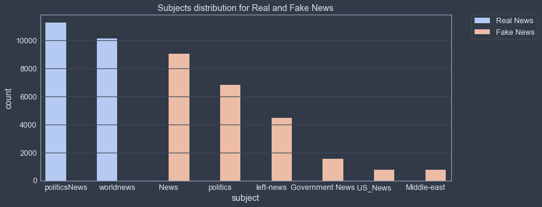
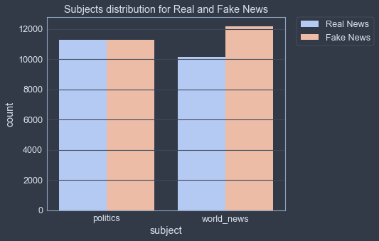

___

<a href='http://www.dourthe.tech'> </a>
___
<center><em>For more information, visit <a href='http://www.dourthe.tech'>www.dourthe.tech</a></em></center>


# Real vs. Fake News Classification using Natural Language Processing

___ 
## Objective
Train a machine learning model to detect Fake and Real news using Natural Language Processing.

 ___
## Dataset
Fake and Real news dataset from Kaggle.com

Link: https://www.kaggle.com/clmentbisaillon/fake-and-real-news-dataset

The dataset contains two CSV files named Fake (Fake News samples) and True (Real News samples). Both CSV files have the same four columns:

| Name | Description | Data Type | 
|:---|:---|:---|
| title | Title of the article | _string_ |
| text | Text of the article | _string_ |
| subject | Subject/Category of the article | _string_ |
| date | Date when the article was released | _string_ |

___
## Libraries Imports
### Data manipulation and analysis


```python
import pandas as pd
import numpy as np
```

### Data visualization


```python
import warnings
warnings.filterwarnings("ignore")
import matplotlib.pyplot as plt
import seaborn as sns
from jupyterthemes import jtplot
jtplot.style(theme='chesterish')
```

### Text processing


```python
# For dates conversion to datetime format
from dateutil import parser
# For punctuation extraction
import string
# For stopwords (i.e. common words) extraction
from nltk.corpus import stopwords
```

### Machine learning


```python
# For splitting data between training and test set
from sklearn.model_selection import train_test_split

# For generating pipelines
from sklearn.pipeline import Pipeline

# For words vectorization
from sklearn.feature_extraction.text import CountVectorizer
# For term frequency-inverse document frequency
from sklearn.feature_extraction.text import TfidfTransformer
# Classification model
from sklearn.naive_bayes import MultinomialNB

# For model evaluation
from sklearn.metrics import confusion_matrix,classification_report
```

___
## Data Import


```python
true = pd.read_csv('True.csv')
fake = pd.read_csv('Fake.csv')
```

___
## Exploratory Data Analysis
### General

**Display the first few rows of each dataset.**


```python
true.head()
```


<div>
<table border="1" class="dataframe">
  <thead>
    <tr style="text-align: right;">
      <th></th>
      <th>title</th>
      <th>text</th>
      <th>subject</th>
      <th>date</th>
    </tr>
  </thead>
  <tbody>
    <tr>
      <th>0</th>
      <td>As U.S. budget fight looms, Republicans flip t...</td>
      <td>WASHINGTON (Reuters) - The head of a conservat...</td>
      <td>politicsNews</td>
      <td>December 31, 2017</td>
    </tr>
    <tr>
      <th>1</th>
      <td>U.S. military to accept transgender recruits o...</td>
      <td>WASHINGTON (Reuters) - Transgender people will...</td>
      <td>politicsNews</td>
      <td>December 29, 2017</td>
    </tr>
    <tr>
      <th>2</th>
      <td>Senior U.S. Republican senator: 'Let Mr. Muell...</td>
      <td>WASHINGTON (Reuters) - The special counsel inv...</td>
      <td>politicsNews</td>
      <td>December 31, 2017</td>
    </tr>
    <tr>
      <th>3</th>
      <td>FBI Russia probe helped by Australian diplomat...</td>
      <td>WASHINGTON (Reuters) - Trump campaign adviser ...</td>
      <td>politicsNews</td>
      <td>December 30, 2017</td>
    </tr>
    <tr>
      <th>4</th>
      <td>Trump wants Postal Service to charge 'much mor...</td>
      <td>SEATTLE/WASHINGTON (Reuters) - President Donal...</td>
      <td>politicsNews</td>
      <td>December 29, 2017</td>
    </tr>
  </tbody>
</table>
</div>


```python
fake.head()
```


<div>
<table border="1" class="dataframe">
  <thead>
    <tr style="text-align: right;">
      <th></th>
      <th>title</th>
      <th>text</th>
      <th>subject</th>
      <th>date</th>
    </tr>
  </thead>
  <tbody>
    <tr>
      <th>0</th>
      <td>Donald Trump Sends Out Embarrassing New Year’...</td>
      <td>Donald Trump just couldn t wish all Americans ...</td>
      <td>News</td>
      <td>December 31, 2017</td>
    </tr>
    <tr>
      <th>1</th>
      <td>Drunk Bragging Trump Staffer Started Russian ...</td>
      <td>House Intelligence Committee Chairman Devin Nu...</td>
      <td>News</td>
      <td>December 31, 2017</td>
    </tr>
    <tr>
      <th>2</th>
      <td>Sheriff David Clarke Becomes An Internet Joke...</td>
      <td>On Friday, it was revealed that former Milwauk...</td>
      <td>News</td>
      <td>December 30, 2017</td>
    </tr>
    <tr>
      <th>3</th>
      <td>Trump Is So Obsessed He Even Has Obama’s Name...</td>
      <td>On Christmas day, Donald Trump announced that ...</td>
      <td>News</td>
      <td>December 29, 2017</td>
    </tr>
    <tr>
      <th>4</th>
      <td>Pope Francis Just Called Out Donald Trump Dur...</td>
      <td>Pope Francis used his annual Christmas Day mes...</td>
      <td>News</td>
      <td>December 25, 2017</td>
    </tr>
  </tbody>
</table>
</div>


**Check for missing data.**


```python
true.count()
```


    title      21417
    text       21417
    subject    21417
    date       21417
    dtype: int64


```python
fake.count()
```


    title      23481
    text       23481
    subject    23481
    date       23481
    dtype: int64


We can see that the dataset is fairly balanced, as there are comparable amounts of Real News and Fake News.

Also, since there is the same number of entries for each column in both datasets, we can assume that there is no missing data (e.g. article with a title but no text or no data).

### Datasets concatenation

**Create a new column in both datasets called 'label' indicating the label of each article (Real News or Fake News).**


```python
true['label'] = 'Real News'
fake['label'] = 'Fake News'
```

**Combine/concatenate the two datasets.**


```python
data = pd.concat([true, fake], axis=0)
```

**Shuffle the rows of our new dataset to avoid having the first half of the data being all Real News and the second half being all Fake News.**


```python
data = data.sample(frac=1).reset_index(drop=True)
```


```python
data.head(10)
```


<div>
<table border="1" class="dataframe">
  <thead>
    <tr style="text-align: right;">
      <th></th>
      <th>title</th>
      <th>text</th>
      <th>subject</th>
      <th>date</th>
      <th>label</th>
    </tr>
  </thead>
  <tbody>
    <tr>
      <th>0</th>
      <td>Mnuchin says trade focus with China is issue s...</td>
      <td>WASHINGTON (Reuters) - U.S. Treasury Secretary...</td>
      <td>politicsNews</td>
      <td>June 6, 2017</td>
      <td>Real News</td>
    </tr>
    <tr>
      <th>1</th>
      <td>U.S. committed to Europe alliances: Haley</td>
      <td>NEW YORK (Reuters) - NATO is the “strongest al...</td>
      <td>politicsNews</td>
      <td>February 21, 2017</td>
      <td>Real News</td>
    </tr>
    <tr>
      <th>2</th>
      <td>U.N. mulls U.S. push for North Korea oil embar...</td>
      <td>UNITED NATIONS (Reuters) - The United States w...</td>
      <td>worldnews</td>
      <td>September 6, 2017</td>
      <td>Real News</td>
    </tr>
    <tr>
      <th>3</th>
      <td>Turkey says hopes U.S. will lift decision on v...</td>
      <td>ANKARA (Reuters) - Turkey hopes the United Sta...</td>
      <td>worldnews</td>
      <td>October 11, 2017</td>
      <td>Real News</td>
    </tr>
    <tr>
      <th>4</th>
      <td>Trump takes first actions on Cabinet, declares...</td>
      <td>WASHINGTON (Reuters) - Donald Trump took his f...</td>
      <td>politicsNews</td>
      <td>January 20, 2017</td>
      <td>Real News</td>
    </tr>
    <tr>
      <th>5</th>
      <td>Czech parliament revokes Communist-era policem...</td>
      <td>PRAGUE (Reuters) - The Czech parliament revoke...</td>
      <td>worldnews</td>
      <td>December 19, 2017</td>
      <td>Real News</td>
    </tr>
    <tr>
      <th>6</th>
      <td>WATCH: TOP 5 VIDEOS The Leftist Media Doesn’t ...</td>
      <td>Organized protesters took to the streets outsi...</td>
      <td>politics</td>
      <td>Sep 12, 2017</td>
      <td>Fake News</td>
    </tr>
    <tr>
      <th>7</th>
      <td>THE TRUTH ABOUT Why SORE LOSER Obama Is Using ...</td>
      <td>Make no mistake: it s payback time. In orderin...</td>
      <td>politics</td>
      <td>Dec 13, 2016</td>
      <td>Fake News</td>
    </tr>
    <tr>
      <th>8</th>
      <td>Trump packs trade team with veterans of steel ...</td>
      <td>WASHINGTON (Reuters) - President-elect Donald ...</td>
      <td>politicsNews</td>
      <td>December 9, 2016</td>
      <td>Real News</td>
    </tr>
    <tr>
      <th>9</th>
      <td>WHO WAS THE MOST “GOOGLED” CANDIDATE DURING TH...</td>
      <td>The Washington Post is of course, befuddled as...</td>
      <td>politics</td>
      <td>Aug 7, 2015</td>
      <td>Fake News</td>
    </tr>
  </tbody>
</table>
</div>


### Title and Text feature engineering

**Create two new columns indicating the number of words in the 'title' and 'text' columns.**


```python
data['title length'] = data['title'].apply(lambda text: int(len(text.split())))
data['text length'] = data['text'].apply(lambda text: int(len(text.split())))
```

**Let's look at the text length distributions.**


```python
data['title length'].plot(kind='hist', bins=30)
plt.title('Title length')
plt.show()
```


    

    


```python
data['title length'].describe()
```


    count    44898.000000
    mean        12.453472
    std          4.111476
    min          1.000000
    25%         10.000000
    50%         11.000000
    75%         14.000000
    max         42.000000
    Name: title length, dtype: float64


The title length column appears to have a fairly narrow distribution, with a min count of 1 word and a max of 42.

**What about the text length distribution?**


```python
data['text length'].plot(kind='hist', bins=30)
plt.title('Text length')
plt.show()
```


    

    


```python
data['text length'].describe()
```


    count    44898.000000
    mean       405.282284
    std        351.265595
    min          0.000000
    25%        203.000000
    50%        362.000000
    75%        513.000000
    max       8135.000000
    Name: text length, dtype: float64


The text length column seems to have a some outliers, where the number of words in the article are above 2000.
Let's have a look at how many articles are longer than 2000 words, and what percentage of the total data they represent.


```python
print('Number of articles with more than 2000 words: ',
      np.round(data[data['text length']>2000].count()[0]*100/len(data),2), '%')
```

    Number of articles with more than 2000 words:  0.49 %
    

**To see whether the title or text length columns represent distinguishing features between Real News and Fake News, let's create separate distributions plots:**


```python
data.hist(column='title length', bins=20, by='label', figsize=(12,5), sharex=True)
plt.show()
```


    

    


```python
data.hist(column='text length', bins=20, by='label', figsize=(12,5), sharex=True)
plt.show()
```


    

    


#### CONCLUSION
The number of words in the title or text of the articles does not seem to be clearly different between Real News and Fake News.


```python
data.drop(['title length', 'text length'], axis=1, inplace=True)
```

### Subject feature engineering

**Check the number of subjects across the entire dataset.**


```python
data['subject'].nunique()
```


    8


**Let's explore the distribution of each subject based on the label (Real News or Fake News).**


```python
plt.figure(figsize=(12,5))
sns.countplot('subject', hue='label', data=data, order=data['subject'].value_counts().index, palette='coolwarm')
plt.title('Subjects distribution for Real and Fake News')
plt.legend(bbox_to_anchor=(1.05, 1), loc=2, borderaxespad=0.)
plt.show()
```


    

    


This plot indicates that the subjects are completely different between the Real and Fake News, which could create a bias in the machine learning algorithm. Indeed, if we create dummy variables based on the subjects, since there are no subjects including both Real and Fake News, the algorithm would quickly learn how to correctly classify Real and Fake News, but would most likely only learn from the subject, which do not seem to be a clear indication of the actual content of the article.

Also, we see similarities between subjects across each category of news (e.g. 'politicsNews' and 'politics').

**Let's take a look some examples to better understand the content of each subject.**


```python
for sub in data['subject'].value_counts().index:
    print(sub)
    for row in range(5):
        print('\t', data[data['subject']==sub]['title'].iloc[row])
```

    politicsNews
       Mnuchin says trade focus with China is issue specific
       U.S. committed to Europe alliances: Haley
       Trump takes first actions on Cabinet, declares day of patriotism: spokesman
       Trump packs trade team with veterans of steel wars with China
       German industry says vulnerable to Russia sanctions fall-out
    worldnews
       U.N. mulls U.S. push for North Korea oil embargo, textile export ban
       Turkey says hopes U.S. will lift decision on visa embargo soon
       Czech parliament revokes Communist-era policeman's election to oversight post
       Demoralized and divided: inside Catalonia's police force
       Austria's conservatives reach coalition deal with far right: Kurz
    News
        Trump’s Love Of Dictators Continues – Now He’s Praising Saddam Hussein (VIDEO)
        It Took A Scathing Letter From Canada’s Prime Minister To Make Fox News FINALLY Correct Fake Story
        One Group Of GOP Voters May Vote Blue For The First Time In 60 Years Because Of Trump
        Donald Trump ‘SHOCKED’ A Group Of Women Have Heard Of One Of The Most Famous Women In History (VIDEO)
        U.S. Corporations Plead With Trump On Front Page Of NY Times: Don’t Abandon Paris Deal
    politics
       WATCH: TOP 5 VIDEOS The Leftist Media Doesn’t Want You to See Of KID ROCK Giving Back To Others
       THE TRUTH ABOUT Why SORE LOSER Obama Is Using “Russian Hackers” Story [VIDEO]
       WHO WAS THE MOST “GOOGLED” CANDIDATE DURING THE GOP PRIMARY DEBATE?
       Ground Zero Mosque Was NOT Defeated: Three Story Islamic Museum And Muslim Prayer Space Will Take Its Place [Video]
       HEY DEMOCRATS! Judicial Watch Just Discovered Hillary Invited Putin To 2009 Clinton Foundation Gala…Is This The Collusion You’ve Been Looking For?
    left-news
       D.C. BAR OWNER Where Seth Rich Was Last Seen Drops Bombshell: NO EMPLOYEES Of Bar Questioned By DC Police…Never Asked For Surveillance Tapes [VIDEO]
       THINGS ARE ABOUT TO GET UGLY: GOP Introduces Plan To Stop $44 BILLION In Obama’s Last Minute Taxpayer Funded Regulations
       (VIDEO) BALTIMORE MAYOR REOPENS LOOTED MALL: TELLS VENDORS THEY’RE MAKING A “GREAT INVESTMENT” BY STAYING
       PANERA BREAD CEO 2014: “Don’t Bring Your Guns Into Restaurants”…UPDATE: Two MD Sheriffs Shot And KILLED In Panera Bread Restaurant
       WOW! HILLARY’S UNCENSORED COMMENTS About Monica Lewinsky Revealed By Longtime Hillary Friend [VIDEO]
    Government News
       PRESIDENT TRUMP AND MELANIA Arrive in Poland to Cheering Crowds [Video]
       HOUSE DEMOCRATS MAKE STUNNING Move To Implement Sharia Law In America
       INVESTIGATION LAUNCHED: SECOND TRESPASSER May Have Been Near President Trump In U.S. Capitol [Video]
       OBAMA’S BAILOUT OF PUERTO RICO: TAXPAYERS Take A BIG Hit But Rewards Go To Political And Financial Players
       OBAMA RACES TO SET GITMO TERRORISTS FREE…Leaves Servicemen Punished For Making “Heat-of-the-battle decisions that saved lives” In Fort Leavenworth
    US_News
       Uber, Google, Twitter, Netflix and Other Tech Giants File ‘Unlawful’ Immigration Retort Against Trump
       The Wahabi Vote: Poll Shows 68 percent of Saudis prefer Hillary Clinton
       SUNDAY SCREENING: Guns, Drugs & the CIA (1988)
       Orlando Mass Shooting & The Accelerated Police State – UK Column – June 13, 2016
       The Changing Face of Mainstream Media?
    Middle-east
       Trump Asks O’Reilly, ‘Do you think our country is so innocent?’ After Pundit calls Putin ‘a killer’
       BOMBSHELL: Classified NATO Report Praises Russia Airstrikes as ‘Efficient, and Accurate’ in Syria
       EP #15: Patrick Henningsen LIVE – ‘Crisis of American Liberalism’ with guest Caleb Maupin
       SUNDAY SCREENING: ‘The War on Democracy’ (2007)
       Boiler Room EP #81 – Halloween Fireside Book of Suspense Vol. 1
    

Before dropping the subject column completely, let's try to combine some of these subjects based on their similarities.

We should also consider what subjects only appear as Real or Fake News to try and create better balance.

**New subjects suggestions:**

| New subject name | Previous subjects names to combine |
| :--- | :--- |
| _politics_ | 'politicsNews', 'politics', 'left-news' |
| _world_news_ | 'News', 'Government News', 'US_News', 'worldnews', 'Middle-east' |


```python
data['subject'] = data['subject'].apply(lambda sub: 'politics' if sub in ['politicsNews', 'politics', 'left-news'] 
                                        else 'world_news')
```

**We can now re-plot the distribution plot:**


```python
plt.figure(figsize=(6,5))
sns.countplot('subject', hue='label', data=data, order=data['subject'].value_counts().index, palette='coolwarm')
plt.title('Subjects distribution for Real and Fake News')
plt.legend(bbox_to_anchor=(1.05, 1), loc=2, borderaxespad=0.)
plt.show()
```


    

    


**CONCLUSION**

No clear pattern seem to be coming out of the subject column, which can therefore be dropped.


```python
data.drop('subject', axis=1, inplace=True)
```

### Date feature engineering

**We can start by looking at the number and distribution of unique entries in the date column.**


```python
data['date'].nunique()
```


    2397


```python
data['date'].value_counts()
```


    December 20, 2017                                                                                                           182
    December 6, 2017                                                                                                            166
    November 30, 2017                                                                                                           162
    November 9, 2017                                                                                                            158
    October 13, 2017                                                                                                            155
                                                                                                                               ... 
    June 24, 2017                                                                                                                 1
    October 22, 2017                                                                                                              1
    MSNBC HOST Rudely Assumes Steel Worker Would Never Let His Son Follow in His Footsteps…He Couldn’t Be More Wrong [Video]      1
    May 28, 2016                                                                                                                  1
    November 12, 2017                                                                                                             1
    Name: date, Length: 2397, dtype: int64


We see that there are too many unique date entries.

Also, some date values are not dates and should be removed.

**Let's replace entries that are longer than 20 characters:**


```python
data['date'] = data['date'].apply(lambda date: np.nan if len(date) > 20 else date)
```


```python
data.dropna(axis=0, inplace=True)
```

**Now we can create two new columns called 'month' and 'year' by converting all string dates into datetime objects and extracting the corresponding features.**


```python
from dateutil import parser

data['month'] = data['date'].apply(lambda date: parser.parse(date).month)
data['year'] = data['date'].apply(lambda date: parser.parse(date).year)
```

**Let's look at the month and year columns distribution based on label:**


```python
plt.figure(figsize=(12,5))
sns.countplot('month', data=data, hue='label', palette='coolwarm')
plt.title('Number of articles published each month basel on label')
plt.show()
```


    

    


```python
plt.figure(figsize=(12,5))
sns.countplot('year', data=data, hue='label', palette='coolwarm')
plt.title('Number of articles published each year basel on label')
plt.show()
```


    

    


**CONCLUSION**

The number of Real News articles seem to be fairly constant across months, while there is a clear increase in number of Fake News articles published from September to December.

In addition, the number of Fake News articles seem to be increasing from 2016 to 2017.

The month and year column seem interesting and could be used as potential distinguishing features.

___
## Data Pre-processing

### Dummy variables

**Since we created a 'month' and a 'year' column (in numerical format), the 'date' column is no longer needed.**


```python
data.drop('date', axis=1, inplace=True)
```

**We can generate dummy variables using the get_dummies function from the pandas library.**


```python
dum_month = pd.get_dummies(data['month'], drop_first=True)
dum_year = pd.get_dummies(data['year'], drop_first=True)

data = pd.concat([data, dum_month, dum_year], axis=1).drop(['month', 'year'], axis=1)
```

### Data tokenization - convertion to bag-of-words

**This operation consists of converting a text in string format to a list of words (bag-of-words) where each word is considered as a token.**

This operation can be done in many ways, but here we will simply create a function that:

1. Remove all punctuation characters from all string text
2. Remove all stop words (i.e. most common words in the English language, as they could be present in all sample and may not contribute to any form of differentiation)


```python
def text_tokenization(text):
    '''
    Remove punctuation and stopwords (i.e. common words) from a text (in string format)
    and returns a list of words from the cleaned text.
    Input:
        text: text in string format
    Output:
        cleaned_text: list of words (tokens) from the corresponding text, free of punctuation and stopwords
    '''
    # Remove all punctuation from text by looking at each character
    text_no_punc = [char for char in text if char not in string.punctuation]

    # Re-join all characters to re-form a string
    text_no_punc = ''.join(text_no_punc)
    
    # Remove all stopwords
    cleaned_text = [word for word in text_no_punc.split() if word.lower() not in stopwords.words('english')]
    
    return cleaned_text
```

**The function can now be applied to the 'title' and 'text' columns.**

_Warning: this operation is computationally expensive and can take a while to run! Feel free to import the pre-processed/tonekized data to avoid this time-consuming operation._


```python
# If code ran for the first time, otherwise comment on the next two lines and simply import the pre-processed/tonekized data
# data['title'] = data['title'].apply(text_tokenization)
# data['text'] = data['text'].apply(text_tokenization)

data = pd.read_csv('processed_tokenized_data.csv')
```


```python
data.head()
```


<div>
<table border="1" class="dataframe">
  <thead>
    <tr style="text-align: right;">
      <th></th>
      <th>title</th>
      <th>text</th>
      <th>label</th>
      <th>2</th>
      <th>3</th>
      <th>4</th>
      <th>5</th>
      <th>6</th>
      <th>7</th>
      <th>8</th>
      <th>9</th>
      <th>10</th>
      <th>11</th>
      <th>12</th>
      <th>2016</th>
      <th>2017</th>
      <th>2018</th>
    </tr>
  </thead>
  <tbody>
    <tr>
      <th>0</th>
      <td>['TALENTED', 'HILLARY', 'CLINTON', 'TALKS', 'D...</td>
      <td>['forgot', 'claim', 'Hillary', 'Clinton', 'act...</td>
      <td>Fake News</td>
      <td>0</td>
      <td>0</td>
      <td>0</td>
      <td>0</td>
      <td>0</td>
      <td>1</td>
      <td>0</td>
      <td>0</td>
      <td>0</td>
      <td>0</td>
      <td>0</td>
      <td>0</td>
      <td>0</td>
      <td>0</td>
    </tr>
    <tr>
      <th>1</th>
      <td>['TREASON', 'White', 'House', 'Says', 'It’s', ...</td>
      <td>['anyone', 'please', 'explain', 'US', 'got', '...</td>
      <td>Fake News</td>
      <td>0</td>
      <td>0</td>
      <td>0</td>
      <td>0</td>
      <td>0</td>
      <td>0</td>
      <td>0</td>
      <td>0</td>
      <td>0</td>
      <td>0</td>
      <td>0</td>
      <td>1</td>
      <td>0</td>
      <td>0</td>
    </tr>
    <tr>
      <th>2</th>
      <td>['32', 'Million', 'Uninsured', 'Premiums', 'Do...</td>
      <td>['new', 'report', 'released', 'Congressional',...</td>
      <td>Fake News</td>
      <td>0</td>
      <td>0</td>
      <td>0</td>
      <td>0</td>
      <td>0</td>
      <td>1</td>
      <td>0</td>
      <td>0</td>
      <td>0</td>
      <td>0</td>
      <td>0</td>
      <td>0</td>
      <td>1</td>
      <td>0</td>
    </tr>
    <tr>
      <th>3</th>
      <td>['Democrat', 'Mayor', 'Proclaims', 'He’s', 'Ba...</td>
      <td>['breathe', 'sigh', 'relief', 'knowing', 'reas...</td>
      <td>Fake News</td>
      <td>0</td>
      <td>0</td>
      <td>0</td>
      <td>0</td>
      <td>0</td>
      <td>0</td>
      <td>0</td>
      <td>0</td>
      <td>0</td>
      <td>0</td>
      <td>1</td>
      <td>0</td>
      <td>0</td>
      <td>0</td>
    </tr>
    <tr>
      <th>4</th>
      <td>['Samantha', 'Bee', 'Tells', 'Ted', 'Cruz', 'S...</td>
      <td>['Coming', 'Tuesday', 'Republican', 'primary',...</td>
      <td>Fake News</td>
      <td>0</td>
      <td>0</td>
      <td>0</td>
      <td>1</td>
      <td>0</td>
      <td>0</td>
      <td>0</td>
      <td>0</td>
      <td>0</td>
      <td>0</td>
      <td>0</td>
      <td>1</td>
      <td>0</td>
      <td>0</td>
    </tr>
  </tbody>
</table>
</div>


**Since the text tokenization take a long time to process, we can save the pre-processed and tokenized data into a csv file:**


```python
data.to_csv('processed_tokenized_data.csv', index=False)
```

### Vectorization

At this stage, all text data (from 'title' and 'text' columns) are represented by lists of tokens (also named _lemmas_), which require to be converted to some form of numerical vector in order to be processed by a machine learning algorithm.

This operation is called **Vectorization** and can be done using the _CountVectorizer_ tool from SciKit Learn, which will convert our lists of tokens into a (mxn) matrix of tokens counts as illustrated below:

| Entire vocabulary | Text 1 | Text 2 | ... | Text N |
|:---|:---:|:---:|:---:|:---:|
|Word 1 count | 1 | 0 | ... | 1 |
|Word 2 count | 0 | 1 | ... | 0 |
| ... | ... | ... | ... | ... |
| Word i count | 0 | 2 | ... | 0 |
| ... | ... | ... | ... | ... |
|Word M count | 1 | 0 | ... | 3 |

**Note:** Since this transformation usually results in a lot of zeros (as many text samples won't have a lot of words from the entire vocabulary), the _CountVectorizer_ tool from SciKit Learn will output a _Sparse Matrix_.

### Term frequency-inverse document frequency (TD-IDF) weights calculation

TD-IDF weight is a statistical measure used to evaluate how important a term/word is to a text/document in a collection or corpus (i.e. dataset). It is calculated as followed:

**1. Term frequency (TD):**

    TD(T) = ( Total counts of term T in a given document ) / ( Total number of terms in the same document )


**2. Inverse document frequency (IDF), which measures how import a term/word is based on how often it appears in the whole datatset (all texts/documents):**

    IDF(T) = log_e ( Total number of documents / Number of documents that have term T in them)

**TD-IDF = TD x IDF**

___
## Machine Learning

### Pipeline definition
**Create a pipeline that will:**
1. Vectorize the data
2. Calculate the TD-IDF weight of each word
3. Define the type of classifier for the machine learning algorithm

In terms of classifier, [Naive Bayes models](http://www.inf.ed.ac.uk/teaching/courses/inf2b/learnnotes/inf2b-learn-note07-2up.pdf) models have been shown to perform quite well on text data. Therefore, we will use the _MultinomialNB_ model from SciKit Learn.


```python
pipeline = Pipeline([
    ('bow', CountVectorizer()),  # strings to token integer counts
    ('tfidf', TfidfTransformer()),  # integer counts to weighted TF-IDF scores
    ('classifier', MultinomialNB()),  # train on TF-IDF vectors w/ Naive Bayes classifier
])
```

### Input data and labels definition

**We will start by only including the 'title' column as input.**


```python
X = data['title']
y = data['label']
```

**Split the data into training and test sets:**


```python
X_train, X_test, y_train, y_test = train_test_split(X, y, test_size=0.3,random_state=42)
```

### Run pipeline and fit model to training data


```python
pipeline.fit(X_train,y_train)
```


    Pipeline(steps=[('bow', CountVectorizer()), ('tfidf', TfidfTransformer()),
                    ('classifier', MultinomialNB())])


### Model evaluation

**Generate predictions:**


```python
predictions = pipeline.predict(X_test)
```

**Evaluate the model using classification report and confusion matrix:**


```python
cm = confusion_matrix(y_test, predictions)
print('CONFUSION MATRIX\n')
print('Total number of')
print('\tTrue positives:\t\t', cm[1,1])
print('\tTrue negatives:\t\t', cm[0,0])
print('\tFalse positives:\t', cm[0,1], '\t\tType I error')
print('\tFalse negatives:\t', cm[1,0], '\t\tType II error')
print('\n')
print('Correct classifications:\t', np.round(100*(cm[0,0]+cm[1,1])/len(X_test),2), '%')
print('Incorrect classifications:\t', np.round(100*(cm[1,0]+cm[0,1])/len(X_test),2), '%')
print('\nCLASSIFICATION REPORT\n')
print(classification_report(y_test, predictions))
```

    CONFUSION MATRIX
    
    Total number of
      True positives:    5929
      True negatives:    6745
      False positives:   316    Type I error
      False negatives:   477    Type II error
    
    
    Correct classifications:      94.11 %
    Incorrect classifications:    5.89 %
    
    CLASSIFICATION REPORT
    
                  precision    recall  f1-score   support
    
       Fake News       0.93      0.96      0.94      7061
       Real News       0.95      0.93      0.94      6406
    
        accuracy                           0.94     13467
       macro avg       0.94      0.94      0.94     13467
    weighted avg       0.94      0.94      0.94     13467
    
    

The model performed great in precision and recall for both labels.

Looking at the confusion matrix, we can see that there are still quite a few False Negatives (Type II error) and False Positives (Type I error).

**Let's see if the 'text' column, will help improve the model.**


```python
X = data['text']
y = data['label']
```


```python
X_train, X_test, y_train, y_test = train_test_split(X, y, test_size=0.3,random_state=42)
```


```python
pipeline.fit(X_train,y_train)
```


    Pipeline(steps=[('bow', CountVectorizer()), ('tfidf', TfidfTransformer()),
                    ('classifier', MultinomialNB())])


```python
predictions = pipeline.predict(X_test)
```


```python
cm = confusion_matrix(y_test, predictions)
print('CONFUSION MATRIX\n')
print('Total number of')
print('\tTrue positives:\t\t', cm[1,1])
print('\tTrue negatives:\t\t', cm[0,0])
print('\tFalse positives:\t', cm[0,1], '\t\tType I error')
print('\tFalse negatives:\t', cm[1,0], '\t\tType II error')
print('\n')
print('Correct classifications:\t', np.round(100*(cm[0,0]+cm[1,1])/len(X_test),2), '%')
print('Incorrect classifications:\t', np.round(100*(cm[1,0]+cm[0,1])/len(X_test),2), '%')
print('\nCLASSIFICATION REPORT\n')
print(classification_report(y_test, predictions))
```

    CONFUSION MATRIX
    
    Total number of
      True positives:    6191
      True negatives:    6597
      False positives:   464    Type I error
      False negatives:   215    Type II error
    
    
    Correct classifications:      94.96 %
    Incorrect classifications:    5.04 %
    
    CLASSIFICATION REPORT
    
                  precision    recall  f1-score   support
    
       Fake News       0.97      0.93      0.95      7061
       Real News       0.93      0.97      0.95      6406
    
        accuracy                           0.95     13467
       macro avg       0.95      0.95      0.95     13467
    weighted avg       0.95      0.95      0.95     13467
    
    

The overall performance of the model was slightly improved when only using the 'text' column.

**As a final test, let's try to combine the 'title' and 'text' columns as a new column called 'article'.**


```python
data['article'] = data['title'] + data['text']
```

**We can now repeat the steps above and re-train the model using the data from this new column.**


```python
X = data['article']
y = data['label']
```


```python
X_train, X_test, y_train, y_test = train_test_split(X, y, test_size=0.3,random_state=42) 
```


```python
pipeline.fit(X_train,y_train)
```


    Pipeline(steps=[('bow', CountVectorizer()), ('tfidf', TfidfTransformer()),
                    ('classifier', MultinomialNB())])


```python
predictions = pipeline.predict(X_test)
```


```python
cm = confusion_matrix(y_test, predictions)
print('CONFUSION MATRIX\n')
print('Total number of')
print('\tTrue positives:\t\t', cm[1,1])
print('\tTrue negatives:\t\t', cm[0,0])
print('\tFalse positives:\t', cm[0,1], '\t\tType I error')
print('\tFalse negatives:\t', cm[1,0], '\t\tType II error')
print('\n')
print('Correct classifications:\t', np.round(100*(cm[0,0]+cm[1,1])/len(X_test),2), '%')
print('Incorrect classifications:\t', np.round(100*(cm[1,0]+cm[0,1])/len(X_test),2), '%')
print('\nCLASSIFICATION REPORT\n')
print(classification_report(y_test, predictions))
```

    CONFUSION MATRIX
    
    Total number of
      True positives:    6079
      True negatives:    6665
      False positives:   396    Type I error
      False negatives:   327    Type II error
    
    
    Correct classifications:      94.63 %
    Incorrect classifications:    5.37 %
    
    CLASSIFICATION REPORT
    
                  precision    recall  f1-score   support
    
       Fake News       0.95      0.94      0.95      7061
       Real News       0.94      0.95      0.94      6406
    
        accuracy                           0.95     13467
       macro avg       0.95      0.95      0.95     13467
    weighted avg       0.95      0.95      0.95     13467
    
    

As expected, the performance of the model using the entire article (i.e. title + text) performed as the average of the 'title' and 'text' models.

## Conclusion

Using data manipulation and visualization, feature engineering and natural language processing, we were able to train a Naive Bayes Machine Learning model that can distinguish between Real News and Fake News with an accuracy of 95% on test data. Considering that the original dataset was well balanced (i.e. comparable number of Fake News and Real News samples), this final result can be considered great.

**This pipeline could easily be transferred to other binary text classification problems (e.g. ham or spam emails).**
