___

<a href='https://www.dourthe-technologies.com'> </a>
___
<center><em>For more information, visit <a href='https://www.dourthe-technologies.com'> www.dourthe-technologies.com</a></em></center>

# Medical Imaging Resolution Enhancement using Super Resolution Neural Network [PyTorch Implementation]

## Objective
Implement a Super Resolution Neural Network (SRNN) to enhance the resolution of lung computed tomography (CT) images.

## Dataset
The dataset was downloaded from the Lung Image Database Consortium image collection (LIDC-IDRI), which consists of a total of 1018 thoracic CT scans (diagnostic and lung cancer screening) with marked-up annotated lesions.

For more details, visit: https://wiki.cancerimagingarchive.net/display/Public/LIDC-IDRI#f633413761b746ff9e49dd8f0d5b679d

## References
[1] Ledig C, Theis L, Huszar F, Caballero J, Cunningham A, Acosta A, Aitken A, Tejani A, Totz J, Wang Z, Shi W. Photo-Realistic Single Image Super-Resolution Using a Generative Adversarial Network. arXiv:1609.04802, 2017 (https://arxiv.org/abs/1609.04802)

[2] He K, Zhang X, Ren S, Sun J.Deep Residual Learning for Image Recognition. arXiv:1512.03385v1, 2015 (https://arxiv.org/abs/1512.03385)

[3] Goodfellow IJ, Pouget-Abadie J, Mirza M, Xu B, Warde-Farley D, Ozair S, Courville A, Bengio Y. Generative Adversarial Nets. arXiv:1406.2661v1, 2014 (https://arxiv.org/abs/1406.2661)

[4] Johnson J, Alahi A, Fei-Fei L. Perceptual Losses for Real-Time Style Transfer and Super-Resolution. arXiv:1603.08155v1, 2016 (https://arxiv.org/abs/1603.08155)

[5] Bruna J, Sprechmann P, LeCun Y. Super-Resolution with Deep Convolutional Sufficient Statistics. arXiv:1511.05666v4, 2016 (https://arxiv.org/abs/1511.05666)

[6] Simonyan K, Zisserman A. Very Deep Convolutional Networks for Large-Scale Image Recognition. arXiv:1409.1556v6, 2015 (https://arxiv.org/abs/1409.1556)

___
# Imports


```python
# Ignore warnings
import warnings
warnings.filterwarnings("ignore")

# System characteristics
import psutil
import humanize
import GPUtil as GPU
import torch.backends.cudnn as cudnn

# Computation time monitoring
from time import time

# Data visualization
import matplotlib.pyplot as plt
from IPython.display import clear_output

# Data processing
import os
import math
import pandas as pd
import numpy as np
import cv2
from skimage import io
from scipy import ndimage
from torchvision import datasets, transforms
from torch.utils.data import Dataset
from torch.utils.data import DataLoader

# Deep learning
import torch
import torch.nn as nn
import torch.nn.functional as F
import torchvision
from torch.autograd import Variable
from torch import Tensor
```

___
# System Characteristics

## Check system informations and GPU


```python
# Display local virtual memory (RAM)
print(f'\033[1mRAM Memory:\t\033[0m{humanize.naturalsize(psutil.virtual_memory().available)} (Available)\n')

# Check if GPU is enabled
print(f'\033[1mGPU enabled:\t\033[0m{torch.cuda.is_available()}\n')

# Setting device on GPU ('cuda') if available, if not, the device will be set to CPU ('cpu')
device = torch.device('cuda' if torch.cuda.is_available() else 'cpu')

# If device set to GPU ('cuda'), display device information
if device.type == 'cuda':
    # Collect GPU information
    GPUs = GPU.getGPUs()
    gpu = GPUs[0]
    process = psutil.Process(os.getpid())
    print(f'\033[1mDevice Name:\t\033[0m{torch.cuda.get_device_name(0)}')
    print(f'\033[1mMemory Usage:\t\033[0m{torch.cuda.memory_allocated(0)/1024**3:3.1f} GB (Allocated)'
          f'\t{torch.cuda.memory_cached(0)/1024**3:3.1f} GB (Cached)')
    print(f'\033[1mMemory Details:\t\033[0m{gpu.memoryTotal/1000:3.1f} GB '
          f'(Total)\t\t{gpu.memoryUsed/1000:3.1f} GB ({gpu.memoryUtil*100:.0f}% Used) '
          f'\t{gpu.memoryFree/1000:4.1f} GB ({100-gpu.memoryUtil*100:.0f}% Free)')
```

    RAM Memory:	    21.2 GB (Available)
    
    GPU enabled:	True
    
    Device Name:	GeForce RTX 2080 Super with Max-Q Design
    Memory Usage:	0.0 GB (Allocated)	0.0 GB (Cached)
    Memory Details:	8.2 GB (Total)		1.1 GB (13% Used) 	 7.1 GB (87% Free)
    

___
# Dataset Definition


```python
# Define data augmentation probability
#   e.g. if set to 0.5, each image has a 50% chance to be transformed
augmentation_probability = 0.5

# Define rotation angle range for data augmentation
#   e.g. if set to 5, each transformed image is randomly rotated by an angle comprised between -5 and +5 degrees
rotation_range = 5

# Define warping range for data augmentation
#   e.g. if set to 0.6, each transformed image is randomly resized along the x- and y-axes by a factor
#   comprised between 60% and 100% of the original image shape (with different factors for each direction).
#   The resize image is then re-resize to the original image shape by filling the cropped pixels with black pixels
#   (giving the impression of warping)
warping_range = 0.8

# Define cropping ratio range for data augmentation
#   e.g. if crop_lower_range = 0.5 and crop_upper_range = 0.8, each transformed image is randomly cropped
#   along the x- and y-axes by a factor comprised between 50% and 80% of the original image dimensions
crop_lower_range = 0.5
crop_upper_range = 0.8
cropping_ratio = np.random.uniform(crop_lower_range, crop_upper_range)

class ProcessedDataset(Dataset):
    
    def __init__(self, input_path, target_path, rotation=True, warping=True, cropping=True):
        '''
        ProcessedDataset(path, rotation=True, warping=True, cropping=True)
            Class enabling the definition of a dataset of 3D images with embedded augmentation strategies 
        Parameters:
            input_path: full path to input data (i.e. low resolution data)
                (type: string)
            target_path: full path to target data (i.e. high resolution data)
                (type: string)
            rotation: specifies whether rotation augmentation should be applied
                (type: boolean - True to apply rotation augmentation, False NOT to apply rotation augmentation) (default=True)
            warping: specifies whether warping augmentation should be applied
                (type: boolean - True to apply warping augmentation, False NOT to apply warping augmentation) (default=True)
            cropping: specifies whether cropping augmentation should be applied
                (type: boolean - True to apply cropping augmentation, False NOT to apply cropping augmentation) (default=True)
        '''
        
        # Generate paths towards low (input) and high (target) resolution images
        self.lr_path = input_path
        self.hr_path = target_path
        
        # Generate lists of filenames for all images and labels contained within corresponding directories (with full path)
        self.lr_files = list(map(lambda lr_file: os.path.join(self.lr_path, lr_file), sorted(os.listdir(self.lr_path))))
        self.hr_files = list(map(lambda hr_file: os.path.join(self.hr_path, hr_file), sorted(os.listdir(self.hr_path))))
        
        # Specify which augmentation strategies to apply
        self.rotation = rotation
        self.warping = warping
        self.cropping = cropping
        
    def __getitem__(self, index):
        
        # Get full paths to selected low (input) and high (target) resolution images
        lr_path = self.lr_files[index]
        hr_path = self.hr_files[index]

        # Read low (input) and high (target) resolution images
        lr_img = io.imread(lr_path, as_gray=True)
        hr_img = io.imread(hr_path, as_gray=True)
        
        # Data augmentation 1: apply random rotation to image (based on defined probability and range)
        if self.rotation:
            if np.random.uniform(0,1) >= augmentation_probability:
                angle = np.random.uniform(-rotation_range,rotation_range)
                lr_img = ndimage.rotate(lr_img, angle, axes=(0,1), reshape=False, order=1, cval=0)
                hr_img = ndimage.rotate(hr_img, angle, axes=(0,1), reshape=False, order=1, cval=0)
        
        # Data augmentation 2: apply random warping to image (based on defined probability and range)
        if self.warping:
            if np.random.uniform(0,1) >= augmentation_probability: 
                #   Generate random warping factors along x- and y-axes
                warping_x = np.random.uniform(warping_range,1)
                warping_y = np.random.uniform(warping_range,1)
                #   Save original shapes
                lr_x_shape, lr_y_shape = lr_img.shape[0], lr_img.shape[1]
                hr_x_shape, hr_y_shape = hr_img.shape[0], hr_img.shape[1]                
                #   Warp images and labels
                lr_img = ndimage.zoom(lr_img, (warping_x,warping_y), order=1, cval=0)
                hr_img = ndimage.zoom(hr_img, (warping_x,warping_y), order=1, cval=0)
                #   Calculate number of rows and columns to add shape
                lr_n_rows, lr_n_cols = lr_x_shape - lr_img.shape[0], lr_y_shape - lr_img.shape[1]
                hr_n_rows, hr_n_cols = hr_x_shape - hr_img.shape[0], hr_y_shape - hr_img.shape[1]
                #   Calculate padding shape
                #      LR
                if lr_n_rows%2 == 0 and lr_n_cols%2 == 0:
                    lr_pad_shape = ((int(lr_n_rows/2), int(lr_n_rows/2)), (int(lr_n_cols/2), int(lr_n_cols/2)))
                elif lr_n_rows%2 != 0 and lr_n_cols%2 == 0:
                    lr_pad_shape = ((math.ceil(lr_n_rows/2), math.floor(lr_n_rows/2)), (int(lr_n_cols/2), int(lr_n_cols/2)))
                elif lr_n_rows%2 == 0 and lr_n_cols%2 != 0:
                    lr_pad_shape = ((int(lr_n_rows/2), int(lr_n_rows/2)), (math.ceil(lr_n_cols/2), math.floor(lr_n_cols/2)))
                elif lr_n_rows%2 != 0 and lr_n_cols%2 != 0:
                    lr_pad_shape = ((math.ceil(lr_n_rows/2), math.floor(lr_n_rows/2)), (math.ceil(lr_n_cols/2), math.floor(lr_n_cols/2)))
                #      HR
                if hr_n_rows%2 == 0 and hr_n_cols%2 == 0:
                    hr_pad_shape = ((int(hr_n_rows/2), int(hr_n_rows/2)), (int(hr_n_cols/2), int(hr_n_cols/2)))
                elif hr_n_rows%2 != 0 and hr_n_cols%2 == 0:
                    hr_pad_shape = ((math.ceil(hr_n_rows/2), math.floor(hr_n_rows/2)), (int(hr_n_cols/2), int(hr_n_cols/2)))
                elif hr_n_rows%2 == 0 and hr_n_cols%2 != 0:
                    hr_pad_shape = ((int(hr_n_rows/2), int(hr_n_rows/2)), (math.ceil(hr_n_cols/2), math.floor(hr_n_cols/2)))
                elif hr_n_rows%2 != 0 and hr_n_cols%2 != 0:
                    hr_pad_shape = ((math.ceil(hr_n_rows/2), math.floor(hr_n_rows/2)), (math.ceil(hr_n_cols/2), math.floor(hr_n_cols/2)))
                #   Pad images and labels to match original shape
                lr_img = np.pad(lr_img, lr_pad_shape, 'constant', constant_values=0)
                hr_img = np.pad(hr_img, hr_pad_shape, 'constant', constant_values=0)
                
        # Data augmentation 3: apply random cropping to image (based on defined probability and range)
        if self.cropping:
            if np.random.uniform(0,1) >= augmentation_probability:
                #   Save original dimensions
                lr_dim = lr_img.shape
                hr_dim = hr_img.shape
                #   Define cropped images length
                cropped_length_lr = int(lr_dim[0] * cropping_ratio)
                cropped_length_hr = int(hr_dim[0] * cropping_ratio)
                #   Define random coordinates for bottom left corner of the cropping areas for high resolution images
                x1 = int(np.random.uniform(0, hr_dim[0]-1 - cropped_length_hr))
                y1 = int(np.random.uniform(0, hr_dim[1]-1 - cropped_length_hr))
                #   Define x1 and y1 ratios to high resolution images shape,
                #   so the equivalent x1 and y1 can be defined for the low resolution images
                x1_ratio = x1/hr_dim[0]
                y1_ratio = y1/hr_dim[1]
                #   Define random coordinates for bottom left corner of the cropping areas for low and high resolution images
                x1_lr = int(lr_dim[0]*x1_ratio)
                y1_lr = int(lr_dim[1]*y1_ratio)
                x1_hr = int(hr_dim[0]*x1_ratio)
                y1_hr = int(hr_dim[1]*y1_ratio)
                #   Define random coordinates for top right corner of the cropping area for low and high resolution images
                x2_lr = x1_lr + cropped_length_lr
                y2_lr = y1_lr + cropped_length_lr
                x2_hr = x1_hr + cropped_length_hr
                y2_hr = y1_hr + cropped_length_hr
                #   Crop images and labels
                lr_img = lr_img[x1_lr:x2_lr+1, y1_lr:y2_lr+1]
                hr_img = hr_img[x1_hr:x2_hr+1, y1_hr:y2_hr+1]
                #   Upsample cropped images and labels to match with original image size
                lr_img = cv2.resize(lr_img, dsize=(lr_dim[0], lr_dim[0]), interpolation=cv2.INTER_CUBIC) 
                hr_img = cv2.resize(hr_img, dsize=(hr_dim[0], hr_dim[0]), interpolation=cv2.INTER_CUBIC)   
                
        # Convert low (input) and high (target) resolution images from numpy.ndarray to torch.FloatTensor format
        lr_img_tensor = torch.cat(3*[torch.FloatTensor(lr_img).unsqueeze(0)])
        hr_img_tensor = torch.cat(3*[torch.FloatTensor(hr_img).unsqueeze(0)])
                                  
        return lr_img_tensor, hr_img_tensor
        
    def __len__(self):
        
        return len(self.lr_files)
```

___
# Deep Learning Models: Definition
This section provides details on:
- **General model architecture**
- **Model's blocks definition**
- **Super-Resolution Residual Neural Network definition**
- **Super-Resolution Generative Adversarial Residual Neural Network definition**
- **Loss function definition**

## General model architecture
The selected architecture was based off the work of Ledig et al. (2017) [1], who implemented a Deep Residual Neural Network (DRNN) that uses the concept of Generative Adversarial Network (GAN) to form a perceptual loss function for photo-realistic Single Image Super Resolution (SISR).

### Residual Neural Network (ResNet)
In order to increase the accuracy of a Neural Network, the first intuition is often to build a deeper architecture by adding more layers, therefore adding more parameters and allowing the model to adapt to more complex problems.

One very common issue with this approach is the vanishing gradient problem, which implies that when the Network is performing backpropagation (i.e. going through each layer one after the other to update their weights), the gradient becomes progressively smaller (i.e. vanishing) as it goes through more and more layers, which ultimately prevents certain deeper layers to be updated.

To prevent this, He et al. (2015) [2] introduced ResNet, a DRNN built on the concepts of residual blocks and skip connections, which allow the Network to skip certain blocks of layers. As a result, the Network is no longer suffering from the vanishing gradient, even when more layers are added.

_For more details, visit https://towardsdatascience.com/an-overview-of-resnet-and-its-variants-5281e2f56035_

### Generative Adversarial Network (GAN)
Introduced by Goodfellow et al. (2014) [3], GANs are composed of two main networks: the Generator and the Discriminator.

The purpose of the **Generator** is to generate data that will fool the Discriminator.

The purpose of the **Discriminator** is to classify the images generated by the Generator as Real or Fake data.

In the context of this work, the GAN architecture will be used not to discriminate between Real and Fake data, but between Low and High resolution images, which should dramatically help the Generator to better learn features from each image, until the Discriminator can no long find differences between the Super (model output) and High (target) resolution images.

### Architecture illustration, _from Ledig et al. (2017) [1]_

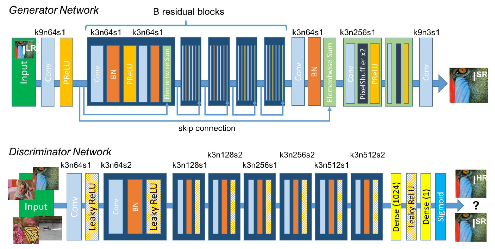

## Model's blocks definition
As seen in the illustration above, each network (Generator and Discriminator) consists of a series of blocks that have a similar architecture. As a result, to faciliate the definition and coding of the entire model, we will create a separate class for each block that composes the different networks. This will result in the definition of the following blocks:

- **Convolutional block**     
- **Sub-Pixel Convolutional block** 
- **Residual block**

### Convolutional block
This block is the most repetitive block observed in both the Generator and Discriminator networks. This block will always start with a 2D Convolutional (Conv2D) layer and will also have the option to comprise (or not) a Batch Normalization (BN) layer as well as a defined Activation layer (i.e. PReLU or Leaky ReLU).


```python
class ConvolutionalBlock(nn.Module):
    
    def __init__(self, input_channels, output_channels, kernel_size, stride=1, batch_norm=False, activation=None):
        '''
        ConvolutionalBlock(input_channels, output_channels, kernel_size, stride=1, batch_norm=False, activation=None)
            Convolutional block comprising a 2D Convolutional layer, as well as potential batch normalization (if True)
            and activation (if different from None) layers.
        Parameters:
            input_channels: specifies number of input channels
                (type: integer)
            output_channels: specifies number of output channels
                (type: integer)
            kernel_size: specifies dimensions of convolutional kernels (e.g. if kernel_size=3, the kernel will be 3x3)
                (type: integer)
            stride: specifies number of pixels by which the kernel moves during convolution
                (type: integer) (default=1)
            batch_norm: defines whether a Batch Normalization layer should be included
                (type: boolean - True for Yes, False for No)
            activation: define whether an Activation layer should be included, and if yes, what kind of activation
                (type: string - 'prelu' for PReLU, 'leakyrelu' for LeakyReLU, 'tanh' for 'Tanh')
        '''
        
        super(ConvolutionalBlock, self).__init__()
        
        # Initialize layers as a list (better for flexibility regarding the potential addition of BN or Activation layers)
        layers = []
        
        # Append 2D Convolutional layer to list of layers
        layers.append(nn.Conv2d(in_channels=input_channels, out_channels=output_channels,
                                     kernel_size=kernel_size, stride=stride, padding=kernel_size//2))
        
        # If set to True, append Batch Normalization layer to list of layers
        if batch_norm == True:
            layers.append(nn.BatchNorm2d(num_features=output_channels))
        
        # If different from None, append Activation layer to list of layers
        if activation == 'prelu':
            layers.append(nn.PReLU())
        elif activation == 'leakyrelu':
            layers.append(nn.LeakyReLU(0.2))
        elif activation == 'tanh':
            layers.append(nn.Tanh())
            
        # Combine layers into Sequential block
        self.conv_block = nn.Sequential(*layers)
    
    def forward(self, input):
        '''
        Enables forward propagation.
        Parameters:
            input: input images (type: torch.FloatTensor,
                                 shape: (number of samples, input_channels, width, height))
        Return:
            output: ouput images (type: torch.FloatTensor
                                  shape: (number of samples, output_channels, width, height))
        '''
        
        output = self.conv_block(input)
        
        return output
```

### Residual block
This block is present in the Generator network and consists of two Convolutional Blocks and a residual connection (skip connection) that goes across them.

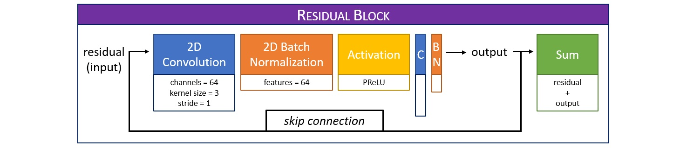


```python
class ResidualBlock(nn.Module):
    
    def __init__(self, kernel_size=3, num_channels=64):
        '''
        ResidualBlock(kernel_size=3, num_channels=64)
            Residual block comprising two Convolutional blocks and a residual connection (skip connection)
            that goes across them.
        Parameters:
            kernel_size: specifies dimensions of convolutional kernels (e.g. if kernel_size=3, the kernel will be 3x3)
                (type: integer) (default=3)
            num_channels: specifies number of channels
                (type: integer) (default=64)
        '''
        
        super(ResidualBlock, self).__init__()
        
        # Define first Convolutional block
        self.conv1 = ConvolutionalBlock(input_channels=num_channels, output_channels=num_channels,
                                        kernel_size=kernel_size, stride=1, batch_norm=True, activation='prelu')
        
        # Define second Convolutional block
        self.conv2 = ConvolutionalBlock(input_channels=num_channels, output_channels=num_channels,
                                        kernel_size=kernel_size, stride=1, batch_norm=True, activation=None)
        
    def forward(self, input):
        '''
        Enables forward propagation.
        Parameters:
            input: input images (type: torch.FloatTensor,
                                 shape: (number of samples, input_channels, width, height))
        Return:
            ouput: output images (type: torch.FloatTensor,
                                  shape: (number of samples, input_channels, width, height))
        '''
        
        # Define residual (i.e. input images)
        residual = input
        
        # Pass input images through the two Convolutional blocks
        output = self.conv1(input)
        output = self.conv2(output)
        
        # Combine Convolutional output with residual
        output = output + residual
        
        return output
```

### Sub-Pixel Convolutional block
This block is present at the end of the Generator network and will always start with a 2D Convolutional (Conv2D) layer, followed by a Pixel Shuffler and an Activation layer (i.e. PReLU).


```python
class SubPixelConvolutionalBlock(nn.Module):
    
    def __init__(self, kernel_size=3, num_channels=64, scaling_factor=2):
        '''
        SubPixelConvolutionalBlock(kernel_size=3, num_channels=64, scaling_factor=2)
            Sub-Pixel Convolutional block comprising a 2D Convolutional layer, as well as a Pixel Shuffle layer
            and a PReLU activation layer.
        Parameters:
            kernel_size: specifies dimensions of convolutional kernels (e.g. if kernel_size=3, the kernel will be 3x3)
                (type: integer) (default=3)
            num_channels: specifies number of channels 
                (type: integer) (default=64)
            scaling_factor: defines the factor by which to upscale the images (e.g. if scaling_factor=2,
                the images resolution will be increase by a factor of 2)
                (type: integer) (default=2) (range: can only be 2, 4 or 8)
        '''
        
        super(SubPixelConvolutionalBlock, self).__init__()
        
        # Define block within Sequential layer
        self.sub_pix_conv = nn.Sequential(nn.Conv2d(in_channels=num_channels, out_channels=num_channels*(scaling_factor**2),
                                                    kernel_size=kernel_size, padding=kernel_size//2),
                                          nn.PixelShuffle(upscale_factor=scaling_factor),
                                          nn.PReLU())
    
    def forward(self, input):
        '''
        Enables forward propagation.
        Parameters:
            input: input images (type: torch.FloatTensor,
                                 shape: (number of samples, input_channels, width, height))
        Return:
            upscaled: upscaled images (type: torch.FloatTensor,
                                       shape: (number of samples, input_channels, width*scaling_factor, height*scaling_factor))
        '''
        
        upscaled = self.sub_pix_conv(input)
        
        return upscaled
```

## Super-Resolution Residual Neural Network definition
Now that the different building blocks have been defined, we can combine them and create a Super-Resolution Residual Neural Network (SRResNet) architecture, which will also be used as our Generator network.

This will give us the opportunity to compare a single SRResNet architecture with a Super-Resolution Generative Adversarial Residual Neural Network (SRGAResNet) architecture.

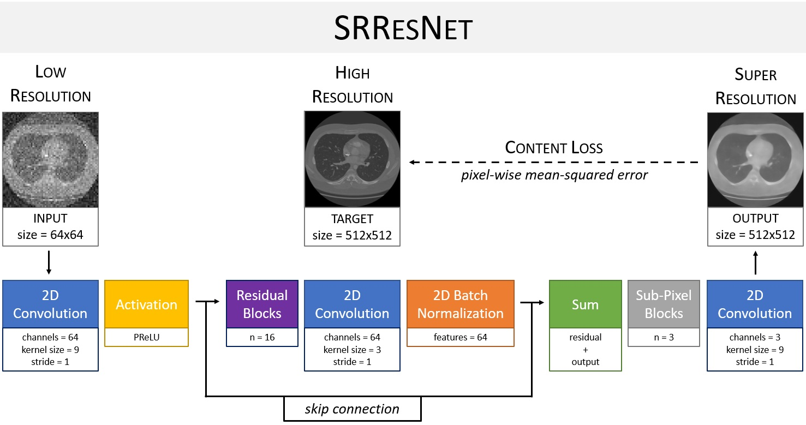


```python
class SRResNet(nn.Module):
    
    def __init__(self, in_out_kernel_size=9, mid_kernel_size=3, num_channels=64, num_blocks=16, scaling_factor=4):
        '''
        SRResNet(in_out_kernel_size=9, mid_kernel_size=3, num_channels=64, num_blocks=16, scaling_factor=4)
            Super-Resolution Residual Neural Network (SRResNet) as defined by Ledig et al. (2017).
            [1] Ledig C, Theis L, Huszar F, Caballero J, Cunningham A, Acosta A, Aitken A, Tejani A, Totz J, Wang Z, Shi W.
            Photo-Realistic Single Image Super-Resolution Using a Generative Adversarial Network.
            arXiv:1609.04802, 2017 (https://arxiv.org/abs/1609.04802).
        Parameters:
            in_out_kernel_size: specifies dimensions of convolutional kernels for first and last convolutions
                (i.e. input and output)
                (type: integer) (default=9)
            mid_kernel_size: specifies dimensions of convolutional kernels for all remaining convolutions
                (i.e. between input and output)
                (type: integer) (default=3)
            num_channels: specifies number of channels for the different blocks
                (type: integer) (default=64)
            num_blocks: specifies number of residual blocks
                (type: integer) (default=16)
            scaling_factor: defines the factor by which to upscale the images (e.g. if scaling_factor=2,
                the images resolution will be increase by a factor of 2)
                (type: integer) (default=4) (range: can only be 2, 4 or 8)
        '''
        
        super(SRResNet, self).__init__()
        
        # Verify that scaling factor is either 2, 4 or 8, otherwise returns error
        assert scaling_factor in [2, 4, 8], 'Error: The scaling factor should be set to either 2, 4 or 8'
        
        # Define first Convolutional block
        self.conv1 = ConvolutionalBlock(input_channels=3, output_channels=num_channels,
                                       kernel_size=in_out_kernel_size, batch_norm=False, activation='prelu')
        
        # Define intermediate Residual blocks based on defined number of blocks
        self.residual = nn.Sequential(*[ResidualBlock(kernel_size=mid_kernel_size,
                                                      num_channels=num_channels) for i in range(num_blocks)])
        
        # Define intermediate Convolutional block
        self.conv2 = ConvolutionalBlock(input_channels=num_channels, output_channels=num_channels,
                                        kernel_size=in_out_kernel_size, batch_norm=True, activation=None)
        
        # Define Sub-Pixel Convolutional blocks, which enable the progressive increase in image resolution
        # (i.e. each Sub-Pixel Convolutional block is upscaling the image by a factor of two)
        #   Calculate number of Sub-Pixel Convolutional blocks based on SRRestNet scaling factor
        num_subpix_blocks = int(math.log2(scaling_factor))
        #   Define blocks
        self.subpix_conv = nn.Sequential(*[SubPixelConvolutionalBlock(kernel_size=mid_kernel_size,
                                                                      num_channels=num_channels,
                                                                      scaling_factor=2) for i in range(num_subpix_blocks)])
        
        # Define last Convolutional block
        self.conv3 = ConvolutionalBlock(input_channels=num_channels, output_channels=3,
                                        kernel_size=in_out_kernel_size, batch_norm=False, activation='tanh')
        
    def forward(self, lr_imgs):
        '''
        Enables forward propagation.
        Parameters:
            lr_imgs: low resolution images (type: torch.FloatTensor,
                                            shape: (number of samples, 3, width, height))
        Return:
            sr_imgs: super-resolution images (type: torch.FloatTensor,
                                              shape: (number of samples, 3, width*scaling_factor, height*scaling_factor))
        '''
        
        # Pass low resolution images through first Convolutional block
        output = self.conv1(lr_imgs)
        
        # Define residual
        res = output
        
        # Pass output of first Convolutional block through Residual blocks
        output = self.residual(output)
        
        # Pass output of Residual blocks through intermediate Convolutional block
        output = self.conv2(output)
        
        # Combine output of intermediate Convolutional block with residual
        output = output + res
        
        # Pass combined output of intermediate Convolutional block and redisual through Sub-Pixel Convolutional blocks
        output = self.subpix_conv(output)
        
        # Pass output of Sub-Pixel Convolutional blocks through last Convolutional block
        sr_imgs = self.conv3(output)
        
        return sr_imgs
```

## Super-Resolution Generative Adversarial Residual Neural Network definition
### Generator definition
Here, the Generator that we intend to use in the SRGARestNet has the exact same architecture as the SRResNet defined above. As a result, the Generator network only requires to regenerate an instance of the SRResNet to be generated. We will also add the option to initialize the weights of this Generator using a pre-trained SRResNet for enhanced performance.

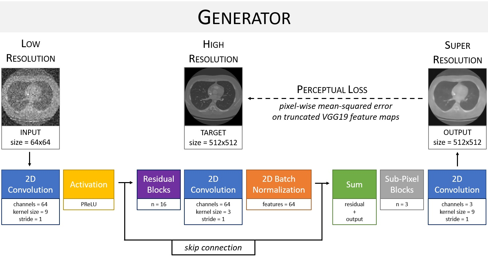


```python
class Generator(nn.Module):
    
    def __init__(self, in_out_kernel_size=9, mid_kernel_size=3, num_channels=64, num_blocks=16, scaling_factor=4):
        '''
        Generator(in_out_kernel_size=9, mid_kernel_size=3, num_channels=64, num_blocks=16, scaling_factor=4)
            Generator of the Super-Resolution Generative Adversarial Residual Neural Network (SRGAResNet)
            as defined by Ledig et al. (2017) (same architecture as SRRestNet).
            [1] Ledig C, Theis L, Huszar F, Caballero J, Cunningham A, Acosta A, Aitken A, Tejani A, Totz J, Wang Z, Shi W.
            Photo-Realistic Single Image Super-Resolution Using a Generative Adversarial Network.
            arXiv:1609.04802, 2017 (https://arxiv.org/abs/1609.04802).
        Parameters:
            in_out_kernel_size: specifies dimensions of convolutional kernels for first and last convolutions
                (i.e. input and output)
                (type: integer) (default=9)
            mid_kernel_size: specifies dimensions of convolutional kernels for all remaining convolutions
                (i.e. between input and output)
                (type: integer) (default=3)
            num_channels: specifies number of channels for the different blocks
                (type: integer) (default=64)
            num_blocks: specifies number of residual blocks
                (type: integer) (default=16)
            scaling_factor: defines the factor by which to upscale the images (e.g. if scaling_factor=2,
                the images resolution will be increase by a factor of 2)
                (type: integer) (default=4) (range: can only be 2, 4 or 8)
        '''
        
        super(Generator, self).__init__()
        
        # Generate Network by creating an instance of the SRResNet
        self.generator = SRResNet(in_out_kernel_size=in_out_kernel_size, mid_kernel_size=mid_kernel_size,
                                  num_channels=num_channels, num_blocks=num_blocks, scaling_factor=scaling_factor)
        
    def srresnet_init(self, srresnet_checkpoint_path):
        '''
        Initialize Generator's weights using the  pre-trained weights of the SRResNet.
        Parameters:
            srresnet_checkpoint_path: filepath to pre-trained srresnet checkpoint
        '''
        
        # Load pre-trained SRResNet weights
        srresnet = torch.load(srresnet_checkpoint_path)['model']
        
        # Initialize Generator's weights using pre-trained SRResNet weights
        self.generator.load_state_dict(srresnet.state_dict())
        
        # Display initialization statement
        print("\nGenerator's weights initialized using pre-trained SRResNet\n")
        
    def forward(self, lr_imgs):
        '''
        Enables forward propagation.
        Parameters:
            lr_imgs: low resolution images (type: torch.FloatTensor,
                                            shape: (number of samples, 3, width, height))
        Return:
            sr_imgs: super-resolution images (type: torch.FloatTensor,
                                              shape: (number of samples, 3, width*scaling_factor, height*scaling_factor))
        '''
        
        # Pass low resolution images through Generator
        sr_imgs = self.generator(lr_imgs)
        
        return sr_imgs
```

### Discriminator definition
The architecture of the Discriminator network will follow the one defined by Ledig et al. (2017) [1].

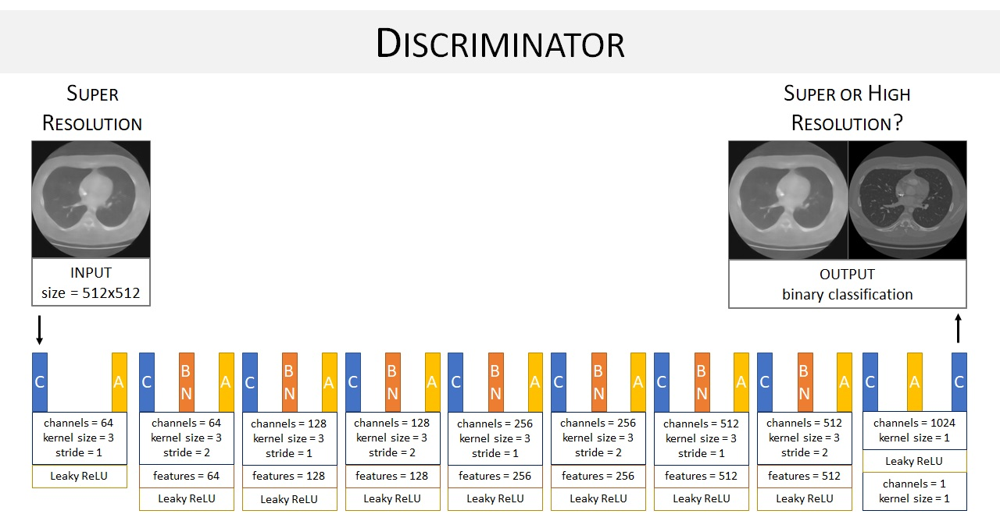


```python
class Discriminator(nn.Module):
    
    def __init__(self):
        
        '''
        Discriminator()
            Discriminator of the Super-Resolution Generative Adversarial Residual Neural Network (SRGAResNet)
            as defined by Ledig et al. (2017).
            [1] Ledig C, Theis L, Huszar F, Caballero J, Cunningham A, Acosta A, Aitken A, Tejani A, Totz J, Wang Z, Shi W.
            Photo-Realistic Single Image Super-Resolution Using a Generative Adversarial Network.
            arXiv:1609.04802, 2017 (https://arxiv.org/abs/1609.04802).
        Parameters:
            None
        '''
        
        super(Discriminator, self).__init__()
        
        self.discriminator = nn.Sequential(nn.Conv2d(3, 64, kernel_size=3, stride=1, padding=1),
                                           nn.LeakyReLU(0.2),
                                          
                                           nn.Conv2d(64, 64, kernel_size=3, stride=2, padding=1),
                                           nn.BatchNorm2d(64),
                                           nn.LeakyReLU(0.2),
                                           
                                           nn.Conv2d(64, 128, kernel_size=3, stride=1, padding=1),
                                           nn.BatchNorm2d(128),
                                           nn.LeakyReLU(0.2),
                                           
                                           nn.Conv2d(128, 128, kernel_size=3, stride=2, padding=1),
                                           nn.BatchNorm2d(128),
                                           nn.LeakyReLU(0.2),
                                           
                                           nn.Conv2d(128, 256, kernel_size=3, stride=1, padding=1),
                                           nn.BatchNorm2d(256),
                                           nn.LeakyReLU(0.2),
                                           
                                           nn.Conv2d(256, 256, kernel_size=3, stride=2, padding=1),
                                           nn.BatchNorm2d(256),
                                           nn.LeakyReLU(0.2),
                                           
                                           nn.Conv2d(256, 512, kernel_size=3, stride=1, padding=1),
                                           nn.BatchNorm2d(512),
                                           nn.LeakyReLU(0.2),
                                           
                                           nn.Conv2d(512, 512, kernel_size=3, stride=2, padding=1),
                                           nn.BatchNorm2d(512),
                                           nn.LeakyReLU(0.2),
                                           
                                           nn.AdaptiveAvgPool2d(1),
                                           nn.Conv2d(512, 1024, kernel_size=1),
                                           nn.LeakyReLU(0.2),
                                           
                                           nn.Conv2d(1024, 1, kernel_size=1))
        
    def forward(self, x):
        '''
        Enables forward propagation.
        Parameters:
            x: images to classify as either Super (model output) or High (target) Resolution  
                (type: torch.FloatTensor, shape: (number of samples, 3, width*scaling_factor, height*scaling_factor))
        Return:
            score: classification score (type: float)
        '''

        return torch.sigmoid(self.discriminator(x).view(x.size(0)))
```

## Loss function definition
In many image transformation problems, the pixel-wise Mean Squared Error (MSE) (i.e. difference between the pixel value of the target and the model's output) is often used as a loss function. However, this kind of approach has shown to struggle with high-frequency details as it often leads the model to learn a pixel-wise average solution that can possibly smoothen/lose important image features.

As a result, based on the work of Johnson et al. (2016) [4] and Bruna et al. (2016) [5], Ledig et al. (2017) [1] proposed to use the concept of **Perceptual loss**.

### Perceptual loss definition
The main idea behind the concept of Perceptual loss is that we want the model to learn higher level image features (i.e. perceptual features) rather than focusing on pixel-wise differences. This becomes specifically important for applications such as Super Resolution or Style Transfer, where we want the model to retain higher frequency image features that can be critical when evaluating the quality and fidelity of the model's outcome.

A Perceptual loss can be divided into two sub-losses:
- **Content loss:** designed to help the model learn how to generate an image that is similar to the target;
- **Adversarial loss:** designed to help the model learn higher level features that will help fool the discriminator.

### Content loss
In the work of Ledig et al. (2017) [1], the Content loss was defined as a function that tries to minimize the euclidean distance between the feature maps of the Super (model output) and High (target) Resolution images. Those feature maps were extracted from a pre-trained VGG network (i.e. a well-known Convolutional Neural Network (CNN) architecture originally proposed by Simonyan et al. (2015) [6]), which was implemented with 19 layers (VGG19).

In terms of implementation, the Content loss will be defined as PyTorch's MSELoss function and applied to the output (i.e. feature maps) of a truncated pre-trained VGG network applied to the Super (model output) and High (target) Resolution images.

### Adversarial loss
In the work of Ledig et al. (2017) [1], the Adversarial loss was defined based on the probability generated by the Discriminator.

In terms of implementation, the Adversarial loss will be defined as PyTorch's BCEWithLogitsLoss function (with BCE standing for Binary Cross-Entropy) and applied to the output of the Discriminator network.

### Feature extractor definition
To enable the extraction of features (as mentioned under the definition of the Content loss), we will define a new class that will allow a different implementation of a truncated version of the VGG19 network, from which we will be able to extract features maps from selected batches of images.


```python
class TVLoss(nn.Module):
    
    def __init__(self, weight: Tensor) -> None:
        '''
        TVLoss(weight)
            Implementation of total variation loss.
        Parameters:
            weight: super resolution images weight
                (type: torch.FloatTensor, shape: (number of samples, 3, width, height))
        '''
        
        super(TVLoss, self).__init__()
        self.weight = weight
        
    def forward(self, input: Tensor) -> Tensor:
        '''
        Enables forward propagation.
        Parameters:
            input: super resolution images 
                (type: torch.FloatTensor, shape: (number of samples, 3, width, height))
        Return:
            total variation loss
        '''
        
        batch_size = input.size()[0]
        height_x = input.size()[2]
        width_x = input.size()[3]
        count_h = self.tensor_size(input[:, :, 1:, :])
        count_w = self.tensor_size(input[:, :, :, 1:])
        height_tv = torch.pow((input[:, :, 1:, :] - input[:, :, :height_x-1, :]), 2).sum()
        width_tv = torch.pow((input[:, :, :, 1:] - input[:, :, :, :width_x-1]), 2).sum()
        
        return self.weight*2*(height_tv/count_h + width_tv/count_w)/batch_size
    
    @staticmethod
    def tensor_size(t):
        
        return t.size()[1] * t.size()[2] *t.size()[3]
    
class ContentLoss(nn.Module):
    
    def __init__(self, network, feature_layer: int=36) -> None:
        '''
        ContentLoss(network, feature_layer=36)
            Implementation of a truncated network architecture (to be defined) for the extraction of content loss
            between feature maps.
        Parameters:
            network: neural network architecture to import
                (type: torchvision.models, e.g. torchvision.models.vgg19(pretrained=True))
            feature_layer: index of the layer where truncation will occur
                (type: integer) (default=36)
        '''
        
        super(ContentLoss, self).__init__()
        self.features = nn.Sequential(*list(network.features.children())[:feature_layer]).eval()
        for name, param in self.features.named_parameters():
            param.requires_grad = False
            
    def forward(self, input: Tensor, target: Tensor) -> Tensor:
        '''
        Enables forward propagation.
        Parameters:
            input: super resolution images 
                (type: torch.FloatTensor, shape: (number of samples, 3, width, height))
            target: high resolution images
                (type: torch.FloatTensor, shape: (number of samples, 3, width, height))
        Return:
            content_loss: MSE distance between the feature maps of the super and high resolution images
        '''
        
        content_loss = F.mse_loss(self.features(input), self.features(target))
        
        return content_loss
```

___
# Deep Learning Models: Training and Evaluation
In this section, we will train several model architectures (SRResNet and SRGAResNet) using different coding approaches as well as different training parameters. Each trained model will then be evaluated on testing images (i.e. images that the model had never seen before).

As reference, every evaluation of each SRGAResNet model will be compared to the results of the SRResNet.

## Data selection
We will use the following images as low (model input) and high (model target) resolution samples for the training of each network:

- **Input images:** Downsampled images with resolution of 64x64 and with added noise
- **Target images:** Normalized 512x512 images
- **Resulting scaling factor:** 8 (-> 512/64)

## SRResNet training
Before training the SRGAResNet, we will start by training the SRResNet, which outcome will be used for 1) comparison, and 2) to enable the SRGAResNet to start its own training using the pre-trained weights of the SResNet.


```python
# Define path towards directory containing the processed images
input_path = "../../data/non_segmented/train/LR_Noise/64x64"
target_path = "../../data/non_segmented/train/HR"

# Define library in which the model has been coded (e.g. PyTorch, Keras)
lib = 'PyTorch'

# Define number of epochs
epochs = 500

# Define DataLoader parameters
batch_size = 3
num_workers = 0
pin_memory = False

# Define model parameters
in_out_kernel_size = 9
mid_kernel_size = 3
num_channels = 64
num_blocks = 16

# Define path to previously trained model
pre_trained_path = None

# Define frequency of print statements (i.e. every how many epochs to print training progress)
print_checkpoint = 10

# Define checkpoint (i.e. number of epochs after which the model will be saved)
checkpoint = 100

# Define learning rate
lr = 0.0001

# Assign device to 'cuda' if available, or to 'cpu' otherwise
device = torch.device('cuda' if torch.cuda.is_available() else 'cpu')

# Enable cudnn benchmark, which allows cudnn to look for the optimal set of algorithms for the current device configuration
cudnn.benchmark = True
    
# Generate dataset
train = ProcessedDataset(input_path, target_path, rotation=True, warping=True)

# Load dataset
train_loader = DataLoader(train, batch_size=batch_size, shuffle=True, num_workers=num_workers, pin_memory=pin_memory)

# Calculate scaling factor based on input and target images shapes
#   Grab the first sample to extract LR and HR images dimensions 
for lr_imgs, hr_imgs in train_loader:
    break
#   Calculate corresponding scaling factor
scaling_factor = int(hr_imgs.shape[2]/lr_imgs.shape[2])

# Initialize model and optimizer or load pre-trained model (if pre_trained_path different from None)
if pre_trained_path == None:
    # Create instance of SRRestNet
    model = SRResNet(in_out_kernel_size=in_out_kernel_size,
                     mid_kernel_size=mid_kernel_size,
                     num_channels=num_channels,
                     num_blocks=num_blocks,
                     scaling_factor=scaling_factor)
    # Initialize SRResNet optimizer
    optimizer = torch.optim.Adam(params=filter(lambda p: p.requires_grad, model.parameters()), lr=lr)
    # Define starting epoch number
    start_epoch = 1
else:
    # Load pre-trained model information
    pre_trained = torch.load(pre_trained_path)
    # Load pre-trained model
    model = pre_trained['model']
    # Load optimizer
    optimizer = pre_trained['optimizer']
    # Define starting epoch number based on last trained epoch of loaded model
    start_epoch = pre_trained['epoch'] + 1
    
# Assign model to available device ('cuda' or 'cpu')
model = model.to(device)

# Define loss function (for SRResNet, only need to specify the Content loss, which is usually PyTorch's MSELoss function)
criterion = nn.MSELoss().to(device)

# Initialize mean epoch loss tracker (-> one mean loss value per epoch)
mean_epoch_loss = []

# Initialize time tracker
start_time = time()

# Start training
for epoch in range(start_epoch, epochs+1):
    
    # Set model to training mode
    model.train()
    
    # Initialize mean sample loss tracker (-> one mean loss value per sample)
    mean_sample_loss = []
    
    # Loop through training samples
    for lr_imgs, hr_imgs in train_loader:
        
        # Assign images to available device ('cuda' or 'cpu')
        lr_imgs = lr_imgs.to(device)
        hr_imgs = hr_imgs.to(device)
        
        # Pass low resolution images through model
        sr_imgs = model(lr_imgs)
        
        # Calculate batch loss
        loss = criterion(sr_imgs, hr_imgs)
        
        # Append loss to mean sample loss tracker
        mean_sample_loss.append(loss.item())
        
        # Update model parameters
        optimizer.zero_grad()
        loss.backward()
        optimizer.step()
        
        # Delete current samples to save memory
        del lr_imgs, hr_imgs, sr_imgs
        
    # Append loss to mean epoch loss tracker
    mean_epoch_loss.append(loss.item())    
    
    # Print update statement for tracking
    if epoch == 1  or epoch%print_checkpoint == 0:
        current_time = time() - start_time
        print(f'\033[1mCompleted epochs:\033[0m {epoch:4.0f}/{epochs} | '
              f'\033[1mContent loss:\033[0m {loss.item():.2e} | '
              f'\033[1mTime elapsed:\033[0m {current_time//3600:2.0f} hrs '
              f'{(current_time - current_time//3600*3600)//60:2.0f} mins '
              f'{current_time%60:2.0f} secs')

    # Save model every checkpoint
    if epoch%checkpoint == 0:
        #   Define current model state using dictionary
        model_state = {'epoch': epoch, 'model': model, 'optimizer': optimizer}
        #   Save current model
        torch.save(model_state, '../../models/' + lib + '/non_segmented/SRResNet/' + lib + '_SRResNet_' + str(epoch) + '.pt')
        # Generate loss history DataFrame
        loss_history = pd.DataFrame(mean_epoch_loss, columns=['Content loss'])
        # Save loss history
        loss_history.to_csv('../../history/' + lib + '/non_segmented/SRResNet/' + lib + '_SRResNet_' + str(epoch) + '.csv')
        #   Print save statement
        print(f'\n\tCheckpoint -> Model saved at {epoch:4.0f}/{epochs} epochs\n')

# Save final model
#   Define current model state using dictionary
model_state = {'epoch': epoch, 'model': model, 'optimizer': optimizer}
#   Save current model
torch.save(model_state, '../../models/' + lib + '/non_segmented/SRResNet/' + lib + '_SRResNet_' + str(epoch) + '.pt')

# Generate loss history DataFrame
loss_history = pd.DataFrame(mean_epoch_loss, columns=['Content loss'])

# Save loss history
loss_history.to_csv('../../history/' + lib + '/non_segmented/SRResNet/' + lib + '_SRResNet_' + str(epoch) + '.csv')

# Plot training history
loss_history.plot(figsize=(12,6))
plt.legend()
plt.xlabel('epoch')
plt.ylabel('Content loss')
plt.title('Training history')
plt.show()

# Print total computing time
total_time = time() - start_time
print(f'\033[1m\nTotal computing time:\033[0m {total_time//3600:2.0f} hrs '
      f'{(total_time - total_time//3600*3600)//60:2.0f} mins '
      f'{total_time%60:2.0f} secs')
```

    Completed epochs:    1/500 | Content loss: 1.46e-02 | Time elapsed:  0 hrs  1 mins 24 secs
    Completed epochs:   10/500 | Content loss: 1.88e-02 | Time elapsed:  0 hrs 12 mins 35 secs
    Completed epochs:   20/500 | Content loss: 1.58e-02 | Time elapsed:  0 hrs 23 mins 57 secs
    Completed epochs:   30/500 | Content loss: 1.31e-02 | Time elapsed:  0 hrs 34 mins 48 secs
    Completed epochs:   40/500 | Content loss: 2.74e-02 | Time elapsed:  0 hrs 45 mins 53 secs
    Completed epochs:   50/500 | Content loss: 1.53e-02 | Time elapsed:  0 hrs 56 mins 41 secs
    Completed epochs:   60/500 | Content loss: 1.16e-02 | Time elapsed:  1 hrs  7 mins 60 secs
    Completed epochs:   70/500 | Content loss: 2.48e-02 | Time elapsed:  1 hrs 19 mins 18 secs
    Completed epochs:   80/500 | Content loss: 1.21e-02 | Time elapsed:  1 hrs 30 mins 15 secs
    Completed epochs:   90/500 | Content loss: 1.25e-02 | Time elapsed:  1 hrs 41 mins 14 secs
    Completed epochs:  100/500 | Content loss: 1.52e-02 | Time elapsed:  1 hrs 51 mins 53 secs
    
    	Checkpoint -> Model saved at  100/500 epochs
    
    Completed epochs:  110/500 | Content loss: 1.16e-02 | Time elapsed:  2 hrs  3 mins  9 secs
    Completed epochs:  120/500 | Content loss: 2.04e-02 | Time elapsed:  2 hrs 14 mins 26 secs
    Completed epochs:  130/500 | Content loss: 1.88e-02 | Time elapsed:  2 hrs 25 mins 18 secs
    Completed epochs:  140/500 | Content loss: 4.76e-03 | Time elapsed:  2 hrs 36 mins 32 secs
    Completed epochs:  150/500 | Content loss: 3.33e-02 | Time elapsed:  2 hrs 47 mins 47 secs
    Completed epochs:  160/500 | Content loss: 5.01e-03 | Time elapsed:  2 hrs 59 mins  2 secs
    Completed epochs:  170/500 | Content loss: 4.61e-03 | Time elapsed:  3 hrs 10 mins 18 secs
    Completed epochs:  180/500 | Content loss: 5.90e-03 | Time elapsed:  3 hrs 21 mins  3 secs
    Completed epochs:  190/500 | Content loss: 2.23e-02 | Time elapsed:  3 hrs 31 mins 29 secs
    Completed epochs:  200/500 | Content loss: 1.14e-02 | Time elapsed:  3 hrs 41 mins 57 secs
    
    	Checkpoint -> Model saved at  200/500 epochs
    
    Completed epochs:  210/500 | Content loss: 5.11e-03 | Time elapsed:  3 hrs 52 mins 25 secs
    Completed epochs:  220/500 | Content loss: 5.51e-03 | Time elapsed:  4 hrs  2 mins 51 secs
    Completed epochs:  230/500 | Content loss: 5.90e-03 | Time elapsed:  4 hrs 13 mins 18 secs
    Completed epochs:  240/500 | Content loss: 5.94e-03 | Time elapsed:  4 hrs 23 mins 43 secs
    Completed epochs:  250/500 | Content loss: 9.72e-03 | Time elapsed:  4 hrs 34 mins 38 secs
    Completed epochs:  260/500 | Content loss: 1.46e-02 | Time elapsed:  4 hrs 45 mins 56 secs
    Completed epochs:  270/500 | Content loss: 1.14e-02 | Time elapsed:  4 hrs 57 mins 14 secs
    Completed epochs:  280/500 | Content loss: 3.20e-02 | Time elapsed:  5 hrs  8 mins 31 secs
    Completed epochs:  290/500 | Content loss: 1.70e-02 | Time elapsed:  5 hrs 19 mins 45 secs
    Completed epochs:  300/500 | Content loss: 1.04e-02 | Time elapsed:  5 hrs 30 mins 28 secs
    
    	Checkpoint -> Model saved at  300/500 epochs
    
    Completed epochs:  310/500 | Content loss: 2.25e-02 | Time elapsed:  5 hrs 40 mins 52 secs
    Completed epochs:  320/500 | Content loss: 2.79e-02 | Time elapsed:  5 hrs 51 mins 16 secs
    Completed epochs:  330/500 | Content loss: 1.07e-02 | Time elapsed:  6 hrs  1 mins 41 secs
    Completed epochs:  340/500 | Content loss: 5.87e-03 | Time elapsed:  6 hrs 12 mins  5 secs
    Completed epochs:  350/500 | Content loss: 9.99e-03 | Time elapsed:  6 hrs 22 mins 32 secs
    Completed epochs:  360/500 | Content loss: 5.80e-03 | Time elapsed:  6 hrs 32 mins 57 secs
    Completed epochs:  370/500 | Content loss: 2.47e-02 | Time elapsed:  6 hrs 43 mins 21 secs
    Completed epochs:  380/500 | Content loss: 1.78e-02 | Time elapsed:  6 hrs 53 mins 46 secs
    Completed epochs:  390/500 | Content loss: 8.91e-03 | Time elapsed:  7 hrs  4 mins 11 secs
    Completed epochs:  400/500 | Content loss: 5.26e-03 | Time elapsed:  7 hrs 14 mins 36 secs
    
    	Checkpoint -> Model saved at  400/500 epochs
    
    Completed epochs:  410/500 | Content loss: 1.31e-02 | Time elapsed:  7 hrs 25 mins  2 secs
    Completed epochs:  420/500 | Content loss: 2.02e-03 | Time elapsed:  7 hrs 35 mins 28 secs
    Completed epochs:  430/500 | Content loss: 1.62e-02 | Time elapsed:  7 hrs 45 mins 52 secs
    Completed epochs:  440/500 | Content loss: 1.71e-02 | Time elapsed:  7 hrs 56 mins 16 secs
    Completed epochs:  450/500 | Content loss: 6.10e-03 | Time elapsed:  8 hrs  6 mins 42 secs
    Completed epochs:  460/500 | Content loss: 2.51e-02 | Time elapsed:  8 hrs 17 mins  6 secs
    Completed epochs:  470/500 | Content loss: 1.06e-02 | Time elapsed:  8 hrs 27 mins 30 secs
    Completed epochs:  480/500 | Content loss: 1.65e-02 | Time elapsed:  8 hrs 37 mins 55 secs
    Completed epochs:  490/500 | Content loss: 8.14e-03 | Time elapsed:  8 hrs 48 mins 19 secs
    Completed epochs:  500/500 | Content loss: 5.43e-03 | Time elapsed:  8 hrs 58 mins 45 secs
    
    	Checkpoint -> Model saved at  500/500 epochs
    

    
    Total computing time:  8 hrs 58 mins 45 secs
    

## SRGAResNet training


```python
# Define path towards directory containing the processed images
input_path = "../../data/non_segmented/train/LR_Noise/64x64"
target_path = "../../data/non_segmented/train/HR"

# Define library in which the model has been coded (e.g. PyTorch, Keras)
lib = 'PyTorch'

# Define number of epochs
epochs = 2000

# Define starting epoch number
start_epoch = 1

# Define DataLoader parameters
batch_size = 3
num_workers = 0
pin_memory = False

# Define frequency of print statements (i.e. every how many epochs to print training progress)
print_checkpoint = 10

# Define checkpoint (i.e. number of epochs after which the model will be saved)
checkpoint = 100

# Define Generator parameters
in_out_kernel_size = 9
mid_kernel_size = 3
num_channels_g = 64
num_blocks_g = 16

# Define Feature Extractor parameters
selected_network = torchvision.models.vgg19(pretrained=True)

# Use pre-trained Generator? (using the trained SRResNet)
pretrained_generator = True
srresnet_checkpoint_path = '../../models/PyTorch/non_segmented/SRResNet/PyTorch_SRResNet_500.pt'

# Define learning rate
lr = 0.0001

# Assign device to 'cuda' if available, or to 'cpu' otherwise
device = torch.device('cuda' if torch.cuda.is_available() else 'cpu')

# Enable cudnn benchmark, which allows cudnn to look for the optimal set of algorithms for the current device configuration
cudnn.benchmark = True
    
# Generate dataset
train = ProcessedDataset(input_path, target_path, rotation=True, warping=True)

# Load dataset
train_loader = DataLoader(train, batch_size=batch_size, shuffle=True, num_workers=num_workers, pin_memory=pin_memory)

# Calculate scaling factor based on input and target images shapes
#   Grab the first sample to extract LR and HR images dimensions 
for lr_imgs, hr_imgs in train_loader:
    break
#   Calculate corresponding scaling factor
scaling_factor = int(hr_imgs.shape[2]/lr_imgs.shape[2])
  
# Initialize Generator
#   Create instance of Generator
generator = Generator(in_out_kernel_size=in_out_kernel_size,
                      mid_kernel_size=mid_kernel_size,
                      num_channels=num_channels_g,
                      num_blocks=num_blocks_g,
                      scaling_factor=scaling_factor).to(device)
#   Initialize Generator using weights from pre-trained SRResNet
if pretrained_generator:    
    generator.srresnet_init(srresnet_checkpoint_path=srresnet_checkpoint_path)

# Initialize Discriminator
discriminator = Discriminator().to(device)

# Loss functions
#   Define MSE Loss
mse_criterion = nn.MSELoss().to(device)
#   Define Content loss
content_criterion = ContentLoss(selected_network).to(device)
#   Define Adversarial loss
adversarial_criterion = nn.BCELoss().to(device)
#   Initialize mean epoch losses tracker
mean_epoch_generator_loss = []
mean_epoch_discriminator_loss = []

# Set models to training mode
generator.train()
discriminator.train()

# Iniatialize optimizers
optimizer_g = torch.optim.Adam(generator.parameters(), lr=lr)
optimizer_d = torch.optim.Adam(discriminator.parameters(), lr=lr)

# Initialize dynamic learning rate schedulers
scheduler_g = torch.optim.lr_scheduler.StepLR(optimizer_g, step_size=epochs//2, gamma=0.1)
scheduler_d = torch.optim.lr_scheduler.StepLR(optimizer_d, step_size=epochs//2, gamma=0.1)

# Initialize time tracker
start_time = time()

# Train SRGAResNet model
print('SRGAResNet training in progress')
for epoch in range(start_epoch, epochs+1):
    
    # Initialize mean sample losses tracker
    mean_sample_generator_loss = []
    mean_sample_discriminator_loss = []
    
    # Loop through training samples
    for lr_imgs, hr_imgs in train_loader:
                
        # Assign images to available device ('cuda' or 'cpu')
        hr_imgs = Variable(hr_imgs).to(device)
        lr_imgs = Variable(lr_imgs).to(device)        
        """
        # Pass low resolution images through Generator
        sr_imgs = generator(lr_imgs)
        
        # Pass images through discriminator
        hr_labels = discriminator(hr_imgs)
        sr_labels = discriminator(Variable(sr_imgs.data))
        """
        # Generate targets
        hr_target = torch.full((lr_imgs.size(0), 1), 1, dtype=lr_imgs.dtype, device=device)
        sr_target = torch.full((lr_imgs.size(0), 1), 0, dtype=lr_imgs.dtype, device=device)
        
        ########################
        # DISCRIMINATOR UPDATE #
        ########################
        
        # Set discriminator gradient to zero
        discriminator.zero_grad()
        
        #   Pass low resolution images through Generator
        sr_imgs = generator(lr_imgs)
        
        #   Train using high resolution images
        hr_labels = discriminator(hr_imgs)
        #   Calculate target adversarial loss
        hr_discriminator_loss = adversarial_criterion(hr_labels, hr_target)
        hr_discriminator_loss.backward()
        D_x = hr_labels.mean().item()
        
        #   Train using super resolution images
        sr_labels = discriminator(sr_imgs.detach())
        sr_discriminator_loss = adversarial_criterion(sr_labels, sr_target)
        sr_discriminator_loss.backward()
        D_G_z1 = sr_labels.mean().item()
        
        #   Calculate total discriminator loss
        discriminator_loss = hr_discriminator_loss + sr_discriminator_loss
        
        #   Append loss to mean sample loss tracker
        mean_sample_discriminator_loss.append(discriminator_loss.item())
        
        #   Update parameters
        optimizer_d.step()
        
        ####################
        # GENERATOR UPDATE #
        ####################
        
        # Set generator gradient to zero
        generator.zero_grad()
        
        #   Calculate content loss between feature maps extracted by the VGG network
        content_loss = content_criterion(sr_imgs, hr_imgs)
        
        #   Re-train discriminator using super resolution images
        sr_labels = discriminator(sr_imgs)
        
        #   Calculate new adversarial loss
        adversarial_loss = adversarial_criterion(sr_labels, hr_target)
        
        #   Calculate perceptual loss
        generator_loss = content_loss + 1e-3*adversarial_loss
        generator_loss.backward()
        D_G_z2 = sr_labels.mean().item()
        
        #   Append loss to mean sample loss tracker
        mean_sample_generator_loss.append(generator_loss.item())
        
        #   Update parameters
        optimizer_g.step()
        
        # Perform dynamic adjustments of learning rate
        scheduler_g.step()
        scheduler_d.step()
        
        # Delete current samples to save memory
        del lr_imgs, hr_imgs, sr_imgs, hr_labels, sr_labels, hr_target, sr_target
        
    # Append losses to mean epoch losses tracker
    mean_epoch_generator_loss.append(generator_loss.item())
    mean_epoch_discriminator_loss.append(discriminator_loss.item())   
    
    # Print update statement for tracking
    if epoch == 1 or epoch%print_checkpoint == 0:
        current_time = time() - start_time
        print(f'\033[1mCompleted epochs:\033[0m {epoch:4.0f}/{epochs} | '
              f'\033[1mGenerator loss:\033[0m {generator_loss.item():.2e} | '
              f'\033[1mDiscriminator loss:\033[0m {discriminator_loss.item():.2e} | '
              f'\033[1mTime elapsed:\033[0m {current_time//3600:2.0f} hrs '
              f'{(current_time - current_time//3600*3600)//60:2.0f} mins '
              f'{current_time%60:2.0f} secs')

    # Save model every checkpoint
    if  epoch%checkpoint == 0:
        #   Define current model state using dictionary
        model_state = {'epoch': epoch,
                       'generator': generator,
                       'discriminator': discriminator,
                       'optimizer_g': optimizer_g,
                       'optimizer_d': optimizer_d}
        #   Save current model
        torch.save(model_state, '../../models/' + lib + 'non_segmented/SRGAResNet/' + lib + '_SRGAResNet_' + str(epoch) + '.pt')
        # Generate losses history DataFrame
        losses_history = pd.DataFrame(np.transpose([mean_epoch_generator_loss,
                                      mean_epoch_discriminator_loss]),
                                      columns=['Generator loss', 'Discriminator loss'])
        # Save loss history
        losses_history.to_csv('../../history/' + lib + 'non_segmented/SRGAResNet/' + lib + '_SRGAResNet_' + str(epoch) + '.csv')
        #   Print save statement
        print(f'\n\tCheckpoint -> Model saved at {epoch:4.0f}/{epochs} epochs\n')

# Save final model
#   Define current model state using dictionary
model_state = {'epoch': epoch,
               'generator': generator,
               'discriminator': discriminator,
               'optimizer_g': optimizer_g,
               'optimizer_d': optimizer_d}
#   Save current model
torch.save(model_state, '../../models/' + lib + 'non_segmented/SRGAResNet/' + lib + '_SRGAResNet_' + str(epoch) + '.pt')

# Generate losses history DataFrame
losses_history = pd.DataFrame(np.transpose([mean_epoch_generator_loss,
                              mean_epoch_discriminator_loss]),
                              columns=['Generator loss', 'Discriminator loss'])

# Save loss history
losses_history.to_csv('../../history/' + lib + 'non_segmented/SRGAResNet/' + lib + '_SRGAResNet_' + str(epoch) + '.csv')

# Plot training history
#   Generator
plt.subplot(211)
losses_history['Generator loss'].plot(figsize=(12,12))
plt.legend()
plt.xlabel('epoch')
plt.ylabel('Perceptual loss')
plt.legend()
plt.title('Generator training history')
plt.show()
#   Discriminator
plt.subplot(212)
losses_history['Discriminator loss'].plot(figsize=(12,12), c='orange')
plt.legend()
plt.xlabel('epoch')
plt.ylabel('Adversarial loss')
plt.legend()
plt.title('Discriminator training history')
plt.show()

# Print total computing time
total_time = time() - start_time
print(f'\033[1m\nTotal computing time:\033[0m {total_time//3600:2.0f} hrs '
      f'{(total_time - total_time//3600*3600)//60:2.0f} mins '
      f'{total_time%60:2.0f} secs')
```

    
    Generator's weights initialized using pre-trained SRResNet
    
    SRGAResNet training in progress
    Completed epochs:    1/2000 | Generator loss: 5.78e-02 | Discriminator loss: 2.73e+00 | Time elapsed:  0 hrs  3 mins 17 secs
    Completed epochs:   10/2000 | Generator loss: 6.42e-02 | Discriminator loss: 1.54e+00 | Time elapsed:  0 hrs 32 mins 52 secs
    Completed epochs:   20/2000 | Generator loss: 6.58e-02 | Discriminator loss: 9.64e-01 | Time elapsed:  1 hrs  7 mins 23 secs
    Completed epochs:   30/2000 | Generator loss: 6.71e-02 | Discriminator loss: 7.05e-01 | Time elapsed:  1 hrs 41 mins  4 secs
    Completed epochs:   40/2000 | Generator loss: 5.26e-02 | Discriminator loss: 5.51e-01 | Time elapsed:  2 hrs 13 mins 32 secs
    Completed epochs:   50/2000 | Generator loss: 5.43e-02 | Discriminator loss: 1.09e+00 | Time elapsed:  2 hrs 47 mins 41 secs
    Completed epochs:   60/2000 | Generator loss: 6.08e-02 | Discriminator loss: 2.50e+00 | Time elapsed:  3 hrs 20 mins 33 secs
    Completed epochs:   70/2000 | Generator loss: 4.44e-02 | Discriminator loss: 1.55e+00 | Time elapsed:  3 hrs 54 mins 53 secs
    Completed epochs:   80/2000 | Generator loss: 5.28e-02 | Discriminator loss: 1.25e+00 | Time elapsed:  4 hrs 27 mins 25 secs
    Completed epochs:   90/2000 | Generator loss: 6.39e-02 | Discriminator loss: 5.34e+00 | Time elapsed:  4 hrs 58 mins 35 secs
    Completed epochs:  100/2000 | Generator loss: 6.26e-02 | Discriminator loss: 1.47e+00 | Time elapsed:  5 hrs 29 mins 42 secs
    
    	Checkpoint -> Model saved at  100/2000 epochs
    
    Completed epochs:  110/2000 | Generator loss: 7.00e-02 | Discriminator loss: 1.28e+00 | Time elapsed:  6 hrs  0 mins 49 secs
    Completed epochs:  120/2000 | Generator loss: 5.28e-02 | Discriminator loss: 9.51e-02 | Time elapsed:  6 hrs 31 mins 58 secs
    Completed epochs:  130/2000 | Generator loss: 4.59e-02 | Discriminator loss: 4.01e-01 | Time elapsed:  7 hrs  3 mins  3 secs
    Completed epochs:  140/2000 | Generator loss: 5.30e-02 | Discriminator loss: 8.67e-01 | Time elapsed:  7 hrs 34 mins  9 secs
    Completed epochs:  150/2000 | Generator loss: 4.66e-02 | Discriminator loss: 4.85e-01 | Time elapsed:  8 hrs  5 mins 13 secs
    Completed epochs:  160/2000 | Generator loss: 6.58e-02 | Discriminator loss: 4.20e-01 | Time elapsed:  8 hrs 36 mins 19 secs
    Completed epochs:  170/2000 | Generator loss: 5.73e-02 | Discriminator loss: 8.86e-01 | Time elapsed:  9 hrs  7 mins 25 secs
    Completed epochs:  180/2000 | Generator loss: 4.61e-02 | Discriminator loss: 2.58e-01 | Time elapsed:  9 hrs 38 mins 31 secs
    Completed epochs:  190/2000 | Generator loss: 6.64e-02 | Discriminator loss: 4.22e-01 | Time elapsed: 10 hrs  9 mins 37 secs
    Completed epochs:  200/2000 | Generator loss: 8.34e-02 | Discriminator loss: 1.47e+00 | Time elapsed: 10 hrs 40 mins 42 secs
    
    	Checkpoint -> Model saved at  200/2000 epochs
    
    Completed epochs:  210/2000 | Generator loss: 5.30e-02 | Discriminator loss: 6.76e-01 | Time elapsed: 11 hrs 11 mins 46 secs
    Completed epochs:  220/2000 | Generator loss: 5.59e-02 | Discriminator loss: 2.61e-01 | Time elapsed: 11 hrs 42 mins 50 secs
    Completed epochs:  230/2000 | Generator loss: 1.17e-01 | Discriminator loss: 1.08e+00 | Time elapsed: 12 hrs 13 mins 55 secs
    Completed epochs:  240/2000 | Generator loss: 5.31e-02 | Discriminator loss: 3.08e-01 | Time elapsed: 12 hrs 45 mins  0 secs
    Completed epochs:  250/2000 | Generator loss: 6.36e-02 | Discriminator loss: 3.08e+00 | Time elapsed: 13 hrs 16 mins  5 secs
    Completed epochs:  260/2000 | Generator loss: 7.85e-02 | Discriminator loss: 1.64e+00 | Time elapsed: 13 hrs 47 mins 11 secs
    Completed epochs:  270/2000 | Generator loss: 5.79e-02 | Discriminator loss: 3.74e-01 | Time elapsed: 14 hrs 18 mins 15 secs
    Completed epochs:  280/2000 | Generator loss: 6.97e-02 | Discriminator loss: 1.46e+00 | Time elapsed: 14 hrs 49 mins 21 secs
    Completed epochs:  290/2000 | Generator loss: 5.66e-02 | Discriminator loss: 4.95e+00 | Time elapsed: 15 hrs 20 mins 28 secs
    Completed epochs:  300/2000 | Generator loss: 5.69e-02 | Discriminator loss: 7.43e-01 | Time elapsed: 15 hrs 51 mins 33 secs
    
    	Checkpoint -> Model saved at  300/2000 epochs
    
    Completed epochs:  310/2000 | Generator loss: 7.89e-02 | Discriminator loss: 4.00e-01 | Time elapsed: 16 hrs 22 mins 42 secs
    Completed epochs:  320/2000 | Generator loss: 4.33e-02 | Discriminator loss: 2.96e+00 | Time elapsed: 16 hrs 54 mins 58 secs
    Completed epochs:  330/2000 | Generator loss: 6.81e-02 | Discriminator loss: 1.06e+00 | Time elapsed: 17 hrs 29 mins 27 secs
    Completed epochs:  340/2000 | Generator loss: 7.69e-02 | Discriminator loss: 3.95e+00 | Time elapsed: 18 hrs  3 mins 55 secs
    Completed epochs:  350/2000 | Generator loss: 4.96e-02 | Discriminator loss: 4.83e-01 | Time elapsed: 18 hrs 35 mins 12 secs
    Completed epochs:  360/2000 | Generator loss: 5.14e-02 | Discriminator loss: 8.18e-01 | Time elapsed: 19 hrs  6 mins 27 secs
    Completed epochs:  370/2000 | Generator loss: 4.89e-02 | Discriminator loss: 2.85e-01 | Time elapsed: 19 hrs 37 mins 42 secs
    Completed epochs:  380/2000 | Generator loss: 6.88e-02 | Discriminator loss: 1.34e+00 | Time elapsed: 20 hrs 10 mins 42 secs
    Completed epochs:  390/2000 | Generator loss: 5.31e-02 | Discriminator loss: 1.43e+00 | Time elapsed: 20 hrs 44 mins 32 secs
    Completed epochs:  400/2000 | Generator loss: 5.26e-02 | Discriminator loss: 6.76e-01 | Time elapsed: 21 hrs 17 mins 53 secs
    
    	Checkpoint -> Model saved at  400/2000 epochs
    
    Completed epochs:  410/2000 | Generator loss: 4.49e-02 | Discriminator loss: 1.21e+00 | Time elapsed: 21 hrs 49 mins 56 secs
    Completed epochs:  420/2000 | Generator loss: 6.01e-02 | Discriminator loss: 3.39e+00 | Time elapsed: 22 hrs 22 mins  6 secs
    Completed epochs:  430/2000 | Generator loss: 6.29e-02 | Discriminator loss: 6.72e-01 | Time elapsed: 22 hrs 54 mins 28 secs
    Completed epochs:  440/2000 | Generator loss: 4.71e-02 | Discriminator loss: 2.45e+00 | Time elapsed: 23 hrs 27 mins 26 secs
    Completed epochs:  450/2000 | Generator loss: 4.96e-02 | Discriminator loss: 1.58e+00 | Time elapsed: 24 hrs  1 mins 45 secs
    Completed epochs:  460/2000 | Generator loss: 4.96e-02 | Discriminator loss: 3.02e+00 | Time elapsed: 24 hrs 36 mins  5 secs
    Completed epochs:  470/2000 | Generator loss: 4.46e-02 | Discriminator loss: 9.91e-01 | Time elapsed: 25 hrs  8 mins 49 secs
    Completed epochs:  480/2000 | Generator loss: 7.39e-02 | Discriminator loss: 1.47e+00 | Time elapsed: 25 hrs 43 mins  7 secs
    Completed epochs:  490/2000 | Generator loss: 5.01e-02 | Discriminator loss: 1.54e+00 | Time elapsed: 26 hrs 15 mins 26 secs
    Completed epochs:  500/2000 | Generator loss: 6.96e-02 | Discriminator loss: 5.13e-01 | Time elapsed: 26 hrs 46 mins 34 secs
    
    	Checkpoint -> Model saved at  500/2000 epochs
    
    ...
    
    	Checkpoint -> Model saved at 1500/2000 epochs
    
    Completed epochs: 1510/2000 | Generator loss: 8.24e-02 | Discriminator loss: 6.83e-01 | Time elapsed: 80 hrs 34 mins 26 secs
    Completed epochs: 1520/2000 | Generator loss: 5.26e-02 | Discriminator loss: 3.69e-01 | Time elapsed: 81 hrs  6 mins 26 secs
    Completed epochs: 1530/2000 | Generator loss: 8.54e-02 | Discriminator loss: 1.19e-01 | Time elapsed: 81 hrs 38 mins 26 secs
    Completed epochs: 1540/2000 | Generator loss: 5.85e-02 | Discriminator loss: 2.01e+00 | Time elapsed: 82 hrs 10 mins 26 secs
    Completed epochs: 1550/2000 | Generator loss: 3.94e-02 | Discriminator loss: 3.45e-01 | Time elapsed: 82 hrs 42 mins 25 secs
    Completed epochs: 1560/2000 | Generator loss: 5.11e-02 | Discriminator loss: 1.81e+00 | Time elapsed: 83 hrs 14 mins 25 secs
    Completed epochs: 1570/2000 | Generator loss: 6.91e-02 | Discriminator loss: 5.29e-01 | Time elapsed: 83 hrs 46 mins 24 secs
    Completed epochs: 1580/2000 | Generator loss: 5.64e-02 | Discriminator loss: 3.21e+00 | Time elapsed: 84 hrs 18 mins 24 secs
    Completed epochs: 1590/2000 | Generator loss: 5.17e-02 | Discriminator loss: 2.43e+00 | Time elapsed: 84 hrs 50 mins 35 secs
    Completed epochs: 1600/2000 | Generator loss: 4.38e-02 | Discriminator loss: 1.48e+00 | Time elapsed: 85 hrs 22 mins 34 secs
    
    	Checkpoint -> Model saved at 1600/2000 epochs
    
    Completed epochs: 1610/2000 | Generator loss: 5.95e-02 | Discriminator loss: 4.33e-01 | Time elapsed: 85 hrs 54 mins 32 secs
    Completed epochs: 1620/2000 | Generator loss: 5.69e-02 | Discriminator loss: 5.72e-01 | Time elapsed: 86 hrs 26 mins 31 secs
    Completed epochs: 1630/2000 | Generator loss: 3.74e-02 | Discriminator loss: 1.43e+00 | Time elapsed: 86 hrs 58 mins 35 secs
    Completed epochs: 1640/2000 | Generator loss: 6.40e-02 | Discriminator loss: 2.69e+00 | Time elapsed: 87 hrs 30 mins 37 secs
    Completed epochs: 1650/2000 | Generator loss: 6.40e-02 | Discriminator loss: 2.23e-01 | Time elapsed: 88 hrs  2 mins 40 secs
    Completed epochs: 1660/2000 | Generator loss: 5.79e-02 | Discriminator loss: 4.24e+00 | Time elapsed: 88 hrs 34 mins 42 secs
    Completed epochs: 1670/2000 | Generator loss: 7.24e-02 | Discriminator loss: 3.28e+00 | Time elapsed: 89 hrs  6 mins 44 secs
    Completed epochs: 1680/2000 | Generator loss: 5.20e-02 | Discriminator loss: 3.89e-01 | Time elapsed: 89 hrs 39 mins 50 secs
    Completed epochs: 1690/2000 | Generator loss: 4.60e-02 | Discriminator loss: 6.00e-01 | Time elapsed: 90 hrs 14 mins 22 secs
    Completed epochs: 1700/2000 | Generator loss: 6.53e-02 | Discriminator loss: 1.65e+00 | Time elapsed: 90 hrs 47 mins  5 secs
    
    	Checkpoint -> Model saved at 1700/2000 epochs
    
    Completed epochs: 1710/2000 | Generator loss: 5.55e-02 | Discriminator loss: 4.92e-01 | Time elapsed: 91 hrs 20 mins 54 secs
    Completed epochs: 1720/2000 | Generator loss: 7.31e-02 | Discriminator loss: 1.42e+00 | Time elapsed: 91 hrs 54 mins  5 secs
    Completed epochs: 1730/2000 | Generator loss: 5.00e-02 | Discriminator loss: 6.76e-01 | Time elapsed: 92 hrs 27 mins 13 secs
    Completed epochs: 1740/2000 | Generator loss: 7.86e-02 | Discriminator loss: 8.96e-01 | Time elapsed: 93 hrs  1 mins 32 secs
    Completed epochs: 1750/2000 | Generator loss: 6.12e-02 | Discriminator loss: 1.52e+00 | Time elapsed: 93 hrs 33 mins 15 secs
    Completed epochs: 1760/2000 | Generator loss: 6.51e-02 | Discriminator loss: 8.09e-01 | Time elapsed: 94 hrs  4 mins 25 secs
    Completed epochs: 1770/2000 | Generator loss: 5.37e-02 | Discriminator loss: 5.63e+00 | Time elapsed: 94 hrs 35 mins 37 secs
    Completed epochs: 1780/2000 | Generator loss: 4.86e-02 | Discriminator loss: 6.04e-01 | Time elapsed: 95 hrs  6 mins 43 secs
    Completed epochs: 1790/2000 | Generator loss: 6.46e-02 | Discriminator loss: 9.10e-02 | Time elapsed: 95 hrs 37 mins 53 secs
    Completed epochs: 1800/2000 | Generator loss: 5.16e-02 | Discriminator loss: 6.51e-01 | Time elapsed: 96 hrs  9 mins  2 secs
    
    	Checkpoint -> Model saved at 1800/2000 epochs
    
    Completed epochs: 1810/2000 | Generator loss: 5.65e-02 | Discriminator loss: 6.36e-01 | Time elapsed: 96 hrs 41 mins 47 secs
    Completed epochs: 1820/2000 | Generator loss: 5.98e-02 | Discriminator loss: 3.78e+00 | Time elapsed: 97 hrs 15 mins 46 secs
    Completed epochs: 1830/2000 | Generator loss: 5.60e-02 | Discriminator loss: 1.29e+00 | Time elapsed: 97 hrs 50 mins 10 secs
    Completed epochs: 1840/2000 | Generator loss: 5.91e-02 | Discriminator loss: 2.42e-01 | Time elapsed: 98 hrs 23 mins  4 secs
    Completed epochs: 1850/2000 | Generator loss: 5.20e-02 | Discriminator loss: 1.77e+00 | Time elapsed: 98 hrs 54 mins 17 secs
    Completed epochs: 1860/2000 | Generator loss: 6.01e-02 | Discriminator loss: 1.11e+00 | Time elapsed: 99 hrs 25 mins 37 secs
    Completed epochs: 1870/2000 | Generator loss: 6.53e-02 | Discriminator loss: 7.63e-01 | Time elapsed: 99 hrs 59 mins  4 secs
    Completed epochs: 1880/2000 | Generator loss: 4.60e-02 | Discriminator loss: 3.11e+00 | Time elapsed: 100 hrs 31 mins 53 secs
    Completed epochs: 1890/2000 | Generator loss: 6.16e-02 | Discriminator loss: 2.42e+00 | Time elapsed: 101 hrs  4 mins 31 secs
    Completed epochs: 1900/2000 | Generator loss: 4.81e-02 | Discriminator loss: 9.74e-01 | Time elapsed: 101 hrs 37 mins 11 secs
    
    	Checkpoint -> Model saved at 1900/2000 epochs
    
    Completed epochs: 1910/2000 | Generator loss: 6.13e-02 | Discriminator loss: 1.15e+00 | Time elapsed: 102 hrs 10 mins 24 secs
    Completed epochs: 1920/2000 | Generator loss: 7.96e-02 | Discriminator loss: 2.73e+00 | Time elapsed: 102 hrs 44 mins 45 secs
    Completed epochs: 1930/2000 | Generator loss: 5.74e-02 | Discriminator loss: 4.71e-01 | Time elapsed: 103 hrs 16 mins 12 secs
    Completed epochs: 1940/2000 | Generator loss: 7.25e-02 | Discriminator loss: 1.62e+00 | Time elapsed: 103 hrs 47 mins 17 secs
    Completed epochs: 1950/2000 | Generator loss: 4.50e-02 | Discriminator loss: 8.88e-01 | Time elapsed: 104 hrs 18 mins 23 secs
    Completed epochs: 1960/2000 | Generator loss: 4.76e-02 | Discriminator loss: 9.63e-01 | Time elapsed: 104 hrs 49 mins 27 secs
    Completed epochs: 1970/2000 | Generator loss: 7.39e-02 | Discriminator loss: 1.38e+00 | Time elapsed: 105 hrs 20 mins 32 secs
    Completed epochs: 1980/2000 | Generator loss: 7.55e-02 | Discriminator loss: 9.65e-01 | Time elapsed: 105 hrs 51 mins 37 secs
    Completed epochs: 1990/2000 | Generator loss: 4.79e-02 | Discriminator loss: 5.49e-01 | Time elapsed: 106 hrs 22 mins 41 secs
    Completed epochs: 2000/2000 | Generator loss: 5.17e-02 | Discriminator loss: 6.42e-01 | Time elapsed: 106 hrs 53 mins 46 secs
    
    	Checkpoint -> Model saved at 2000/2000 epochs
    
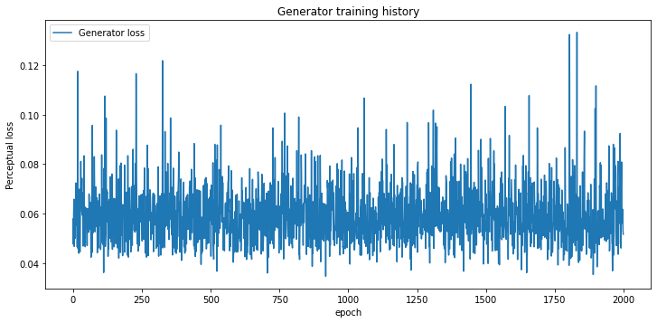
       
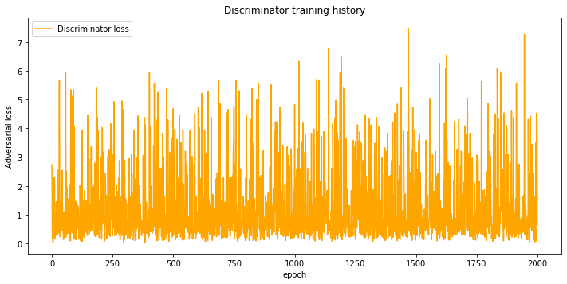
    
    Total computing time: 106 hrs 53 mins 46 secs
    

## SRResNet and SRGAResNet evaluations


```python
# Define paths towards low (input) and high (target) resolution images
lr_path = "../../data/non_segmented/test/LR_Noise/64x64"
hr_path = "../../data/non_segmented/test/HR"

# Define paths to models
srresnet_path = "../../models/PyTorch/non_segmented/SRResNet/PyTorch_SRResNet_500.pt"
srgaresnet_path = "../../models/PyTorch/non_segmented/SRGAResNet/PyTorch_SRGAResNet_2000.pt"

# Define number of images to test
test_size = 10

# Assign device to 'cuda' if available, or to 'cpu' otherwise
device = torch.device('cuda' if torch.cuda.is_available() else 'cpu')

# Enable cudnn benchmark, which allows cudnn to look for the optimal set of algorithms for the current device configuration
cudnn.benchmark = True

# Generate lists of filenames for all images and labels contained within corresponding directories (with full path)
lr_files = list(map(lambda lr_file: os.path.join(lr_path, lr_file), sorted(os.listdir(lr_path))))
hr_files = list(map(lambda hr_file: os.path.join(hr_path, hr_file), sorted(os.listdir(hr_path))))

# Define indices of random samples based on number of testing images
idx_list = np.random.randint(0, len(lr_files), test_size)

# Load models
srresnet = torch.load(srresnet_path)['model'].to(device)
srgaresnet = torch.load(srgaresnet_path)['generator'].to(device)

# Set models to evaluation mode
srresnet.eval()
srgaresnet.eval()

# Loop through testing images
for lr_file, hr_file in np.transpose([lr_files, hr_files])[idx_list]:

    # Read low (input) and high (target) resolution images
    lr_img = io.imread(lr_file, as_gray=True)
    hr_img = io.imread(hr_file, as_gray=True)
    
    # Convert low (input) and high (target) resolution images from numpy.ndarray to torch.FloatTensor format
    lr_img_tensor = torch.cat(3*[torch.FloatTensor(lr_img).unsqueeze(0)])
    hr_img_tensor = torch.cat(3*[torch.FloatTensor(hr_img).unsqueeze(0)])
    
    # Assign images to available device ('cuda' or 'cpu')
    lr_img_tensor = lr_img_tensor.unsqueeze(0).to(device)
    hr_img_tensor = hr_img_tensor.unsqueeze(0).to(device)
    
    # Apply models to low resolution image
    sr_srresnet = srresnet(lr_img_tensor)
    sr_srgaresnet = srgaresnet(lr_img_tensor)
    
    # Convert super resolution images to image format
    sr_srresnet = sr_srresnet.squeeze(0).cpu().detach().numpy()[0,:,:]
    sr_srgaresnet = sr_srgaresnet.squeeze(0).cpu().detach().numpy()[0,:,:]
    
    # Normalize pixel values between 0 and 1
    sr_srresnet = sr_srresnet + np.abs(sr_srresnet.min())
    sr_srresnet = sr_srresnet/(sr_srresnet.max())
    sr_srgaresnet = sr_srgaresnet + np.abs(sr_srgaresnet.min())
    sr_srgaresnet = sr_srgaresnet/(sr_srgaresnet.max())  
    
    # Display low, super (SRResNet and SRGAResNet) and high resolution images
    plt.figure(figsize=(18,8))
    
    plt.subplot(141)
    plt.imshow(lr_img, cmap='gray')
    plt.title('LR', fontsize=20)
    ax = plt.gca()
    ax.axes.get_xaxis().set_visible(False)
    ax.axes.get_yaxis().set_visible(False)
    
    plt.subplot(142)
    plt.imshow(sr_srresnet, cmap='gray')
    plt.title('SRResNet', fontsize=20)
    ax = plt.gca()
    ax.axes.get_xaxis().set_visible(False)
    ax.axes.get_yaxis().set_visible(False)
    
    plt.subplot(143)
    plt.imshow(sr_srgaresnet, cmap='gray')
    plt.title('SRGAResNet', fontsize=20)
    ax = plt.gca()
    ax.axes.get_xaxis().set_visible(False)
    ax.axes.get_yaxis().set_visible(False)
    
    plt.subplot(144)
    plt.imshow(hr_img, cmap='gray')
    plt.title('HR', fontsize=20)
    ax = plt.gca()
    ax.axes.get_xaxis().set_visible(False)
    ax.axes.get_yaxis().set_visible(False)
```

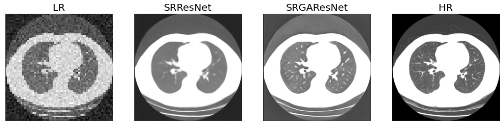
    
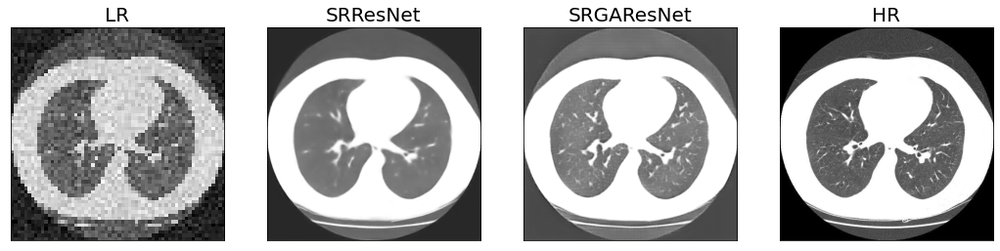
    
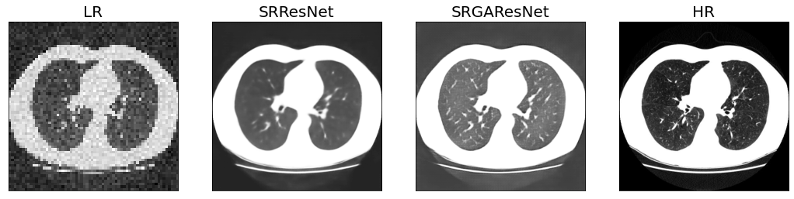
    
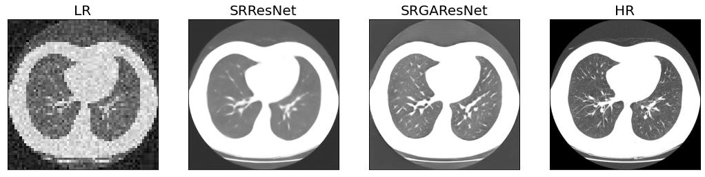
    
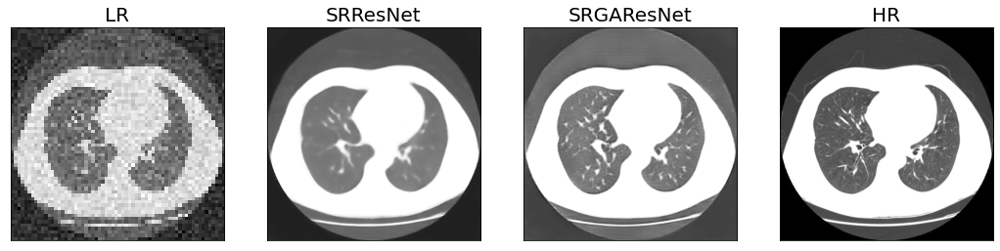
 
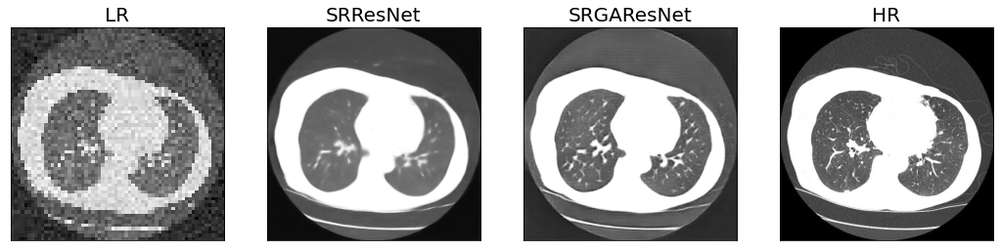
    
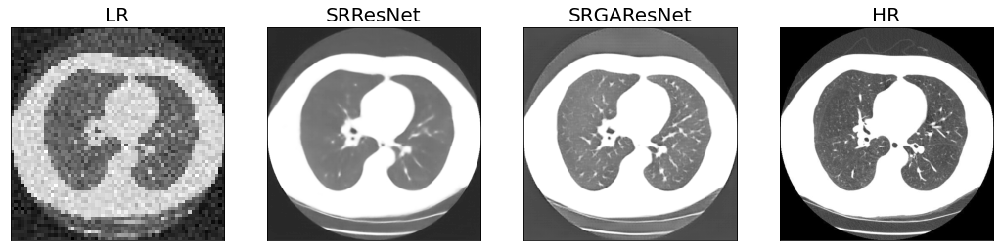

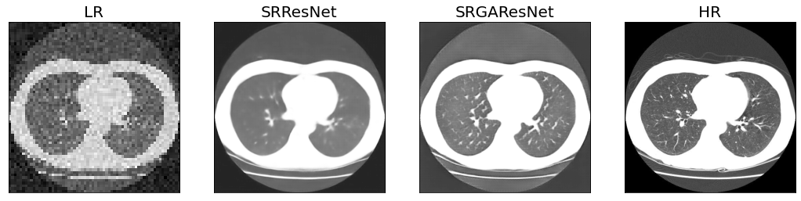
  
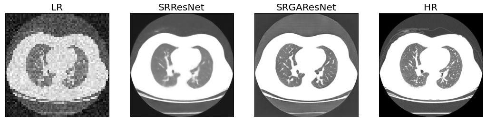
 
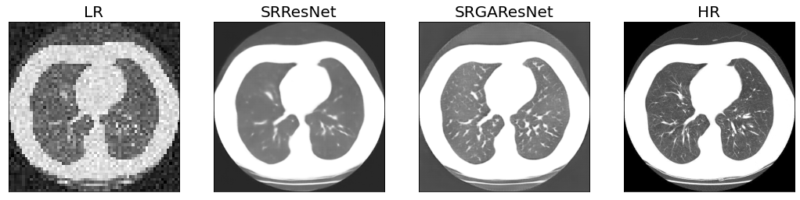

___
# Observations
Throughout training, the content loss of the SRResNet showed a lot of variations and no significant sign of learning. This could be due to either an insufficient number of epochs (i.e., more training required), or a high performance of the model within the first few epochs (i.e., very quick learning).

Similarly to the SRResNet, no clear learning effect was observed for both the Generator and Discriminator of the SRGAN. This does not necessarily imply that the model was unable to learn (as specified in the training interpretation section of the SRResNet). A detailed evaluation on the test sample will provide a better assessment of the performance of the trained model.

When comparing the performances of each model, the SRResNet resulted in slightly blurrier images, but accurately reconstructed the general grayscale tones of the high-resolution target. Conversely, the SRGAN did a better job at reconstructing finer image features, but also resulted in brighter grayscale tones.
