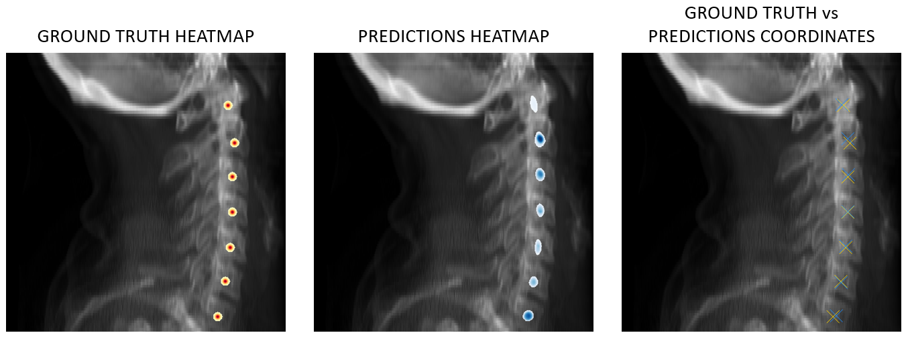

___

<a href='https://www.dourthe-technologies.com'> </a>
___
<center><em>For more information, visit <a href='https://www.dourthe-technologies.com'> www.dourthe-technologies.com</a></em></center>

# Automated Detection of Anatomical Landmarks Using Convolutional Neural Network

## Objectives
To train a Neural Network to automatically detect the coordinates of anatomical landmarks from medical imaging data.

## Neural Network Architecture
The selected architecture is composed of a local and global network [1]. The local network has a U-Net structure and aims to learn dataset-specific features. The global network is built using sequential convolutional layers and aims to extract non-dataset-specific features to facilitate generalization.

## Instructions

### Download Project Directory
Go to https://download-directory.github.io/

Copy/paste the link of this project into the URL bar, then press enter to download the project’s directory.

### Requirements
Create a new Conda Python 3.10 environment (example environment name: medical_landmark_detection_env) and install requirements.txt within this environment.
You will also need to run the following commands to install PyTorch and torchvision:
- conda install pytorch -c pytorch
- pip install torchvision

### Data Management

#### Data Structure
In order to allow the code to run successfully, it is recommended to organize the training data using the following structure:
<pre>
project_directory
└─ data
	└─ spine
		└─ cervical
			├─ images
			│   └─ contains all the raw images available in the training dataset
			└─ labels
				└─ contains a single CSV file with the coordinates of all ground truth landmarks for each image (more details below)</pre>

#### Data Format
Here are the supported data formats:
- images: PNG format (.png)
- labels: CSV file (.csv)

#### Labels File
The CSV file containing the ground truth landmarks coordinates (in pixel coordinates) should have the following structure:

|     | L1 | L2 | ... | Ln |
| --- | --- | --- | --- | --- |
| filename_1 | (L1_x, L1_y) | (L2_x, L2_y) | ... | (Ln_x, Ln_y) | 
| filename_2 | (L1_x, L1_y) | (L2_x, L2_y) | ... | (Ln_x, Ln_y) | 
| ... | (L1_x, L1_y) | (L2_x, L2_y) | ... | (Ln_x, Ln_y) | 
| filename_m | (L1_x, L1_y) | (L2_x, L2_y) | ... | (Ln_x, Ln_y) |

Where each filename should perfectly match with the filename of the corresponding image.

**Example:** If the first sample has the filaneme 'sample_1.png', then filename_1 in the CSV file would be 'sample_1' (without the extension).

### Config Setup
The file 'config.yaml' contains the configuration information to train the model. Some of the parameters listed in this file can be overwritten if specified in the training or testing BAT files (more details in the BAT Files Setup section below).

The most important section to edit in the config file is the dataset information. Specifically:

- dataset:
	- name_list: make sure the name of your dataset appears in the list (e.g. cervical_spine).
	- batch_size_dic: make sure the name of your dataset (exact same as above) appears here with a defined batch size (e.g. cervical_spine: 4).
	- dataset_name: make sure the name of your dataset (exact same as above) appears as a parameter here, with the following list of arguments:
		- prefix: path to directory containing the 'images' and 'labels' folder that you want to use for training (e.g. data/spine/cervical).
		- num_landmark: specify the number of landmarks to detect in your dataset.
		- size: size of the images in pixels (e.g. [512, 512]). Note the images in you dataset can have different sizes. The values indicated here will be used to reshape the images. However, it remains best to choose a size that somewhat matches with the sizes of the input images (e.g. if images are almost squared, specify a squared size).

### Datasets Setup
Go to app > datasets > __ini__.py

In the function 'get_dataset', make sure the name of your dataset appears (exact same as above) with the corresponding dataset class (e.g. cervical_spine: Spine).

Feel free to look at how the Spine class was built by going to app > datasets > spine_dataset.py

You can also use this file as a template to build your own dataset class if you want to use this pipeline on a different dataset (i.e. different format of input images, different format of labels file).

### BAT Files Setup
Two BAT files were defined to run the training and testing of the landmark detection model.

#### Training BAT file (train.bat)
The training BAT file has the following content:

```
@ECHO OFF
call C:\Users\username\anaconda3\Scripts\activate.bat medical_landmark_detection_env
ECHO #-----------------------------------------------------------------------------#
ECHO # Python 3.10 Conda Environment Activated
ECHO #-----------------------------------------------------------------------------#
call cd C:\Users\username\local-folder-path\medical-landmark-detection
call python main.py -d runs -r unet2d_runs -p train -m unet2d -e 50 -ds cervical_spine
PAUSE nul | set /p "=<Hit Enter To Close Window>"
```

To allow it to run on your local computer, make sure to right click on train.bat, edit, and change the following sections:

- Line 2: Write the correct path to activate the Conda environment you created for this project.
- Line 6: Write the correct path to the local copy of the project folder.
- Line 7: Here, you can adjust the settings that will be used to run main.py:

'''
-d: defines the name of the of the directory where the results of each run will be saved (e.g. id set to -d runs, a directory called runs will be created within your local copy of the project folder, and the details of the run will be saved there).

-r: defines the name of the results folder, which will be created within the -d directory, where the results of a specific neural network architecture will be saved.

-p: defines the phase, should be set to train.

-m: defines which model to use (i.e. unet2d or gln).

-e: defines the number of epochs used for training.

-ds: defines the name of the dataset (more details in the Config Setup section above).
'''

#### Testing BAT file (test.bat)
The testing BAT file has the following content:

```
@ECHO OFF
call C:\Users\username\anaconda3\Scripts\activate.bat medical_landmark_detection_env
ECHO #-----------------------------------------------------------------------------#
ECHO # Python 3.10 Conda Environment Activated
ECHO #-----------------------------------------------------------------------------#
call cd C:\Users\username\local-folder-path\medical-landmark-detection
call python main.py -d runs -r unet2d_runs -p test -m unet2d -l u2net -ds cervical_spine -c runs/unet2d_runs/cervical_spine/checkpoints/trained_model.pt
PAUSE nul | set /p "=<Hit Enter To Close Window>"
```

This file can only be run after running the training BAT file. It has a similar structure than the training BAT file, so Lines 2, 6 and 7 can be edited using the same indications as provided above.

The only difference is with Line 7, where most arguments should be set to the exact same as for the training BAT file (e.g. same model architecture, same dataset). The main differences with the training BAT file are listed below:

'''
-p: should be set to test.

-c: defines path to model checkpoint (i.e. location of trained model). Set it to the location of the trained model with best performance on validation.
'''

### Expected Results
After running the training or testing BAT files, the results will be saved at:

runs > results folder (e.g. unet2d_runs) > dataset name (e.g. cervical_spine)

In this directory, you will find:

- checkpoints: folder containing the trained models
- results:
	- loss: folder containing text files with loss information for testing data.
	- test_epoch#: folder containing:
		- 3 images per testing samples for visual assessment (see illustration below).
		- coordinate_results.csv: file containing the x- an y-coordinates of ground truth and predicted landmarks for each testing sample.
		- distance_results.csv: file containing the distance (in pixels) between ground truth and predicated landmarks for each testing sample.

</a>

**NOTE:** in some cases where a landmark is missed or wrongly detected by the model, the two CSV files in the results may need some manual adjustments to make sure the right set of coordinates are compared and used for distance calculation.


## References
[1] Zhu H, Yao Q, Xiao Li, Zhou S.K. You Only Learn Once: Universal Anatomical Landmark Detection. Key Lab of Intelligent Information Processing of Chinese Academy of Sciences (CAS), Institute of Computing Technology, CAS In MICCAI 2021. doi: 10.1007/978-3-030-87240-3_9. arXiv: 2103.04657. https://arxiv.org/abs/2103.04657

</a>
