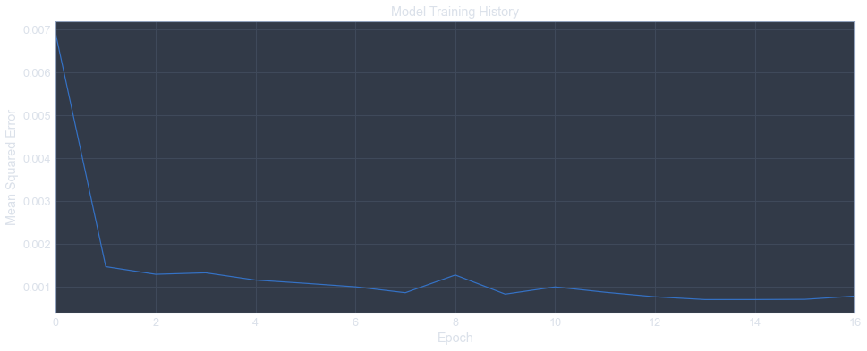
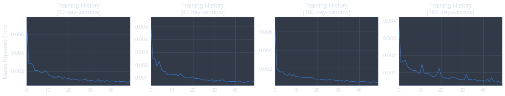

___

<a href='http://www.dourthe.tech'> </a>
___
<center><em>For more information, visit <a href='http://www.dourthe.tech'>www.dourthe.tech</a></em></center>

# Stock Market Forecasting using Deep Recurrent Neural Network

___
## Objective
Train a Deep Recurrent Neural Network (RNN) to predict next day Closing Price of a defined stock by using multivariate historical data and time series segmentation.

___
## Experiments
Several experiments are presented below.

### 1. Google Stock Closing Price Forecasting [Univariate-Single time window]
This experiment only uses the historical closing price of GOOG (univariate).

The model is trained and historical data from January 1st 2005 until one year before current day (i.e. until July 15th 2019) and is tested on the remaining days (until current day -> July 15th 2020).

**NOTE:** Each prediction is made one day into the future, but each prediction made is always using KNOWN data from the specified time window.

**EXAMPLE (with historical window of 90 days/3 months):**
- Prediction on day 1 from test data is generated from KNOWN closing prices from the previous 90 days
- Prediction on day 2 from test data is generated from KNOWN closing prices from the previous 90 days -> we use known data even for the very last point of that second time window and DO NOT USE the prediction made above

As a result, every prediction is always based on KNOWN historical data from previous days. No predicted value is used to build another prediction.

**This means that the plot shown only represents the accuracy of the model at predicting a SINGLE DAY into the future.**

### 2. Google Stock Closing Price Forecasting [Multivariate-Single time window]
This experiment follows the same logic as experiment 1, but includes Low, High, Open, Close and Volume as part of the training data (multivariate) but still tries to predict closing price.

### 3. Next Day Prediction on Single Stock [Multivariate-Multiple time windows-Detailed]
This section was built to train a model on a single stock (to be selected) with no train/test split. The code will import historical data until current day and try to predict closing price for the next day. 

This section also includes the training of 4 models with different segmentation windows (1, 3, 6 months and 1 year).

### 4. Next Day Prediction on Single Stock [Multivariate-Multiple time windows-One script]
This section is identical to section 3, but presented as a single (less detailed) script. 

This section also includes the training of 4 models with different segmentation windows (1, 3, 6 months and 1 year).

### 5. Next Day Prediction on Single Stock [Multivariate-Single time windows-One Script]
This section was built to train a model on a single stock (to be selected) with no train/test split. The code will import historical data until current day and try to predict closing price for the next day.

The difference with sections 3 and 4 is that a single time window is used. Also, the user can select the period during which predictions should be made. The model will be trained using historical data of each data until the day before each prediction is made and will be retrained with an additional day for each new prediction.

The script ends with a chart showing Real vs. Prediction and the possibility to download a DataFrame containing real and predicted values for the defined period.

___
# Libraries import


```python
# Ignore warnings
import warnings
warnings.filterwarnings("ignore")
import logging
logging.getLogger('tensorflow').disabled = True

# Computation time monitoring
import time

# Data processing
import pandas as pd
import numpy as np
import datetime
from datetime import datetime
from datetime import timedelta
from pandas_datareader import data, wb

# Data visualization
import matplotlib.pyplot as plt
from jupyterthemes import jtplot
jtplot.style(theme='chesterish')

# Data normalization
from sklearn.preprocessing import MinMaxScaler

# Neural network architecture
from tensorflow.keras.models import Sequential
from tensorflow.keras.layers import Dense, LSTM, Dropout

# Callbacks
from tensorflow.keras.callbacks import EarlyStopping

# Evaluation
from sklearn.metrics import mean_squared_error
```

___
# Google Stock Closing Price Forecasting [Univariate-Single time window]
**Here, we will only use the closing price column during training and try to predict closing price for the next day**

## Data import
### Select ticker of the stock you wish to import


```python
ticker = 'GOOG'
```

### Select start and end dates and import data from Yahoo Fianance


```python
start = datetime(2005,1,1)
end = datetime.today()
stock = data.DataReader(ticker, 'yahoo', start, end)
stock.tail()
```


<div>
<table border="1" class="dataframe">
  <thead>
    <tr style="text-align: right;">
      <th></th>
      <th>High</th>
      <th>Low</th>
      <th>Open</th>
      <th>Close</th>
      <th>Volume</th>
      <th>Adj Close</th>
    </tr>
    <tr>
      <th>Date</th>
      <th></th>
      <th></th>
      <th></th>
      <th></th>
      <th></th>
      <th></th>
    </tr>
  </thead>
  <tbody>
    <tr>
      <th>2021-07-16</th>
      <td>2643.659912</td>
      <td>2616.429932</td>
      <td>2632.820068</td>
      <td>2636.909912</td>
      <td>742800.0</td>
      <td>2636.909912</td>
    </tr>
    <tr>
      <th>2021-07-19</th>
      <td>2624.939941</td>
      <td>2570.739990</td>
      <td>2623.110107</td>
      <td>2585.080078</td>
      <td>1285500.0</td>
      <td>2585.080078</td>
    </tr>
    <tr>
      <th>2021-07-20</th>
      <td>2640.027100</td>
      <td>2583.768066</td>
      <td>2600.080078</td>
      <td>2622.030029</td>
      <td>953300.0</td>
      <td>2622.030029</td>
    </tr>
    <tr>
      <th>2021-07-21</th>
      <td>2652.344971</td>
      <td>2612.030029</td>
      <td>2615.739990</td>
      <td>2652.010010</td>
      <td>736200.0</td>
      <td>2652.010010</td>
    </tr>
    <tr>
      <th>2021-07-22</th>
      <td>2670.090088</td>
      <td>2648.000000</td>
      <td>2653.000000</td>
      <td>2666.570068</td>
      <td>661276.0</td>
      <td>2666.570068</td>
    </tr>
  </tbody>
</table>
</div>


### Drop all columns beside the closing price column


```python
stock = stock.drop(['High', 'Low', 'Open', 'Volume', 'Adj Close'], axis=1)
stock.tail()
```


<div>
<table border="1" class="dataframe">
  <thead>
    <tr style="text-align: right;">
      <th></th>
      <th>Close</th>
    </tr>
    <tr>
      <th>Date</th>
      <th></th>
    </tr>
  </thead>
  <tbody>
    <tr>
      <th>2021-07-16</th>
      <td>2636.909912</td>
    </tr>
    <tr>
      <th>2021-07-19</th>
      <td>2585.080078</td>
    </tr>
    <tr>
      <th>2021-07-20</th>
      <td>2622.030029</td>
    </tr>
    <tr>
      <th>2021-07-21</th>
      <td>2652.010010</td>
    </tr>
    <tr>
      <th>2021-07-22</th>
      <td>2666.570068</td>
    </tr>
  </tbody>
</table>
</div>


### Plot closing price history


```python
plt.figure(figsize=(16,6))
stock['Close'].plot()
plt.title(ticker + ' Closing Price History')
plt.ylabel('Stock Price [USD]')
plt.show()
```


    

    


## Data pre-processing & Model training
### Choose length of historical data to use to predict next day closing price (in days)
**We will select a window of 3 months (90 days)**


```python
historical_window = 90
days_into_the_future = 1
```

### Train/Test split
**Select test size (i.e. number of days from the historical data that won't be used to train the model)**


```python
test_size = 12*30
```


```python
train = stock[:-test_size]
test = stock[-test_size:]

plt.figure(figsize=(16,6))
plt.plot(train['Close'], label='Training data')
plt.plot(test['Close'], label='Test data')
plt.title(ticker + ' Closing Price History')
plt.ylabel('Stock Price [USD]')
plt.legend()
plt.show()
```


    

    


```python
train.tail()
```


<div>
<table border="1" class="dataframe">
  <thead>
    <tr style="text-align: right;">
      <th></th>
      <th>Close</th>
    </tr>
    <tr>
      <th>Date</th>
      <th></th>
    </tr>
  </thead>
  <tbody>
    <tr>
      <th>2020-02-11</th>
      <td>1508.790039</td>
    </tr>
    <tr>
      <th>2020-02-12</th>
      <td>1518.270020</td>
    </tr>
    <tr>
      <th>2020-02-13</th>
      <td>1514.660034</td>
    </tr>
    <tr>
      <th>2020-02-14</th>
      <td>1520.739990</td>
    </tr>
    <tr>
      <th>2020-02-18</th>
      <td>1519.670044</td>
    </tr>
  </tbody>
</table>
</div>


```python
test.head()
```


<div>
<table border="1" class="dataframe">
  <thead>
    <tr style="text-align: right;">
      <th></th>
      <th>Close</th>
    </tr>
    <tr>
      <th>Date</th>
      <th></th>
    </tr>
  </thead>
  <tbody>
    <tr>
      <th>2020-02-19</th>
      <td>1526.689941</td>
    </tr>
    <tr>
      <th>2020-02-20</th>
      <td>1518.150024</td>
    </tr>
    <tr>
      <th>2020-02-21</th>
      <td>1485.109985</td>
    </tr>
    <tr>
      <th>2020-02-24</th>
      <td>1421.589966</td>
    </tr>
    <tr>
      <th>2020-02-25</th>
      <td>1388.449951</td>
    </tr>
  </tbody>
</table>
</div>


### Feature scaling


```python
scaler = MinMaxScaler()
train_scaled = scaler.fit_transform(train)
test_scaled = scaler.transform(test)
```

### Reshape data into segments for training


```python
X_train = []
y_train = []
for i in range(historical_window, len(train)):
    X_train.append(train_scaled[i-historical_window:i, 0])
    y_train.append(train_scaled[i, 0])
X_train, y_train = np.array(X_train), np.array(y_train)
X_train = np.reshape(X_train, (X_train.shape[0], X_train.shape[1], 1))

X_test = []
y_test = []
for i in range(historical_window, len(test)):
    X_test.append(test_scaled[i-historical_window:i, 0])
    y_test.append(test_scaled[i, 0])
X_test, y_test = np.array(X_test), np.array(y_test)
X_test = np.reshape(X_test, (X_test.shape[0], X_test.shape[1], 1))
```

### Define and train model on training data (with EarlyStopping callbacks)


```python
model = Sequential()

# Create 1st LSTM layer and some Dropout regularisation
model.add(LSTM(units=100, return_sequences=True, input_shape=(X_train.shape[1],1)))
model.add(Dropout(0.2))
# Create 2nd LSTM layer and some Dropout regularisation
model.add(LSTM(units=100, return_sequences=True))
model.add(Dropout(0.2))
# Create 3rd LSTM layer and some Dropout regularisation
model.add(LSTM(units=100, return_sequences=True))
model.add(Dropout(0.2))
# Create 4th LSTM layer and some Dropout regularisation
model.add(LSTM(units=100))
model.add(Dropout(0.2))

# Create output fully connected layer
model.add(Dense(units=days_into_the_future))

# Compile model
model.compile(optimizer='adam', loss='mean_squared_error')

# Define EarlyStopping callbacks
early_stop = EarlyStopping(monitor='val_loss', patience=10)

# Fit the model to the training set
model.fit(X_train, y_train,
          validation_data=(X_test, y_test),
          epochs=100, batch_size=32,
          callbacks=[early_stop])
```

    Epoch 1/100
    117/117 [==============================] - 12s 34ms/step - loss: 0.0198 - val_loss: 0.0452
    Epoch 2/100
    117/117 [==============================] - 3s 25ms/step - loss: 0.0017 - val_loss: 0.0222
    Epoch 3/100
    117/117 [==============================] - 3s 24ms/step - loss: 0.0013 - val_loss: 0.0461
    Epoch 4/100
    117/117 [==============================] - 3s 24ms/step - loss: 0.0015 - val_loss: 0.0092
    Epoch 5/100
    117/117 [==============================] - 3s 24ms/step - loss: 0.0012 - val_loss: 0.0048
    Epoch 6/100
    117/117 [==============================] - 3s 25ms/step - loss: 0.0011 - val_loss: 0.0318
    Epoch 7/100
    117/117 [==============================] - 3s 24ms/step - loss: 0.0012 - val_loss: 0.0047
    Epoch 8/100
    117/117 [==============================] - 3s 24ms/step - loss: 8.8568e-04 - val_loss: 0.0445
    Epoch 9/100
    117/117 [==============================] - 3s 24ms/step - loss: 0.0018 - val_loss: 0.0105
    Epoch 10/100
    117/117 [==============================] - 3s 25ms/step - loss: 8.4266e-04 - val_loss: 0.0052
    Epoch 11/100
    117/117 [==============================] - 3s 25ms/step - loss: 9.6754e-04 - val_loss: 0.0203
    Epoch 12/100
    117/117 [==============================] - 3s 24ms/step - loss: 8.6490e-04 - val_loss: 0.0079
    Epoch 13/100
    117/117 [==============================] - 3s 24ms/step - loss: 7.8853e-04 - val_loss: 0.0237
    Epoch 14/100
    117/117 [==============================] - 3s 25ms/step - loss: 6.9182e-04 - val_loss: 0.0157
    Epoch 15/100
    117/117 [==============================] - 3s 24ms/step - loss: 6.9407e-04 - val_loss: 0.0057
    Epoch 16/100
    117/117 [==============================] - 3s 24ms/step - loss: 7.4263e-04 - val_loss: 0.0145
    Epoch 17/100
    117/117 [==============================] - 3s 24ms/step - loss: 8.5965e-04 - val_loss: 0.0335
    


    <tensorflow.python.keras.callbacks.History at 0x1834451a710>


### Plot training history


```python
loss = pd.DataFrame(model.history.history)

plt.figure(figsize=(16,6))
loss['loss'].plot()
plt.ylabel('Mean Squared Error')
plt.xlabel('Epoch')
plt.title('Model Training History')
plt.show()
```


    

    


## Generate predictions
**NOTE:** Each prediction is made one day into the future, but each prediction made is always using KNOWN data from the specified time window.

**EXAMPLE (with historical window of 90 days/3 months):**
- Prediction on day 1 from test data is generated from KNOWN closing prices from the previous 90 days
- Prediction on day 2 from test data is generated from KNOWN closing prices from the previous 90 days -> we use known data even for the very last point of that second time window and DO NOT USE the prediction made above

As a result, every prediction is always based on KNOWN historical data from previous days. No predicted value is used to build another prediction.

**This means that the plot shown below only represents the accuracy of the model at predicting a SINGLE DAY into the future.**


```python
scaled_predictions = model.predict(X_test)
predictions = scaler.inverse_transform(scaled_predictions)

predictions = pd.DataFrame(predictions, index=test.index[historical_window:], columns=['Close'])
```

### Plot predictions


```python
plt.figure(figsize=(16,12))

plt.subplot(211)
plt.plot(train['Close'], color='steelblue', label='Training data')
plt.plot(test['Close'], color='orange', label='Test data')
plt.plot(predictions['Close'], color='green', label='Predictions')
plt.title(ticker + ' Closing Price History')
plt.ylabel('Stock Price [USD]')
plt.legend()

plt.subplot(212)
plt.plot(test['Close'], color='orange', label='Test data')
plt.plot(predictions['Close'], color='green', label='Predictions')
plt.title('ZOOM on Test and Predictions')
plt.ylabel('Stock Price [USD]')
plt.legend()

plt.show()
```


    

    


### Calculate error


```python
rmse = np.round(np.sqrt(mean_squared_error(test.iloc[historical_window:]['Close'], predictions['Close'])), 2)
rmse_ratio = np.round(rmse*100/stock['Close'].max(), 2)
print('Mean Error (RMSE) for all SINGLE DAY predictions:\t', rmse, ' [USD]\t', rmse_ratio, '% of max historical closing price')
```

    Mean Error (RMSE) for all SINGLE DAY predictions:  262.35  [USD]   9.84 % of max historical closing price
    

___
# Google Stock Closing Price Forecasting [Multivariate-Single time window]
**Here, we will only use all columns from the imported data (High, Low, Open, Close, Volume, Adj Close) during training and try to predict closing price for the next day**


```python
# Select ticker
ticker = 'GOOG'

# Select start and end dates of historical data
start = datetime(2005,1,1)
end = datetime.today()

# Import data from Yahoo Finance
stock = data.DataReader(ticker, 'yahoo', start, end).drop(['Adj Close'], axis=1)
close_idx = stock.columns.get_loc('Close')

# Specify historical windows to use for each model
historical_window = 90

# Specify how far into the future to predict (i.e. lag)
days_into_the_future = 1

# Specify test size (i.e. number of days from the historical data that won't be used to train the model)
test_size = 12*30

# Train/Test split
train = stock[:-test_size]
test = stock[-test_size:]

# Feature scaling
scaler = MinMaxScaler()
train_scaled = scaler.fit_transform(train)
test_scaled = scaler.transform(test)

# Reshape data into segments for training
X_train = []
y_train = []
for i in range(historical_window, len(train)-days_into_the_future+1):
    X_train.append(train_scaled[i-historical_window:i, :])
    y_train.append(train_scaled[i+days_into_the_future-1, close_idx])
X_train, y_train = np.array(X_train), np.array(y_train)
X_train = np.reshape(X_train, (X_train.shape[0], X_train.shape[1], X_train.shape[2]))

X_test = []
y_test = []
for i in range(historical_window, len(test)-days_into_the_future+1):
    X_test.append(test_scaled[i-historical_window:i, :])
    y_test.append(test_scaled[i+days_into_the_future-1, 3])
X_test, y_test = np.array(X_test), np.array(y_test)
X_test = np.reshape(X_test, (X_test.shape[0], X_test.shape[1], X_test.shape[2]))

# Generate sequential model
model = Sequential()

# Create 1st LSTM layer and some Dropout regularisation
model.add(LSTM(units=100, return_sequences=True, input_shape=(X_train.shape[1],X_train.shape[2])))
model.add(Dropout(0.2))
# Create 2nd LSTM layer and some Dropout regularisation
model.add(LSTM(units=100, return_sequences=True))
model.add(Dropout(0.2))
# Create 3rd LSTM layer and some Dropout regularisation
model.add(LSTM(units=100, return_sequences=True))
model.add(Dropout(0.2))
# Create 4th LSTM layer and some Dropout regularisation
model.add(LSTM(units=100))
model.add(Dropout(0.2))

# Create output fully connected layer
model.add(Dense(units=days_into_the_future))

# Compile model
model.compile(optimizer='adam', loss='mean_squared_error')

# Define EarlyStopping callbacks
early_stop = EarlyStopping(monitor='val_loss', patience=10)

# Fit the model to the training set
model.fit(X_train, y_train,
          validation_data=(X_test, y_test),
          epochs=100, batch_size=32,
          callbacks=[early_stop])
    
# Save loss as dataframe
loss = pd.DataFrame(model.history.history)

plt.figure(figsize=(16,6))

loss['loss'].plot()
plt.ylabel('Mean Squared Error')
plt.title('Training History [Historical window = 90 days]')
plt.show()

# Generate predictions for the whole test period
scaled_predictions = model.predict(X_test)
scaled_predictions = np.transpose([scaled_predictions.reshape(-1)]*X_test.shape[2]).reshape(X_test.shape[0],X_test.shape[2])
# Unscale prediction
predictions = scaler.inverse_transform(scaled_predictions)
predictions = pd.DataFrame(predictions[:,0], index=test.index[historical_window:], columns=['Close'])

# Plot predictions
plt.figure(figsize=(16,12))

plt.subplot(211)
plt.plot(train['Close'], color='steelblue', label='Training data')
plt.plot(test['Close'], color='orange', label='Test data')
plt.plot(predictions['Close'], color='green', label='Predictions')
plt.title(ticker + ' Closing Price History')
plt.ylabel('Stock Price [USD]')
plt.legend()

plt.subplot(212)
plt.plot(test['Close'], color='orange', label='Test data')
plt.plot(predictions['Close'], color='green', label='Predictions')
plt.title('ZOOM on Test and Predictions')
plt.ylabel('Stock Price [USD]')
plt.legend()

plt.show()

rmse = np.round(np.sqrt(mean_squared_error(test.iloc[historical_window:]['Close'], predictions['Close'])), 2)
rmse_ratio = np.round(rmse*100/stock['Close'].max(), 2)
print('Mean Error (RMSE) for all SINGLE DAY predictions:\t', rmse, ' [USD]\t', rmse_ratio, '% of max historical closing price')
```

    Epoch 1/100
    117/117 [==============================] - 7s 32ms/step - loss: 0.0142 - val_loss: 0.0230
    Epoch 2/100
    117/117 [==============================] - 3s 24ms/step - loss: 0.0013 - val_loss: 0.0499
    Epoch 3/100
    117/117 [==============================] - 3s 24ms/step - loss: 0.0015 - val_loss: 0.0331
    Epoch 4/100
    117/117 [==============================] - 3s 24ms/step - loss: 0.0016 - val_loss: 0.0163
    Epoch 5/100
    117/117 [==============================] - 3s 24ms/step - loss: 0.0012 - val_loss: 0.0161
    Epoch 6/100
    117/117 [==============================] - 3s 24ms/step - loss: 0.0013 - val_loss: 0.0174
    Epoch 7/100
    117/117 [==============================] - 3s 24ms/step - loss: 9.4943e-04 - val_loss: 0.0222
    Epoch 8/100
    117/117 [==============================] - 3s 24ms/step - loss: 9.0660e-04 - val_loss: 0.0333
    Epoch 9/100
    117/117 [==============================] - 3s 24ms/step - loss: 9.8506e-04 - val_loss: 0.0215
    Epoch 10/100
    117/117 [==============================] - 3s 23ms/step - loss: 9.5124e-04 - val_loss: 0.0326
    Epoch 11/100
    117/117 [==============================] - 3s 24ms/step - loss: 0.0010 - val_loss: 0.0397
    Epoch 12/100
    117/117 [==============================] - 3s 24ms/step - loss: 7.4106e-04 - val_loss: 0.0254
    Epoch 13/100
    117/117 [==============================] - 3s 24ms/step - loss: 7.1730e-04 - val_loss: 0.0376
    Epoch 14/100
    117/117 [==============================] - 3s 24ms/step - loss: 7.1052e-04 - val_loss: 0.0286
    Epoch 15/100
    117/117 [==============================] - 3s 24ms/step - loss: 6.4937e-04 - val_loss: 0.0165
    


    

    


    

    


    Mean Error (RMSE) for all SINGLE DAY predictions:  176.73  [USD]   6.63 % of max historical closing price
    

___
# Next Day Prediction on Single Stock [Multivariate-Multiple time windows-Detailed]


## Data import
### Select ticker of the stock you wish to import


```python
ticker = 'GNUS'
```


```python
start = datetime(2014,1,1)
end = datetime.today()
stock = data.DataReader(ticker, 'yahoo', start, end).drop(['Adj Close'], axis=1)
close_idx = stock.columns.get_loc('Close')
stock.tail()
```


<div>
<table border="1" class="dataframe">
  <thead>
    <tr style="text-align: right;">
      <th></th>
      <th>High</th>
      <th>Low</th>
      <th>Open</th>
      <th>Close</th>
      <th>Volume</th>
    </tr>
    <tr>
      <th>Date</th>
      <th></th>
      <th></th>
      <th></th>
      <th></th>
      <th></th>
    </tr>
  </thead>
  <tbody>
    <tr>
      <th>2021-07-16</th>
      <td>1.61</td>
      <td>1.52</td>
      <td>1.60</td>
      <td>1.53</td>
      <td>4896500.0</td>
    </tr>
    <tr>
      <th>2021-07-19</th>
      <td>1.54</td>
      <td>1.46</td>
      <td>1.51</td>
      <td>1.52</td>
      <td>6113200.0</td>
    </tr>
    <tr>
      <th>2021-07-20</th>
      <td>1.69</td>
      <td>1.51</td>
      <td>1.51</td>
      <td>1.66</td>
      <td>8677900.0</td>
    </tr>
    <tr>
      <th>2021-07-21</th>
      <td>1.74</td>
      <td>1.67</td>
      <td>1.69</td>
      <td>1.71</td>
      <td>5408700.0</td>
    </tr>
    <tr>
      <th>2021-07-22</th>
      <td>1.72</td>
      <td>1.61</td>
      <td>1.72</td>
      <td>1.65</td>
      <td>3603339.0</td>
    </tr>
  </tbody>
</table>
</div>


### Plot closing price history


```python
plt.figure(figsize=(16,6))
stock['Close'].plot()
plt.title(ticker + ' Closing Price History')
plt.ylabel('Stock Price [USD]')
plt.show()
```


    

    


## Data pre-processing & Model training
### Choose length of historical data to use to predict next day closing price (in days)
**NOTE:** We will define a list of windows (1, 3, 6 months and 1 year) and train one model for each window and test which model offers the best prediction.


```python
historical_windows = [30, 90, 180, 365]
days_into_the_future = 1
```

### Feature scaling


```python
scaler = MinMaxScaler()
scaled_stock = scaler.fit_transform(stock)
```

## In the following cell, we will:
### 1. Reshape data into segments for training
**Each segment in X will contain historical data from as many days as specified by the historical window length (see above) and each corresponding value in y will include the closing price of the day that follows that window.**

**EXAMPLE (with historical window of 30 days/1 month)**
- 1st row in X will have data from day 1 to day 30, and 1st value in y will have data from day 31.
- 2nd row in X will have data from day 2 to day 31, and 2nd value in y will have data from day 32.
- etc.

### 2. Define, compile and train model for each defined historical window
### 3. Save loss into dataframe


```python
for win in historical_windows:
    
    print('\nMODEL with HISTORICAL WINDOW of', win, 'DAYS\n')
    
    X = []
    y = []
    for i in range(win, len(stock)):
        X.append(scaled_stock[i-win:i, :])
        y.append(scaled_stock[i, close_idx])
    X, y = np.array(X), np.array(y)
    X = np.reshape(X, (X.shape[0], X.shape[1], X.shape[2]))

    exec('model_' + str(win) + " = Sequential()")

    # Create 1st LSTM layer and some Dropout regularisation
    exec('model_' + str(win) + ".add(LSTM(units=100, return_sequences=True, input_shape=(X.shape[1],X.shape[2])))")
    exec('model_' + str(win) + ".add(Dropout(0.2))")
    # Create 2nd LSTM layer and some Dropout regularisation
    exec('model_' + str(win) + ".add(LSTM(units=100, return_sequences=True))")
    exec('model_' + str(win) + ".add(Dropout(0.2))")
    # Create 3rd LSTM layer and some Dropout regularisation
    exec('model_' + str(win) + ".add(LSTM(units=100, return_sequences=True))")
    exec('model_' + str(win) + ".add(Dropout(0.2))")
    # Create 4th LSTM layer and some Dropout regularisation
    exec('model_' + str(win) + ".add(LSTM(units=100))")
    exec('model_' + str(win) + ".add(Dropout(0.2))")

    # Create output fully connected layer
    exec('model_' + str(win) + ".add(Dense(units=days_into_the_future))")

    # Compile model
    exec('model_' + str(win) + ".compile(optimizer='adam', loss='mean_squared_error')")

    # Fit the model to the training set
    exec('model_' + str(win) + ".fit(X, y, epochs=50, batch_size=32)")
    
    # Save loss as dataframe
    exec('loss_' + str(win) + ' = pd.DataFrame(model_' + str(win) + '.history.history)')
```

    
    MODEL with HISTORICAL WINDOW of 30 DAYS
    
    Epoch 1/50
    59/59 [==============================] - 4s 14ms/step - loss: 0.0125
    Epoch 2/50
    59/59 [==============================] - 1s 13ms/step - loss: 0.0029
    Epoch 3/50
    59/59 [==============================] - 1s 12ms/step - loss: 0.0029
    Epoch 4/50
    59/59 [==============================] - 1s 12ms/step - loss: 0.0023
    Epoch 5/50
    59/59 [==============================] - 1s 12ms/step - loss: 0.0025
    Epoch 6/50
    59/59 [==============================] - 1s 12ms/step - loss: 0.0022
    Epoch 7/50
    59/59 [==============================] - 1s 12ms/step - loss: 0.0017
    Epoch 8/50
    59/59 [==============================] - 1s 12ms/step - loss: 0.0019
    Epoch 9/50
    59/59 [==============================] - 1s 11ms/step - loss: 0.0026
    Epoch 10/50
    59/59 [==============================] - 1s 12ms/step - loss: 0.0014
    Epoch 11/50
    59/59 [==============================] - 1s 12ms/step - loss: 0.0016
    Epoch 12/50
    59/59 [==============================] - 1s 12ms/step - loss: 0.0018
    Epoch 13/50
    59/59 [==============================] - 1s 12ms/step - loss: 0.0014
    Epoch 14/50
    59/59 [==============================] - 1s 12ms/step - loss: 0.0018
    Epoch 15/50
    59/59 [==============================] - 1s 12ms/step - loss: 0.0013
    Epoch 16/50
    59/59 [==============================] - 1s 12ms/step - loss: 0.0015
    Epoch 17/50
    59/59 [==============================] - 1s 12ms/step - loss: 0.0012A: 0s - loss:
    Epoch 18/50
    59/59 [==============================] - 1s 12ms/step - loss: 0.0012
    Epoch 19/50
    59/59 [==============================] - 1s 12ms/step - loss: 0.0015
    Epoch 20/50
    59/59 [==============================] - 1s 12ms/step - loss: 0.0013
    Epoch 21/50
    59/59 [==============================] - 1s 12ms/step - loss: 0.0015
    Epoch 22/50
    59/59 [==============================] - 1s 13ms/step - loss: 0.0012
    Epoch 23/50
    59/59 [==============================] - 1s 11ms/step - loss: 0.0013
    Epoch 24/50
    59/59 [==============================] - 1s 12ms/step - loss: 0.0012
    Epoch 25/50
    59/59 [==============================] - 1s 12ms/step - loss: 0.0010
    Epoch 26/50
    59/59 [==============================] - 1s 11ms/step - loss: 0.0011
    Epoch 27/50
    59/59 [==============================] - 1s 12ms/step - loss: 8.6586e-04
    Epoch 28/50
    59/59 [==============================] - 1s 12ms/step - loss: 0.0012
    Epoch 29/50
    59/59 [==============================] - 1s 12ms/step - loss: 0.0013
    Epoch 30/50
    59/59 [==============================] - 1s 12ms/step - loss: 0.0014
    Epoch 31/50
    59/59 [==============================] - 1s 12ms/step - loss: 9.3947e-04
    Epoch 32/50
    59/59 [==============================] - 1s 12ms/step - loss: 0.0010
    Epoch 33/50
    59/59 [==============================] - 1s 12ms/step - loss: 0.0012
    Epoch 34/50
    59/59 [==============================] - 1s 11ms/step - loss: 9.0574e-04
    Epoch 35/50
    59/59 [==============================] - 1s 12ms/step - loss: 0.0011
    Epoch 36/50
    59/59 [==============================] - 1s 12ms/step - loss: 8.6002e-04
    Epoch 37/50
    59/59 [==============================] - 1s 11ms/step - loss: 8.6578e-04
    Epoch 38/50
    59/59 [==============================] - 1s 12ms/step - loss: 9.8095e-04
    Epoch 39/50
    59/59 [==============================] - 1s 12ms/step - loss: 8.3744e-04
    Epoch 40/50
    59/59 [==============================] - 1s 12ms/step - loss: 0.0010
    Epoch 41/50
    59/59 [==============================] - 1s 12ms/step - loss: 7.6801e-04
    Epoch 42/50
    59/59 [==============================] - 1s 12ms/step - loss: 7.9500e-04
    Epoch 43/50
    59/59 [==============================] - 1s 11ms/step - loss: 7.5518e-04
    Epoch 44/50
    59/59 [==============================] - 1s 12ms/step - loss: 7.6432e-04
    Epoch 45/50
    59/59 [==============================] - 1s 12ms/step - loss: 8.5471e-04
    Epoch 46/50
    59/59 [==============================] - 1s 12ms/step - loss: 0.0010
    Epoch 47/50
    59/59 [==============================] - 1s 12ms/step - loss: 7.5717e-04
    Epoch 48/50
    59/59 [==============================] - 1s 12ms/step - loss: 8.2650e-04
    Epoch 49/50
    59/59 [==============================] - 1s 12ms/step - loss: 9.1909e-04
    Epoch 50/50
    59/59 [==============================] - 1s 12ms/step - loss: 7.3663e-04
    
    MODEL with HISTORICAL WINDOW of 90 DAYS
    
    Epoch 1/50
    57/57 [==============================] - 5s 25ms/step - loss: 0.0119
    Epoch 2/50
    57/57 [==============================] - 1s 22ms/step - loss: 0.0027
    Epoch 3/50
    57/57 [==============================] - 1s 24ms/step - loss: 0.0024
    Epoch 4/50
    57/57 [==============================] - 1s 23ms/step - loss: 0.0024
    Epoch 5/50
    57/57 [==============================] - 1s 22ms/step - loss: 0.0020
    Epoch 6/50
    57/57 [==============================] - 1s 23ms/step - loss: 0.0017
    Epoch 7/50
    57/57 [==============================] - 1s 23ms/step - loss: 0.0013
    Epoch 8/50
    57/57 [==============================] - 1s 23ms/step - loss: 0.0016
    Epoch 9/50
    57/57 [==============================] - 1s 23ms/step - loss: 0.0015
    Epoch 10/50
    57/57 [==============================] - 1s 23ms/step - loss: 0.0013
    Epoch 11/50
    57/57 [==============================] - 1s 23ms/step - loss: 0.0014
    Epoch 12/50
    57/57 [==============================] - 1s 24ms/step - loss: 0.0012
    Epoch 13/50
    57/57 [==============================] - 1s 23ms/step - loss: 0.0012A: 0s - 
    Epoch 14/50
    57/57 [==============================] - 1s 23ms/step - loss: 9.1266e-04
    Epoch 15/50
    57/57 [==============================] - 1s 23ms/step - loss: 0.0012
    Epoch 16/50
    57/57 [==============================] - 1s 23ms/step - loss: 0.0014
    Epoch 17/50
    57/57 [==============================] - 1s 24ms/step - loss: 0.0011
    Epoch 18/50
    57/57 [==============================] - 1s 23ms/step - loss: 0.0011
    Epoch 19/50
    57/57 [==============================] - 1s 23ms/step - loss: 8.7061e-04
    Epoch 20/50
    57/57 [==============================] - 1s 23ms/step - loss: 0.0014
    Epoch 21/50
    57/57 [==============================] - 1s 23ms/step - loss: 0.0011
    Epoch 22/50
    57/57 [==============================] - 1s 23ms/step - loss: 0.0010
    Epoch 23/50
    57/57 [==============================] - 1s 23ms/step - loss: 0.0010
    Epoch 24/50
    57/57 [==============================] - 1s 23ms/step - loss: 9.1610e-04
    Epoch 25/50
    57/57 [==============================] - 1s 22ms/step - loss: 8.9846e-04
    Epoch 26/50
    57/57 [==============================] - 1s 23ms/step - loss: 9.2276e-04
    Epoch 27/50
    57/57 [==============================] - 1s 23ms/step - loss: 7.6986e-04
    Epoch 28/50
    57/57 [==============================] - 1s 22ms/step - loss: 7.4657e-04
    Epoch 29/50
    57/57 [==============================] - 1s 23ms/step - loss: 8.9171e-04
    Epoch 30/50
    57/57 [==============================] - 1s 23ms/step - loss: 8.5775e-04
    Epoch 31/50
    57/57 [==============================] - 1s 22ms/step - loss: 7.1638e-04
    Epoch 32/50
    57/57 [==============================] - 1s 23ms/step - loss: 8.5969e-04
    Epoch 33/50
    57/57 [==============================] - 1s 23ms/step - loss: 8.5403e-04
    Epoch 34/50
    57/57 [==============================] - 1s 23ms/step - loss: 6.6323e-04
    Epoch 35/50
    57/57 [==============================] - 1s 23ms/step - loss: 8.7175e-04
    Epoch 36/50
    57/57 [==============================] - 1s 22ms/step - loss: 7.0903e-04
    Epoch 37/50
    57/57 [==============================] - 1s 23ms/step - loss: 9.5127e-04
    Epoch 38/50
    57/57 [==============================] - 1s 23ms/step - loss: 6.8891e-04
    Epoch 39/50
    57/57 [==============================] - 1s 23ms/step - loss: 7.2791e-04
    Epoch 40/50
    57/57 [==============================] - 1s 23ms/step - loss: 6.4293e-04
    Epoch 41/50
    57/57 [==============================] - 1s 22ms/step - loss: 5.9963e-04
    Epoch 42/50
    57/57 [==============================] - 1s 23ms/step - loss: 6.1316e-04
    Epoch 43/50
    57/57 [==============================] - 1s 24ms/step - loss: 7.1580e-04
    Epoch 44/50
    57/57 [==============================] - 1s 22ms/step - loss: 6.3567e-04
    Epoch 45/50
    57/57 [==============================] - 1s 22ms/step - loss: 6.9454e-04
    Epoch 46/50
    57/57 [==============================] - 1s 24ms/step - loss: 6.0673e-04
    Epoch 47/50
    57/57 [==============================] - 1s 23ms/step - loss: 7.2476e-04
    Epoch 48/50
    57/57 [==============================] - 1s 23ms/step - loss: 9.4661e-04
    Epoch 49/50
    57/57 [==============================] - 1s 23ms/step - loss: 5.8149e-04
    Epoch 50/50
    57/57 [==============================] - 1s 23ms/step - loss: 6.5706e-04
    
    MODEL with HISTORICAL WINDOW of 180 DAYS
    
    Epoch 1/50
    54/54 [==============================] - 6s 42ms/step - loss: 0.0105
    Epoch 2/50
    54/54 [==============================] - 2s 40ms/step - loss: 0.0020
    Epoch 3/50
    54/54 [==============================] - 2s 40ms/step - loss: 0.0018
    Epoch 4/50
    54/54 [==============================] - 2s 39ms/step - loss: 0.0020
    Epoch 5/50
    54/54 [==============================] - 2s 40ms/step - loss: 0.0020
    Epoch 6/50
    54/54 [==============================] - 2s 40ms/step - loss: 0.0016
    Epoch 7/50
    54/54 [==============================] - 2s 40ms/step - loss: 0.0018
    Epoch 8/50
    54/54 [==============================] - 2s 40ms/step - loss: 0.0012
    Epoch 9/50
    54/54 [==============================] - 2s 40ms/step - loss: 0.0010
    Epoch 10/50
    54/54 [==============================] - 2s 40ms/step - loss: 0.0013
    Epoch 11/50
    54/54 [==============================] - 2s 40ms/step - loss: 0.0010
    Epoch 12/50
    54/54 [==============================] - 2s 39ms/step - loss: 0.0011
    Epoch 13/50
    54/54 [==============================] - 2s 39ms/step - loss: 9.1014e-04
    Epoch 14/50
    54/54 [==============================] - 2s 40ms/step - loss: 0.0010
    Epoch 15/50
    54/54 [==============================] - 2s 40ms/step - loss: 8.5050e-04
    Epoch 16/50
    54/54 [==============================] - 2s 40ms/step - loss: 8.8260e-04
    Epoch 17/50
    54/54 [==============================] - 2s 41ms/step - loss: 9.8856e-04
    Epoch 18/50
    54/54 [==============================] - 2s 40ms/step - loss: 0.0010
    Epoch 19/50
    54/54 [==============================] - 2s 40ms/step - loss: 8.2742e-04
    Epoch 20/50
    54/54 [==============================] - 2s 39ms/step - loss: 8.9262e-04
    Epoch 21/50
    54/54 [==============================] - 2s 40ms/step - loss: 8.6281e-04
    Epoch 22/50
    54/54 [==============================] - 2s 39ms/step - loss: 7.9360e-04
    Epoch 23/50
    54/54 [==============================] - 2s 40ms/step - loss: 8.6725e-04
    Epoch 24/50
    54/54 [==============================] - 2s 41ms/step - loss: 8.2565e-04
    Epoch 25/50
    54/54 [==============================] - 2s 40ms/step - loss: 9.1314e-04
    Epoch 26/50
    54/54 [==============================] - 2s 40ms/step - loss: 9.4243e-04
    Epoch 27/50
    54/54 [==============================] - 2s 40ms/step - loss: 6.3427e-04
    Epoch 28/50
    54/54 [==============================] - 2s 40ms/step - loss: 8.0845e-04
    Epoch 29/50
    54/54 [==============================] - 2s 40ms/step - loss: 8.6772e-04
    Epoch 30/50
    54/54 [==============================] - 2s 40ms/step - loss: 8.7516e-04
    Epoch 31/50
    54/54 [==============================] - 2s 40ms/step - loss: 7.2029e-04
    Epoch 32/50
    54/54 [==============================] - 2s 39ms/step - loss: 7.4479e-04
    Epoch 33/50
    54/54 [==============================] - 2s 40ms/step - loss: 6.3095e-04
    Epoch 34/50
    54/54 [==============================] - 2s 40ms/step - loss: 6.0584e-04
    Epoch 35/50
    54/54 [==============================] - 2s 39ms/step - loss: 5.9760e-04
    Epoch 36/50
    54/54 [==============================] - 2s 40ms/step - loss: 6.2591e-04
    Epoch 37/50
    54/54 [==============================] - 2s 40ms/step - loss: 5.1803e-04
    Epoch 38/50
    54/54 [==============================] - 2s 40ms/step - loss: 7.5463e-04
    Epoch 39/50
    54/54 [==============================] - 2s 40ms/step - loss: 5.4107e-04
    Epoch 40/50
    54/54 [==============================] - 2s 40ms/step - loss: 6.3182e-04
    Epoch 41/50
    54/54 [==============================] - 2s 40ms/step - loss: 5.6462e-04
    Epoch 42/50
    54/54 [==============================] - 2s 40ms/step - loss: 5.8179e-04
    Epoch 43/50
    54/54 [==============================] - 2s 40ms/step - loss: 5.1038e-04
    Epoch 44/50
    54/54 [==============================] - 2s 40ms/step - loss: 5.8194e-04
    Epoch 45/50
    54/54 [==============================] - 2s 39ms/step - loss: 5.6330e-04
    Epoch 46/50
    54/54 [==============================] - 2s 40ms/step - loss: 6.2063e-04
    Epoch 47/50
    54/54 [==============================] - 2s 40ms/step - loss: 5.1023e-04
    Epoch 48/50
    54/54 [==============================] - 2s 41ms/step - loss: 4.2977e-04
    Epoch 49/50
    54/54 [==============================] - 2s 41ms/step - loss: 4.8805e-04
    Epoch 50/50
    54/54 [==============================] - 2s 41ms/step - loss: 5.0841e-04
    
    MODEL with HISTORICAL WINDOW of 365 DAYS
    
    Epoch 1/50
    49/49 [==============================] - 7s 79ms/step - loss: 0.0086
    Epoch 2/50
    49/49 [==============================] - 4s 77ms/step - loss: 0.0014
    Epoch 3/50
    49/49 [==============================] - 4s 77ms/step - loss: 0.0014
    Epoch 4/50
    49/49 [==============================] - 4s 77ms/step - loss: 0.0017
    Epoch 5/50
    49/49 [==============================] - 4s 77ms/step - loss: 0.0021
    Epoch 6/50
    49/49 [==============================] - 4s 77ms/step - loss: 9.5394e-04
    Epoch 7/50
    49/49 [==============================] - 4s 77ms/step - loss: 0.0011
    Epoch 8/50
    49/49 [==============================] - 4s 76ms/step - loss: 0.0011
    Epoch 9/50
    49/49 [==============================] - 4s 77ms/step - loss: 0.0012
    Epoch 10/50
    49/49 [==============================] - 4s 76ms/step - loss: 8.2243e-04
    Epoch 11/50
    49/49 [==============================] - 4s 78ms/step - loss: 8.5754e-04
    Epoch 12/50
    49/49 [==============================] - 4s 77ms/step - loss: 9.6716e-04
    Epoch 13/50
    49/49 [==============================] - 4s 77ms/step - loss: 0.0010
    Epoch 14/50
    49/49 [==============================] - 4s 78ms/step - loss: 0.0017
    Epoch 15/50
    49/49 [==============================] - 4s 77ms/step - loss: 8.6140e-04
    Epoch 16/50
    49/49 [==============================] - 4s 77ms/step - loss: 8.1505e-04
    Epoch 17/50
    49/49 [==============================] - 4s 77ms/step - loss: 7.1452e-04
    Epoch 18/50
    49/49 [==============================] - 4s 77ms/step - loss: 7.7689e-04
    Epoch 19/50
    49/49 [==============================] - 4s 77ms/step - loss: 6.1839e-04
    Epoch 20/50
    49/49 [==============================] - 4s 77ms/step - loss: 6.5341e-04
    Epoch 21/50
    49/49 [==============================] - 4s 78ms/step - loss: 6.5490e-04
    Epoch 22/50
    49/49 [==============================] - 4s 77ms/step - loss: 5.7520e-04
    Epoch 23/50
    49/49 [==============================] - 4s 77ms/step - loss: 6.8120e-04
    Epoch 24/50
    49/49 [==============================] - 4s 78ms/step - loss: 8.7972e-04
    Epoch 25/50
    49/49 [==============================] - 4s 77ms/step - loss: 5.9975e-04
    Epoch 26/50
    49/49 [==============================] - 4s 80ms/step - loss: 9.2656e-04
    Epoch 27/50
    49/49 [==============================] - 4s 78ms/step - loss: 6.1494e-04
    Epoch 28/50
    49/49 [==============================] - 4s 77ms/step - loss: 7.2746e-04
    Epoch 29/50
    49/49 [==============================] - 4s 77ms/step - loss: 7.0533e-04
    Epoch 30/50
    49/49 [==============================] - 4s 77ms/step - loss: 7.6914e-04
    Epoch 31/50
    49/49 [==============================] - 4s 76ms/step - loss: 6.1989e-04
    Epoch 32/50
    49/49 [==============================] - 4s 77ms/step - loss: 6.6868e-04
    Epoch 33/50
    49/49 [==============================] - 4s 78ms/step - loss: 8.5311e-04
    Epoch 34/50
    49/49 [==============================] - 4s 77ms/step - loss: 4.4848e-04
    Epoch 35/50
    49/49 [==============================] - 4s 77ms/step - loss: 5.9602e-04
    Epoch 36/50
    49/49 [==============================] - 4s 77ms/step - loss: 4.7962e-04
    Epoch 37/50
    49/49 [==============================] - 4s 77ms/step - loss: 4.8822e-04
    Epoch 38/50
    49/49 [==============================] - 4s 77ms/step - loss: 6.1820e-04
    Epoch 39/50
    49/49 [==============================] - 4s 77ms/step - loss: 4.6881e-04
    Epoch 40/50
    49/49 [==============================] - 4s 76ms/step - loss: 4.9893e-04
    Epoch 41/50
    49/49 [==============================] - 4s 77ms/step - loss: 4.9459e-04
    Epoch 42/50
    49/49 [==============================] - 4s 77ms/step - loss: 5.2015e-04
    Epoch 43/50
    49/49 [==============================] - 4s 77ms/step - loss: 4.8869e-04
    Epoch 44/50
    49/49 [==============================] - 4s 78ms/step - loss: 4.6914e-04
    Epoch 45/50
    49/49 [==============================] - 4s 77ms/step - loss: 4.0841e-04
    Epoch 46/50
    49/49 [==============================] - 4s 77ms/step - loss: 4.4922e-04
    Epoch 47/50
    49/49 [==============================] - 4s 76ms/step - loss: 5.1253e-04
    Epoch 48/50
    49/49 [==============================] - 4s 77ms/step - loss: 4.5038e-04
    Epoch 49/50
    49/49 [==============================] - 4s 77ms/step - loss: 4.5974e-04
    Epoch 50/50
    49/49 [==============================] - 4s 77ms/step - loss: 3.8341e-04
    

### Plot training history


```python
plt.figure(figsize=(16,12))

plt.subplot(221)
loss_30['loss'].plot()
plt.ylabel('Mean Squared Error')
plt.title('Training History [Historical window = 30 days]')

plt.subplot(222)
loss_90['loss'].plot()
plt.ylabel('Mean Squared Error')
plt.title('Training History [Historical window = 90 days]')

plt.subplot(223)
loss_180['loss'].plot()
plt.ylabel('Mean Squared Error')
plt.title('Training History [Historical window = 180 days]')

plt.subplot(224)
loss_365['loss'].plot()
plt.ylabel('Mean Squared Error')
plt.title('Training History [Historical window = 365 days]')

plt.show()
```


    

    


## Generate prediction for upcoming day


```python
# Generate tomorrow's timestamp
tomorrow = stock.index[-1] + timedelta(days=1)
print('\033[1mPredicted Closing Price for', ticker, 'on', tomorrow.strftime("%a. %b. %d, %Y"), '\033[0m')

# Generate prediction using each model trained for different historical windows
for win in historical_windows:
    # Isolate last segment of data
    last_segment = scaled_stock[-win:]
    # Reshape last segment of data to match with the input shape of the RNN
    last_segment = last_segment.reshape((1, last_segment.shape[0], last_segment.shape[1]))
    # Generate scaled prediction
    exec('scaled_prediction_' + str(win) + ' = model_' + str(win) + '.predict(last_segment)')
    if last_segment.shape[1] > 1:
        exec('scaled_prediction_' + str(win) + ' = np.array([scaled_prediction_' + str(win) + ']*scaled_stock.shape[1]).reshape(last_segment.shape[0],-1)')
    # Unscale prediction
    exec('prediction_' + str(win) + ' = scaler.inverse_transform(scaled_prediction_' + str(win) + ')')
    
    # Print prediction
    exec("print('\t[Historical window = " + str(win) + " days]\t', np.round(prediction_" + str(win) + "[0][0], 4), ' USD')")
```

    Predicted Closing Price for GNUS on Fri. Jul. 23, 2021 
      [Historical window = 30 days]     1.9592  USD
      [Historical window = 90 days]     1.9102  USD
      [Historical window = 180 days]    1.7272  USD
      [Historical window = 365 days]    1.8588  USD
    

___
# Next Day Prediction on Single Stock [Multivariate-Multiple time windows-One Script]


```python
# Set total time tracker
total_start_time = time.time()

# Select ticker
ticker = 'GNUS'

# Select start and end dates of historical data
start = datetime(2014,1,1)
end = datetime.today()

# Specify historical windows to use for each model
historical_windows = [30, 90, 180, 365]

# Specify how far into the future to predict (i.e. lag)
days_into_the_future = 1

# Import data from Yahoo Finance (option to drop certain columns) (for univariate -> drop(['High', 'Low', 'Open', 'Volume', 'Adj Close'], axis=1))
stock = data.DataReader(ticker, 'yahoo', start, end).drop(['Adj Close'], axis=1)
close_idx = stock.columns.get_loc('Close')

# Normalize data
scaler = MinMaxScaler()
scaled_stock = scaler.fit_transform(stock)

# Loop through all historical windows and generate and train one model for each window
for win in historical_windows:
    start_time = time.time()
    print('MODEL with HISTORICAL WINDOW of', win, 'DAYS')
    print('\n\tTraining in progress...')
    X = []
    y = []
    # Segment data
    for i in range(win, len(stock)-days_into_the_future+1):
        X.append(scaled_stock[i-win:i, :])
        y.append(scaled_stock[i+days_into_the_future-1, close_idx])
    X, y = np.array(X), np.array(y)
    X = np.reshape(X, (X.shape[0], X.shape[1], X.shape[2]))

    # Generate sequential model
    exec('model_' + str(win) + " = Sequential()")
    # Create 1st LSTM layer and some Dropout regularisation
    exec('model_' + str(win) + ".add(LSTM(units=100, return_sequences=True, input_shape=(X.shape[1],X.shape[2])))")
    exec('model_' + str(win) + ".add(Dropout(0.2))")
    # Create 2nd LSTM layer and some Dropout regularisation
    exec('model_' + str(win) + ".add(LSTM(units=100, return_sequences=True))")
    exec('model_' + str(win) + ".add(Dropout(0.2))")
    # Create 3rd LSTM layer and some Dropout regularisation
    exec('model_' + str(win) + ".add(LSTM(units=100, return_sequences=True))")
    exec('model_' + str(win) + ".add(Dropout(0.2))")
    # Create 4th LSTM layer and some Dropout regularisation
    exec('model_' + str(win) + ".add(LSTM(units=100))")
    exec('model_' + str(win) + ".add(Dropout(0.2))")
    # Create output fully connected layer
    exec('model_' + str(win) + ".add(Dense(units=days_into_the_future))")

    # Compile model
    exec('model_' + str(win) + ".compile(optimizer='adam', loss='mean_squared_error')")

    # Fit the model to the training set
    exec('model_' + str(win) + ".fit(X, y, epochs=50, batch_size=32, verbose=0)")
    
    # Save loss as dataframe
    exec('loss_' + str(win) + ' = pd.DataFrame(model_' + str(win) + '.history.history)')

    # Print computation time
    current_time = time.time()-start_time
    print(f'\tTraining completed in {current_time//3600:3.0f} hrs {(current_time - current_time//3600*3600)//60:3.0f} mins {current_time%60:3.0f} secs\n')

# Plot training history
plt.figure(figsize=(20,3))
plt.subplot(141)
loss_30['loss'].plot()
plt.ylabel('Mean Squared Error')
plt.title('Training History\n[30 day-window]')
plt.subplot(142)
loss_90['loss'].plot()
plt.title('Training History\n[90 day-window]')
plt.subplot(143)
loss_180['loss'].plot()
plt.title('Training History\n[180 day-window]')
plt.subplot(144)
loss_365['loss'].plot()
plt.title('Training History\n[365 day-window]')
plt.show()

# Generate tomorrow's timestamp
tomorrow = stock.index[-1] + timedelta(days=days_into_the_future)
if tomorrow.strftime("%a") == 'Sat':
    tomorrow = tomorrow + timedelta(days=2)  
print(f'\033[1m\nPredicted Closing Price for {ticker} on {tomorrow.strftime("%a. %b. %d, %Y")} \033[0m')

# Generate prediction using each model trained for different historical windows
for win in historical_windows:
    # Isolate last segment of data
    last_segment = scaled_stock[-win:]
    # Reshape last segment of data to match with the input shape of the RNN
    last_segment = last_segment.reshape((1, last_segment.shape[0], last_segment.shape[1]))
    # Generate scaled prediction
    exec('scaled_prediction_' + str(win) + ' = model_' + str(win) + '.predict(last_segment)')
    if last_segment.shape[1] > 1:
        exec('scaled_prediction_' + str(win) + ' = np.array([scaled_prediction_' + str(win) + ']*scaled_stock.shape[1]).reshape(last_segment.shape[0],-1)')
    # Unscale prediction
    exec('prediction_' + str(win) + ' = scaler.inverse_transform(scaled_prediction_' + str(win) + ')')
    
    # Calculate increase/decrease from previous day (in %)
    previous_day = stock['Close'][-1]
    exec("change = (prediction_" + str(win) + "[0][0] - previous_day)*100/previous_day")

    # Print prediction
    if change > 0:
        exec("print(f'\t[Historical window = {win:3.0f} days]\t" + "{prediction_" + str(win) + "[0][0]:8.2f} USD\t(up by {change:8.2f} %)')")
    else:
        exec("print(f'\t[Historical window = {win:3.0f} days]\t" + "{prediction_" + str(win) + "[0][0]:8.2f} USD\t(down by {change:6.2f} %)')")

total_time = time.time() - total_start_time
print(f'\nTotal computation time: {total_time//3600:3.0f} hrs {(total_time - total_time//3600*3600)//60:3.0f} mins {total_time%60:3.0f} secs')
```

    MODEL with HISTORICAL WINDOW of 30 DAYS
    
      Training in progress...
      Training completed in   0 hrs   0 mins  36 secs
    
    MODEL with HISTORICAL WINDOW of 90 DAYS
    
      Training in progress...
      Training completed in   0 hrs   1 mins   5 secs
    
    MODEL with HISTORICAL WINDOW of 180 DAYS
    
      Training in progress...
      Training completed in   0 hrs   1 mins  50 secs
    
    MODEL with HISTORICAL WINDOW of 365 DAYS
    
      Training in progress...
      Training completed in   0 hrs   3 mins   7 secs
    
    


    

    


    
    Predicted Closing Price for GNUS on Fri. Jul. 23, 2021 
      [Historical window =  30 days]      1.96 USD  (up by    18.62 %)
      [Historical window =  90 days]      1.90 USD  (up by    14.95 %)
      [Historical window = 180 days]      1.91 USD  (up by    15.83 %)
      [Historical window = 365 days]      1.82 USD  (up by    10.07 %)
    
    Total computation time:   0 hrs   6 mins  44 secs
    

___
# Next Day Prediction on Single Stock [Multivariate-Single time window-One Script]


```python
# Set total time tracker
total_start_time = time.time()

# Select ticker
ticker = 'GOOG'

# Select start and end dates of historical data
start = datetime(2012,1,1)
end = datetime(2020,8,2)

# Import data from Yahoo Finance (option to drop certain columns) (for univariate -> drop(['High', 'Low', 'Open', 'Volume', 'Adj Close'], axis=1))
stock_full_history = data.DataReader(ticker, 'yahoo', start, end).drop(['Adj Close'], axis=1)
close_idx = stock_full_history.columns.get_loc('Close')

# Select time period for predictions
period = stock_full_history.loc['2020-06-30':'2020-07'].index

# Specify historical windows to use
win = 90

# Specify how far into the future to predict (i.e. lag)
days_into_the_future = 1

# Initialize lists to store predictions
real_list = []
prediction_list = []
change_list = []

print('MODEL with HISTORICAL WINDOW of', win, 'DAYS')

for p in range(len(period)):

    print('\n\tTraining in progress...')

    # Select historical data up until certain day to train model and predict for following day
    stock = stock_full_history.loc[:period[p]]

    # Normalize data
    scaler = MinMaxScaler()
    scaled_stock = scaler.fit_transform(stock)

    # Loop through all historical windows and generate and train one model for each window
    start_time = time.time()
    X = []
    y = []
    # Segment data
    for i in range(win, len(stock)-days_into_the_future+1):
        X.append(scaled_stock[i-win:i, :])
        y.append(scaled_stock[i+days_into_the_future-1, close_idx])
    X, y = np.array(X), np.array(y)
    X = np.reshape(X, (X.shape[0], X.shape[1], X.shape[2]))

    # Generate sequential model
    model = Sequential()
    # Create 1st LSTM layer and some Dropout regularisation
    model.add(LSTM(units=100, return_sequences=True, input_shape=(X.shape[1],X.shape[2])))
    model.add(Dropout(0.2))
    # Create 2nd LSTM layer and some Dropout regularisation
    model.add(LSTM(units=100, return_sequences=True))
    model.add(Dropout(0.2))
    # Create 3rd LSTM layer and some Dropout regularisation
    model.add(LSTM(units=100, return_sequences=True))
    model.add(Dropout(0.2))
    # Create 4th LSTM layer and some Dropout regularisation
    model.add(LSTM(units=100))
    model.add(Dropout(0.2))
    # Create output fully connected layer
    model.add(Dense(units=days_into_the_future))

    # Compile model
    model.compile(optimizer='adam', loss='mean_squared_error')

    # Fit the model to the training set
    model.fit(X, y, epochs=50, batch_size=32, verbose=0)

    # Save loss as dataframe
    loss = pd.DataFrame(model.history.history)

    # Print computation time
    current_time = time.time()-start_time
    print(f'\tTraining completed in {current_time//3600:3.0f} hrs {(current_time - current_time//3600*3600)//60:3.0f} mins {current_time%60:3.0f} secs\n')

    # Generate following day's timestamp
    if p == len(period)-1:
        tomorrow = stock.index[-1] + timedelta(days=days_into_the_future)
    else:
        tomorrow = period[p+1]
    if tomorrow.strftime("%a") == 'Sat':
        tomorrow = tomorrow + timedelta(days=2)  

    # Generate prediction using each model trained for different historical windows
    # Isolate last segment of data
    last_segment = scaled_stock[-win:]
    # Reshape last segment of data to match with the input shape of the RNN
    last_segment = last_segment.reshape((1, last_segment.shape[0], last_segment.shape[1]))
    # Generate scaled prediction
    scaled_prediction = model.predict(last_segment)
    if last_segment.shape[1] > 1:
        scaled_prediction = np.array([scaled_prediction]*scaled_stock.shape[1]).reshape(last_segment.shape[0],-1)
    # Unscale prediction
    prediction = scaler.inverse_transform(scaled_prediction)

    # Calculate increase/decrease from previous day (in %)
    previous_day = stock['Close'][-1]
    change = (prediction[0][0] - previous_day)*100/previous_day

    # Print prediction
    if change > 0:
        print(f'\033[1m\t\tPredicted Closing Price for {ticker} on {tomorrow.strftime("%a. %b. %d, %Y")} \033[0m\t{prediction[0][0]:8.2f} USD\t(🡕 by {change:3.2f} %)')
    else:
        print(f'\033[1m\t\tPredicted Closing Price for {ticker} on {tomorrow.strftime("%a. %b. %d, %Y")} \033[0m\t{prediction[0][0]:8.2f} USD\t(🡖 by {change:3.2f} %)')

    # Append real price, prediction and corresponding predicted change
    if p != len(period)-1:
        real_list.append(stock_full_history.loc[period[p+1]]['Close'])
    else:
        real_list.append(np.nan)
    prediction_list.append(prediction[0][0])
    change_list.append(change)

# Generate dataframe
prediction_period = period + timedelta(1)
df = pd.DataFrame(np.transpose([real_list, prediction_list, change_list]), columns=['real [$]', 'predicted [$]', 'predicted change [%]'], index=prediction_period)

# Plot Real vs. Predictions
plt.figure(figsize=(16,6))
plt.plot(df['real [$]'], label='Real')
plt.plot(df['predicted [$]'], label='Predicted')
plt.title(ticker + ' Real vs. Predicted')
plt.ylabel('Stock Price [USD]')
plt.legend()
plt.show()

# Set filename
filename = ticker + '_' + str(win) + '-day-model_' + prediction_period[0].strftime("%Y-%b-%d") + '_to_' + prediction_period[-1].strftime("%Y-%b-%d") + '.csv'
df.to_csv(filename) 

# Print total computation time
total_time = time.time() - total_start_time
print(f'\nTotal computation time: {total_time//3600:3.0f} hrs {(total_time - total_time//3600*3600)//60:3.0f} mins {total_time%60:3.0f} secs')
```

    MODEL with HISTORICAL WINDOW of 90 DAYS
    
      Training in progress...
      Training completed in   0 hrs   1 mins  13 secs
    
        Predicted Closing Price for GOOG on Wed. Jul. 01, 2020   1378.84 USD  (🡖 by -2.46 %)
    
      Training in progress...
      Training completed in   0 hrs   1 mins  29 secs
    
        Predicted Closing Price for GOOG on Thu. Jul. 02, 2020   1427.93 USD  (🡖 by -0.70 %)
    
      Training in progress...
      Training completed in   0 hrs   1 mins  22 secs
    
        Predicted Closing Price for GOOG on Mon. Jul. 06, 2020   1366.34 USD  (🡖 by -6.72 %)
    
      Training in progress...
      Training completed in   0 hrs   1 mins  21 secs
    
        Predicted Closing Price for GOOG on Tue. Jul. 07, 2020   1422.00 USD  (🡖 by -4.93 %)
    
      Training in progress...
      Training completed in   0 hrs   1 mins  22 secs
    
        Predicted Closing Price for GOOG on Wed. Jul. 08, 2020   1431.62 USD  (🡖 by -3.61 %)
    
      Training in progress...
      Training completed in   0 hrs   1 mins  22 secs
    
        Predicted Closing Price for GOOG on Thu. Jul. 09, 2020   1531.72 USD  (🡕 by 2.39 %)
    
      Training in progress...
      Training completed in   0 hrs   1 mins  22 secs
    
        Predicted Closing Price for GOOG on Fri. Jul. 10, 2020   1504.95 USD  (🡖 by -0.40 %)
    
      Training in progress...
      Training completed in   0 hrs   1 mins  22 secs
    
        Predicted Closing Price for GOOG on Mon. Jul. 13, 2020   1501.42 USD  (🡖 by -2.62 %)
    
      Training in progress...
      Training completed in   0 hrs   1 mins  22 secs
    
        Predicted Closing Price for GOOG on Tue. Jul. 14, 2020   1535.92 USD  (🡕 by 1.63 %)
    
      Training in progress...
      Training completed in   0 hrs   1 mins  26 secs
    
        Predicted Closing Price for GOOG on Wed. Jul. 15, 2020   1523.72 USD  (🡕 by 0.21 %)
    
      Training in progress...
      Training completed in   0 hrs   1 mins  22 secs
    
        Predicted Closing Price for GOOG on Thu. Jul. 16, 2020   1534.12 USD  (🡕 by 1.35 %)
    
      Training in progress...
      Training completed in   0 hrs   1 mins  22 secs
    
        Predicted Closing Price for GOOG on Fri. Jul. 17, 2020   1506.37 USD  (🡖 by -0.77 %)
    
      Training in progress...
      Training completed in   0 hrs   1 mins  22 secs
    
        Predicted Closing Price for GOOG on Mon. Jul. 20, 2020   1516.74 USD  (🡕 by 0.08 %)
    
      Training in progress...
      Training completed in   0 hrs   1 mins  22 secs
    
        Predicted Closing Price for GOOG on Tue. Jul. 21, 2020   1519.02 USD  (🡖 by -2.98 %)
    
      Training in progress...
      Training completed in   0 hrs   1 mins  19 secs
    
        Predicted Closing Price for GOOG on Wed. Jul. 22, 2020   1583.26 USD  (🡕 by 1.59 %)
    
      Training in progress...
      Training completed in   0 hrs   1 mins  20 secs
    
        Predicted Closing Price for GOOG on Thu. Jul. 23, 2020   1613.95 USD  (🡕 by 2.90 %)
    
      Training in progress...
      Training completed in   0 hrs   1 mins  22 secs
    
        Predicted Closing Price for GOOG on Fri. Jul. 24, 2020   1603.38 USD  (🡕 by 5.79 %)
    
      Training in progress...
      Training completed in   0 hrs   1 mins  22 secs
    
        Predicted Closing Price for GOOG on Mon. Jul. 27, 2020   1567.51 USD  (🡕 by 3.68 %)
    
      Training in progress...
      Training completed in   0 hrs   1 mins  22 secs
    
        Predicted Closing Price for GOOG on Tue. Jul. 28, 2020   1583.14 USD  (🡕 by 3.46 %)
    
      Training in progress...
      Training completed in   0 hrs   1 mins  20 secs
    
        Predicted Closing Price for GOOG on Wed. Jul. 29, 2020   1571.58 USD  (🡕 by 4.75 %)
    
      Training in progress...
      Training completed in   0 hrs   1 mins  19 secs
    
        Predicted Closing Price for GOOG on Thu. Jul. 30, 2020   1476.87 USD  (🡖 by -2.97 %)
    
      Training in progress...
      Training completed in   0 hrs   1 mins  16 secs
    
        Predicted Closing Price for GOOG on Fri. Jul. 31, 2020   1544.49 USD  (🡕 by 0.85 %)
    
      Training in progress...
      Training completed in   0 hrs   1 mins  15 secs
    
        Predicted Closing Price for GOOG on Mon. Aug. 03, 2020   1495.48 USD  (🡕 by 0.84 %)
    


    

    


    
    Total computation time:   0 hrs  31 mins  24 secs
    

___
# Conclusion
While it was interesting to implement a Deep Recurrent Neural Network (DRNN) to forecast stock market prices, it should be acknowledged that this approach is far from sufficient to make realistic predictions.

This project showed that a DRNN has the potential to capture certain historical trends, but it should also be noted that the current approach only allows predictions up to one day into the future. In addition, the model was not always right with respect to changes in price (i.e. up or down by X%), which indicates that it would not be a reliable method to make bids.

In conclusion, it is a known fact that the stock market is somewhat unpredictable and that potential changes in stock price is not only impacted by historical trends, but also by many other parameters that are often hard to quantify.
