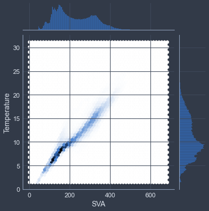
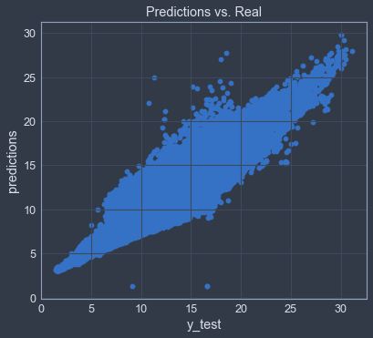
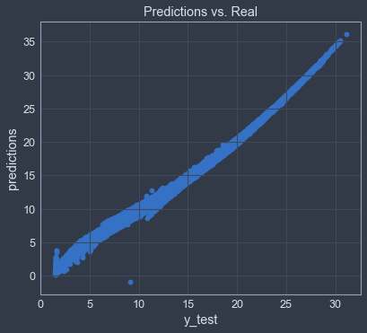

___

<a href='http://www.dourthe.tech'> </a>
___
<center><em>For more information, visit <a href='http://www.dourthe.tech'>www.dourthe.tech</a></em></center>

# Ocean Water Temperature using Linear Regression

___ 
## Objective
Train a Linear Regression model to predict the ocean water temperature based on different metrics from the California Cooperative Oceanic Fisheries Investigations (CalCOFI) Database.

 ___
## Dataset
The California Cooperative Oceanic Fisheries Investigations (CalCOFI) are a unique partnership of the California Department of Fish & Wildlife, NOAA Fisheries Service and Scripps Institution of Oceanography. The organization was formed in 1949 to study the ecological aspects of the sardine population collapse off California. Today our focus has shifted to the study of the marine environment off the coast of California, the management of its living resources, and monitoring the indicators of El Nino and climate change. CalCOFI conducts quarterly cruises off southern & central California, collecting a suite of hydrographic and biological data on station and underway. Data collected at depths down to 500 m include: temperature, salinity, oxygen, phosphate, silicate, nitrate and nitrite, chlorophyll, transmissometer, PAR, C14 primary productivity, phytoplankton biodiversity, zooplankton biomass, and zooplankton biodiversity.

The complete CalCOFI Hydrographic Database, as well as a detailed description of each reported metric can be found directly on their website: https://calcofi.org/ccdata/database.html

For simplicity, a reduced version of the original Database focusing on the 'Reported' metrics was created.

The corresponding CSV file named _bottle\_reduced.csv_ contains the following columns:

| Name | Description | Data Type | 
|:---|:---|:---|
|Depth | Reported Depth in Meters | _integer_ |
|Pressure | Pressure in decibars | _integer_ |
|Temperature | Reported Temperature in Degrees Celcius | _float_ |
|Salinity | Reported Salinity based on Practical Salinity Scale 1978 UNESCO 1981a | _float_ |
|Density | Reported Potential Density of water | _float_ |
|SVA | Reported Specific Volume Anomaly | _float_ |
|DynHeight | Reported Dynamic Height in Dynamic Meters | _float_ |
|Oxygen | Reported milliliters of oxygen per Liter of seawater | _float_ |
|OxygenSat | Reported Oxygen Saturation in Percent | _float_ |
|Silicate | Reported Silicate Concentration in micro Mole per Liter | _float_ |
|Phosphate | Reported Phosphate Concentration in micro Mole per Liter | _float_ |
|Nitrate | Reported Nitrate Concentration in micro Mole per Liter | _float_ |
|Nitrite | Reported Nitrite Concentration in micro Mole per Liter | _float_ |
|Ammonium | Reported Ammonium Concentration in micro Mole per Liter | _float_ |
|Chlorophyll | Reported Chlorophyll-a content in micrograms per Liter | _float_ |
|Phaeophytin | Reported Phaeophytin content in micrograms per Liter | _float_ |

A text file containing the details in the table above was also created: _bottle\_reduced\_description.txt_

___
## Libraries Imports
### Data manipulation and analysis


```python
import pandas as pd
import numpy as np
```

### Data visualization


```python
import warnings
warnings.filterwarnings("ignore")
import matplotlib.pyplot as plt
import seaborn as sns
from jupyterthemes import jtplot
jtplot.style(theme='chesterish')
```

### Machine learning


```python
# Split data between training and test set
from sklearn.model_selection import train_test_split

# Linear regression model
from sklearn.linear_model import LinearRegression

# Model evaluation
from sklearn.metrics import mean_absolute_error, mean_squared_error
```

___
## Data Import


```python
df = pd.read_csv('bottle_reduced.csv')
df_desc = pd.read_csv('bottle_reduced_description.txt')
```

___
## Exploratory Data Analysis
### General

**We will first create a function that takes the name of a column as input and prints out its description based on the _bottle\_reduced\_description.txt_ document.**


```python
def column_info(column):
    print('Column name:\t', column, '\nDescription:\t', df_desc[df_desc['Column name']==column]['Description'].values[0])
```

From now on, if we need to check the description of a column, we can use this function:


```python
df.columns
```


    Index(['Depth', 'Pressure', 'Temperature', 'Salinity', 'Density', 'SVA',
           'DynHeight', 'Oxygen', 'OxygenSat', 'Silicate', 'Phosphate', 'Nitrate',
           'Nitrite', 'Ammonium', 'Chlorophyll', 'Phaeophytin'],
          dtype='object')


```python
column_info('Nitrite')
```

    Column name:   Nitrite 
    Description:   Reported Nitrite Concentration in micro Mole per Liter
    

**Check the statistics of each column to have a better sense of the scale of each metric.**


```python
df.describe()
```


<div>
<table border="1" class="dataframe">
  <thead>
    <tr style="text-align: right;">
      <th></th>
      <th>Depth</th>
      <th>Pressure</th>
      <th>Temperature</th>
      <th>Salinity</th>
      <th>Density</th>
      <th>SVA</th>
      <th>DynHeight</th>
      <th>Oxygen</th>
      <th>OxygenSat</th>
      <th>Silicate</th>
      <th>Phosphate</th>
      <th>Nitrate</th>
      <th>Nitrite</th>
      <th>Ammonium</th>
      <th>Chlorophyll</th>
      <th>Phaeophytin</th>
    </tr>
  </thead>
  <tbody>
    <tr>
      <th>count</th>
      <td>864863.000000</td>
      <td>864863.000000</td>
      <td>853900.000000</td>
      <td>817509.000000</td>
      <td>812007.000000</td>
      <td>812092.000000</td>
      <td>818206.000000</td>
      <td>696201.000000</td>
      <td>666448.000000</td>
      <td>354099.000000</td>
      <td>413325.000000</td>
      <td>337411.000000</td>
      <td>337584.000000</td>
      <td>64982.000000</td>
      <td>225276.000000</td>
      <td>225275.000000</td>
    </tr>
    <tr>
      <th>mean</th>
      <td>226.832495</td>
      <td>228.395694</td>
      <td>10.799697</td>
      <td>33.840295</td>
      <td>25.811010</td>
      <td>220.938918</td>
      <td>0.431763</td>
      <td>3.392498</td>
      <td>57.192940</td>
      <td>26.606862</td>
      <td>1.564736</td>
      <td>17.302188</td>
      <td>0.042336</td>
      <td>0.084851</td>
      <td>0.450225</td>
      <td>0.198599</td>
    </tr>
    <tr>
      <th>std</th>
      <td>316.050007</td>
      <td>319.456731</td>
      <td>4.243829</td>
      <td>0.462978</td>
      <td>1.124645</td>
      <td>93.483703</td>
      <td>0.382336</td>
      <td>2.073271</td>
      <td>37.060537</td>
      <td>27.648403</td>
      <td>1.035973</td>
      <td>14.581998</td>
      <td>0.104201</td>
      <td>0.273022</td>
      <td>1.208566</td>
      <td>0.376539</td>
    </tr>
    <tr>
      <th>min</th>
      <td>0.000000</td>
      <td>0.000000</td>
      <td>1.440000</td>
      <td>4.570000</td>
      <td>20.934000</td>
      <td>0.400000</td>
      <td>0.000000</td>
      <td>-0.010000</td>
      <td>-0.100000</td>
      <td>0.000000</td>
      <td>0.000000</td>
      <td>-0.400000</td>
      <td>0.000000</td>
      <td>0.000000</td>
      <td>-0.010000</td>
      <td>-3.890000</td>
    </tr>
    <tr>
      <th>25%</th>
      <td>46.000000</td>
      <td>46.000000</td>
      <td>7.680000</td>
      <td>33.488000</td>
      <td>24.960000</td>
      <td>143.700000</td>
      <td>0.130000</td>
      <td>1.360000</td>
      <td>21.200000</td>
      <td>3.100000</td>
      <td>0.470000</td>
      <td>0.600000</td>
      <td>0.000000</td>
      <td>0.000000</td>
      <td>0.050000</td>
      <td>0.050000</td>
    </tr>
    <tr>
      <th>50%</th>
      <td>125.000000</td>
      <td>126.000000</td>
      <td>10.060000</td>
      <td>33.863000</td>
      <td>25.990000</td>
      <td>203.200000</td>
      <td>0.340000</td>
      <td>3.440000</td>
      <td>54.500000</td>
      <td>18.000000</td>
      <td>1.570000</td>
      <td>18.100000</td>
      <td>0.010000</td>
      <td>0.000000</td>
      <td>0.160000</td>
      <td>0.110000</td>
    </tr>
    <tr>
      <th>75%</th>
      <td>300.000000</td>
      <td>302.000000</td>
      <td>13.880000</td>
      <td>34.196000</td>
      <td>26.640000</td>
      <td>299.800000</td>
      <td>0.640000</td>
      <td>5.500000</td>
      <td>97.600000</td>
      <td>41.500000</td>
      <td>2.480000</td>
      <td>30.000000</td>
      <td>0.030000</td>
      <td>0.060000</td>
      <td>0.390000</td>
      <td>0.230000</td>
    </tr>
    <tr>
      <th>max</th>
      <td>5351.000000</td>
      <td>5458.000000</td>
      <td>31.140000</td>
      <td>37.034000</td>
      <td>250.784000</td>
      <td>683.400000</td>
      <td>3.880000</td>
      <td>11.130000</td>
      <td>214.100000</td>
      <td>196.000000</td>
      <td>5.210000</td>
      <td>95.000000</td>
      <td>8.190000</td>
      <td>15.630000</td>
      <td>66.110000</td>
      <td>65.300000</td>
    </tr>
  </tbody>
</table>
</div>


**Display the first few rows of the dataset.**


```python
df.head()
```


<div>
<table border="1" class="dataframe">
  <thead>
    <tr style="text-align: right;">
      <th></th>
      <th>Depth</th>
      <th>Pressure</th>
      <th>Temperature</th>
      <th>Salinity</th>
      <th>Density</th>
      <th>SVA</th>
      <th>DynHeight</th>
      <th>Oxygen</th>
      <th>OxygenSat</th>
      <th>Silicate</th>
      <th>Phosphate</th>
      <th>Nitrate</th>
      <th>Nitrite</th>
      <th>Ammonium</th>
      <th>Chlorophyll</th>
      <th>Phaeophytin</th>
    </tr>
  </thead>
  <tbody>
    <tr>
      <th>0</th>
      <td>0</td>
      <td>0</td>
      <td>10.50</td>
      <td>33.440</td>
      <td>25.64</td>
      <td>233.0</td>
      <td>0.00</td>
      <td>NaN</td>
      <td>NaN</td>
      <td>NaN</td>
      <td>NaN</td>
      <td>NaN</td>
      <td>NaN</td>
      <td>NaN</td>
      <td>NaN</td>
      <td>NaN</td>
    </tr>
    <tr>
      <th>1</th>
      <td>8</td>
      <td>8</td>
      <td>10.46</td>
      <td>33.440</td>
      <td>25.65</td>
      <td>232.5</td>
      <td>0.01</td>
      <td>NaN</td>
      <td>NaN</td>
      <td>NaN</td>
      <td>NaN</td>
      <td>NaN</td>
      <td>NaN</td>
      <td>NaN</td>
      <td>NaN</td>
      <td>NaN</td>
    </tr>
    <tr>
      <th>2</th>
      <td>10</td>
      <td>10</td>
      <td>10.46</td>
      <td>33.437</td>
      <td>25.65</td>
      <td>232.8</td>
      <td>0.02</td>
      <td>NaN</td>
      <td>NaN</td>
      <td>NaN</td>
      <td>NaN</td>
      <td>NaN</td>
      <td>NaN</td>
      <td>NaN</td>
      <td>NaN</td>
      <td>NaN</td>
    </tr>
    <tr>
      <th>3</th>
      <td>19</td>
      <td>19</td>
      <td>10.45</td>
      <td>33.420</td>
      <td>25.64</td>
      <td>234.1</td>
      <td>0.04</td>
      <td>NaN</td>
      <td>NaN</td>
      <td>NaN</td>
      <td>NaN</td>
      <td>NaN</td>
      <td>NaN</td>
      <td>NaN</td>
      <td>NaN</td>
      <td>NaN</td>
    </tr>
    <tr>
      <th>4</th>
      <td>20</td>
      <td>20</td>
      <td>10.45</td>
      <td>33.421</td>
      <td>25.64</td>
      <td>234.0</td>
      <td>0.04</td>
      <td>NaN</td>
      <td>NaN</td>
      <td>NaN</td>
      <td>NaN</td>
      <td>NaN</td>
      <td>NaN</td>
      <td>NaN</td>
      <td>NaN</td>
      <td>NaN</td>
    </tr>
  </tbody>
</table>
</div>


### Missing data
**Check for missing data (expressed as a percentage of the dataset length).**


```python
df.isnull().sum()*100/len(df)
```


    Depth           0.000000
    Pressure        0.000000
    Temperature     1.267600
    Salinity        5.475318
    Density         6.111488
    SVA             6.101660
    DynHeight       5.394727
    Oxygen         19.501586
    OxygenSat      22.941784
    Silicate       59.057215
    Phosphate      52.209194
    Nitrate        60.986769
    Nitrite        60.966766
    Ammonium       92.486440
    Chlorophyll    73.952406
    Phaeophytin    73.952522
    dtype: float64


**Most metrics seem to have a lot of missing observations.**

Let's drop all columns that have more than 10% of missing data:


```python
df = df.loc[:,df.isnull().sum()*100/len(df) < 10]
```


```python
df.isnull().sum()*100/len(df)
```


    Depth          0.000000
    Pressure       0.000000
    Temperature    1.267600
    Salinity       5.475318
    Density        6.111488
    SVA            6.101660
    DynHeight      5.394727
    dtype: float64


**We can now remove all rows that have missing observations for one of the remaining metrics.**


```python
pre_drop_na_len = len(df)
```


```python
df = df.dropna()
```


```python
print('Percentage of dropped data:\t', np.round(100-len(df)*100/pre_drop_na_len,2), ' %')
```

    Percentage of dropped data:  6.68  %
    

### Correlations
**Let's look at the correlation matrix.**


```python
plt.figure(figsize=(12,8))
sns.heatmap(df.corr(), cmap='coolwarm', annot=True)
plt.show()
```


    

    


**Now, let's calculate and plot the correlations only for the water temperature column.**


```python
temp_cor = df.corr()['Temperature'].sort_values()[:-1]
print(temp_cor)
```

    Density     -0.861314
    DynHeight   -0.799284
    Depth       -0.681038
    Pressure    -0.679714
    Salinity    -0.503253
    SVA          0.964033
    Name: Temperature, dtype: float64
    


```python
temp_cor.plot(kind='bar', color='steelblue')
plt.show()
```


    

    


It seems like the SVA column has the highest correlation with water temperature.

**We can also use the pairplot command from the seaborn library to have an overall view of the data distribution and see which metrics seem to have a linear relationship.**

Warning: because of the large amount of data, this command can take a while to compute.


```python
sns.pairplot(df)
plt.show()
```


    

    


These plots clearly show some expected relationships, such as a perfect linear correlation between Depth and Pressure.

It also confirms that water temperature and SVA seem to be linearly correlated.

**Let's check the description of the SVA column:**


```python
column_info('SVA')
```

    Column name:   SVA 
    Description:   Reported Specific Volume Anomaly
    

If we look for a more detailed description on Google, the Specific Volume Anomaly seem to be a function of absolute water salinity, conservative temperature and pressure.

**We can try to visualize the potential relationship between water temperature and SVA using a hexagonal plot, which better shows the data distribution compared to a simple scatter plot.**


```python
sns.jointplot('SVA', 'Temperature', data=df, kind='hex')
plt.show()
```


    

    


**CONCLUSION**

The water temperature seem to be linearly correlated to the SVA column.

___
## Machine Learning
### Input/Output definition

**We will try to build a linear regression model based on the SVA column.**


```python
X = df[['SVA']]
y = df[['Temperature']]
```

**Split the data into training and test sets:**


```python
X_train, X_test, y_train, y_test = train_test_split(X, y, test_size=0.3, random_state=42)
```

### Define and fit model to training data


```python
lm = LinearRegression()
```


```python
lm.fit(X_train, y_train)
```


    LinearRegression()


**We can print the model's coefficients:**


```python
print(lm.coef_)
```

    [[0.04350382]]
    

### Model evaluation

**Generate predictions:**


```python
predictions = lm.predict(X_test)
```

**We can now plot the real value against the predicted ones:**


```python
plt.scatter(y_test, predictions)
plt.xlabel('y_test')
plt.ylabel('predictions')
plt.title('Predictions vs. Real')
plt.show()
```


    

    


**We can now calculate the mean absolute and mean squared errors.**


```python
print('MAE:\t', np.round(mean_absolute_error(y_test, predictions),2), '\tDegC')
print('MSE:\t', np.round(mean_squared_error(y_test, predictions),2), '\tDegC squared')
```

    MAE:   0.75   DegC
    MSE:   1.25   DegC squared
    

**In this context, the mean squared error is probably the best representation of the error, as it will increase the penalty on outliers by squaring the corresponding error.**

Considering that squared degrees are not very intuitive to interpret, let's calculate the root mean squared error:


```python
print('RMSE:\t', np.round(np.sqrt(mean_squared_error(y_test, predictions)),2), '\tDegC')
```

    RMSE:  1.12   DegC
    

**To better understand whether a 1.12 DegC difference is significant or not, let's compare it to the water temperature statistics:**


```python
df['Temperature'].describe()
```


    count    807121.000000
    mean         10.881504
    std           4.214839
    min           1.440000
    25%           7.780000
    50%          10.130000
    75%          13.940000
    max          31.140000
    Name: Temperature, dtype: float64


The RMSE is lower than the standard deviations, but is still around 10% of the mean.

**For more details on the fit of the model, we can look at the residuals and check whether they look normally distributed.**


```python
sns.distplot(np.array(y_test-predictions), bins=50)
plt.show()
```


    

    


**CONCLUSION**

The linear regression model using the SVA column showed a fairly descent fit to the data, with normally distributed residuals.

Considering that SVA is a function of salinity and pressure, this indicates that these two metrics may also be linked to the overall water temperature.

### Model enhancement: Multivariate linear regression

**To try and improve the performance of the model, let's build a second model using all metrics.**


```python
df.columns
```


    Index(['Depth', 'Pressure', 'Temperature', 'Salinity', 'Density', 'SVA',
           'DynHeight'],
          dtype='object')


**Define input/output data:**


```python
X = df[['Depth', 'Pressure', 'Salinity', 'Density', 'SVA', 'DynHeight']]
y = df[['Temperature']]
```

**Split the data into training and test sets:**


```python
X_train, X_test, y_train, y_test = train_test_split(X, y, test_size=0.3, random_state=42)
```

**Define and fit model:**


```python
lm = LinearRegression()
```


```python
lm.fit(X_train, y_train)
```


    LinearRegression()


**Print model coefficients:**


```python
coeff_df = pd.DataFrame(lm.coef_.transpose(),index=X.columns,columns=['Coefficient'])
coeff_df
```


<div>
<table border="1" class="dataframe">
  <thead>
    <tr style="text-align: right;">
      <th></th>
      <th>Coefficient</th>
    </tr>
  </thead>
  <tbody>
    <tr>
      <th>Depth</th>
      <td>-0.178545</td>
    </tr>
    <tr>
      <th>Pressure</th>
      <td>0.174792</td>
    </tr>
    <tr>
      <th>Salinity</th>
      <td>3.333018</td>
    </tr>
    <tr>
      <th>Density</th>
      <td>0.084330</td>
    </tr>
    <tr>
      <th>SVA</th>
      <td>0.050181</td>
    </tr>
    <tr>
      <th>DynHeight</th>
      <td>-0.215885</td>
    </tr>
  </tbody>
</table>
</div>


**Calculate predictions and plot against real data:**


```python
predictions = lm.predict(X_test)
```


```python
plt.scatter(y_test, predictions)
plt.xlabel('y_test')
plt.ylabel('predictions')
plt.title('Predictions vs. Real')
plt.show()
```


    

    


**Evaluate model:**


```python
print('MAE:\t', np.round(mean_absolute_error(y_test, predictions),2), '\tDegC')
print('MSE:\t', np.round(mean_squared_error(y_test, predictions),2), '\tDegC squared')
print('RMSE:\t', np.round(np.sqrt(mean_squared_error(y_test, predictions)),2), '\tDegC')
```

    MAE:   0.21   DegC
    MSE:   0.1    DegC squared
    RMSE:  0.31   DegC
    

**Plot residuals:**


```python
sns.distplot(np.array(y_test-predictions), bins=50)
plt.show()
```


    

    


___
## Conclusion

The model was significantly improved after using all features, with an RMSE of 0.31 DegC compared to the 1.12 DegC obtained when only using the SVA column. This model could be used to predict ocean water temperature from water properties such as salinity, density and pressure. This also shows the potential impact of change in water properties on water temperature, which can be a valuable information when studying climate change and sea level rise.

**This pipeline could easily be transferred to other linear regression problems.**
